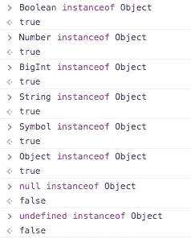
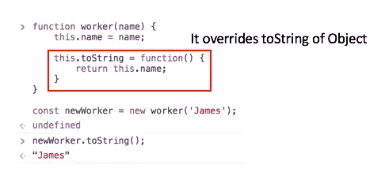
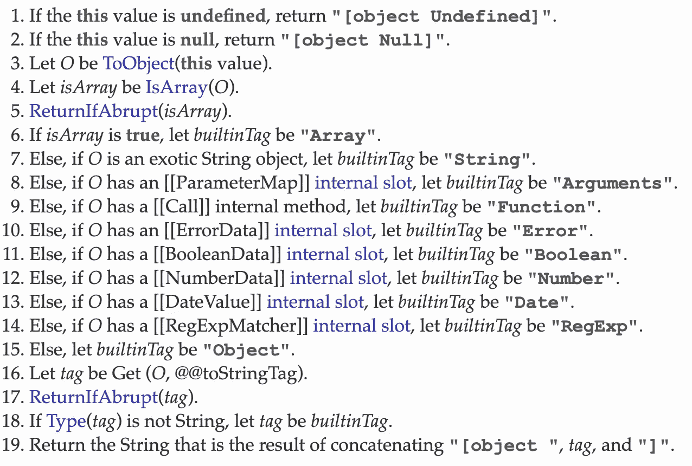
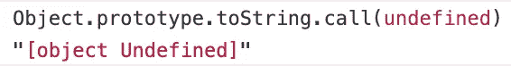
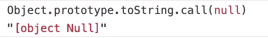
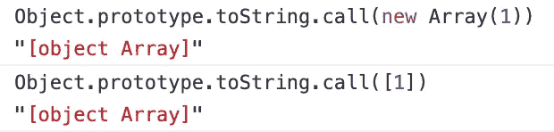
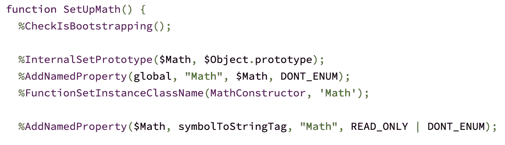
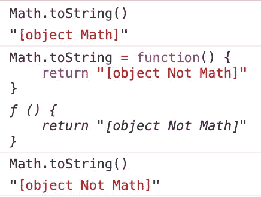

# JavaScript:Object . prototype . tostring 中的[object Object]是什么

> 原文：<https://betterprogramming.pub/what-is-object-object-in-javascript-object-prototype-tostring-1db888c695a4>

## [object Object]的更深一层的解释


伊利亚·巴甫洛夫在 [Unsplash](https://unsplash.com?utm_source=medium&utm_medium=referral) 上拍摄的照片

作为一名 JavaScript 开发人员，您可能使用过或者至少听说过`toString`方法。

此外，如果您热衷于为开源 GitHub 项目贡献您的经验，您也将有机会看到他们如何检查参数的类型。

有一天，我看到了一个相当诡异的东西——`[object Object]`。嗯，我第一次看的时候不知道它是什么意思。

我认为这是打印数据时的某种控制台错误，所以我习惯用`console.dir`，而不是`console.log`来表示对象。

然后，我从 [MDN](https://developer.mozilla.org/en-US/) 看到了这个:

> “每个对象都有一个`toString()`方法，当对象被表示为一个文本值时，或者当一个对象以一种应该是字符串的方式被引用时，这个方法会被自动调用。”

# 先决条件

为了更好地理解这篇文章将要谈论的内容，你应该知道 JavaScript 中的`prototype`和`prototype chain`是什么。

# TL；速度三角形定位法(dead reckoning)

`Object.prototype.toString`是一个打印出传递给`toString`的类名的方法。

根据 ECMAScript 的规范，您可以从中获得几个值。当您检查对象的类的类型时，这可能会很有帮助。

# JavaScript 对象的类型

是一种表示…什么的方法？

要理解这到底意味着什么，您应该知道 JavaScript 有哪些数据类型。基本上，JavaScript 有七种原始数据类型和其他类型，`Object`。

*   [布尔型](https://developer.mozilla.org/en-US/docs/Glossary/Boolean)
*   [空值](https://developer.mozilla.org/en-US/docs/Glossary/Null)
*   [未定义](https://developer.mozilla.org/en-US/docs/Glossary/Undefined)
*   [编号](https://developer.mozilla.org/en-US/docs/Glossary/Number)
*   [BigInt](https://developer.mozilla.org/en-US/docs/Glossary/BigInt)
*   [弦](https://developer.mozilla.org/en-US/docs/Glossary/String)
*   [符号](https://developer.mozilla.org/en-US/docs/Glossary/Symbol)
*   [对象](https://developer.mozilla.org/en-US/docs/Glossary/Object)

有些是`Object`的实例，有些不是。每种类型的`toString`打印出来的内容略有不同，但它们都在相同的逻辑下工作。

我们来看看有没有办法看出他们的类型。

除了`Null`和`Undefined`，列表中的每个成员都是`Object`类的一个实例。

如果一个对象是`Object`的实例，就意味着这个对象的`[[prototype]]`，也就是大多数浏览器中的`__proto__`，引用`Object.prototyp` *e* 作为其原型链的最终链接位置。



除了 Null 和 Undefined 之外，所有都是对象的实例

让我们来看看这个简短的例子:



我创建了一个名为`worker` 的随机函数类，它的方法覆盖了打印内容的`Object.prototype.toString`(我们很快就会深入研究它，不要担心)。

然后，我通过调用`toString`打印出`newWorker`的名字。那么，这有什么关系呢？

在 JavaScript 中，任何对象都可以拥有自己的方法，即使这个名称对于它们的`super`类中的 q method 来说是多余的。在这个例子中，一旦调用了`toString`，JavaScript 引擎就会开始寻找`newWorker`的作用域中是否有`toString`。

如果有，引擎会获取并调用它。如果没有，那么引擎寻找`newWorker`的`[[prototype]]`(同样，在大多数浏览器中是`__proto__`)并在`[[prototype]]`的范围内寻找`toString`。

如果有，那么引擎获取并调用它，如果没有，当它寻找`newWorker`的`[[prototype]]`时做同样的事情。

第二种情况是`newWorker`的`[[prototype]]`的`[[prototype]]`。如果`[[prototype]]`是`null`，当到达`Object`，或者`toString`存在于此过程范围内，发动机停止。

这被称为原型链接。

# [object Object]是 Object.prototype.toString 的精确算法的结果

那`Object.prototype.toString`到底是做什么的？它检测一个对象的类别并告诉你它是什么。让我们看一些例子。

我在本文前面提到的每一种数据类型都可以作为参数传递给`toString`，而`Object.prototype.toString`打印出传递的参数的类名。

当你使用`toString` 获取类类型时，要记住的一件事是确保在`Object`上使用`Function.prototype.call`或`Function.prototype.apply`。

```
'call' in Object; //true
```

那么，为什么需要调用`Function.prototype.call`或者`Function.prototype.apply`？

首先，我们来想想那两个函数是做什么的。它们所做的是允许您将某个对象传递给`call`或`apply`以使用参数作为它们的`thisArg`属性，这就是所谓的`this`。

```
function print() {
  console.log(this);
}print(); // Window
print.call([1, 2, 3]); // [1, 2, 3]
print.apply([1, 2, 3]); // [1, 2, 3]
```

在例子中可以看到，`call`和`apply`把`[1, 2, 3]`做成`print`的`this`，而`print()`的`this`只是`Window`的对象。

下面是文档告诉我们的关于`toString`如何工作的信息:



你可以点击查看

让我们采取第一个。想象这段代码如下所示。

```
Object.prototype.toString.call(undefined);
```

在这个上下文中，“如果`this`值未定义”，`this`是指你传入`toString`的对象调用`Function.prototype.call`或`Function.prototype.apply`。

还记得那些函数让自变量折腾`thisArg`，也就是`this`吗？这就是为什么我们必须使用`call`或`apply`，因为`toString`的第一个条件。这种情况下，`this`就是`undefined`。所以，返回`[object Undefined]`。



非常正确！下一个！

```
Object.prototype.toString.call(null);
```

`this`这个参数的`null`不是`undefined`，所以跳过第一个条件。

但是第二个问题，“如果`this`值为空”，对于这个例子来说是完美的！然后，让我们看看这个例子是否像第二个条件所说的那样肯定打印了`[object Null]`。



是啊，简单模式！

那`Array`呢？我没有把它放在这篇文章开始的数据类型列表中。`Array`不也是 JavaScript 拥有的一类类型吗？嗯，听起来很有道理。再看第三到第六个条件。

1.  设`O`为`ToObject`(该值)
2.  设`isArray`为`IsArray(O)`
3.  如果`isArray`为真，设`builtinTag`为`“Array”`

所以，即使我们不知道`[ToObject](https://www.ecma-international.org/ecma-262/6.0/#sec-toobject)`和`[IsArray](https://www.ecma-international.org/ecma-262/6.0/#sec-isarray)`是什么，我们知道这些条件谈打印`“Array”`如果我们把`Array`类型对象传入`toString` *。*



还是那句话，没错！现在，轮到你将我在本文开头列出的所有数据类型与来自`toString`算法的结果进行比较。

# 定制的 toString

我们简单检查了一下`newWorker`代码。在那个例子中，我们定制了`toString`方法，因为它打印了我们在创建`worker`类的实例时设置的名称。

我也解释了这是怎么可能的。像这样，有一个对象继承了`Object`，但是内部有一个定制的`toString`方法。

`[Math](https://mathjs.org/)`是一个奇妙的数学内置 JavaScript 库，帮助我们获得许多不同种类的预先计算的值或方法，以便于计算。

```
Math instanceof Object; // true
'toString' in Math; // true
```



[铬](https://chromium.googlesource.com/v8/v8/+/4.3.21/src/math.js?autodive=0%2F%2F)中的 Math.js

在 Chromium 中，当引擎编译`math.js`时，运行`SetUpMath`，您将看到:

```
%AddNamedProperty($Math, symbolToStringTag, "Math", ...);
```

虽然我们不知道这段代码到底是做什么的，但是有一点我们可以知道，当`Math`被声明的时候，它的属性，名为`symbolToStringTag`，会被赋给`“Math”`。

实际上，您可以在浏览器控制台中检查这一点。


您可以通过 console.dir(Math)看到这一点

那么，`Symbol.toStringTag`是做什么的？

`Symbol.toStringTag`众所周知的符号是一个字符串值属性，用于创建对象的默认字符串描述。它由`[Object.prototype.toString()](https://developer.mozilla.org/en-US/docs/Web/JavaScript/Reference/Global_Objects/Object/toString)`方法在内部访问。

因此，总的来说，有一些内置的 JavaScript 对象有一个定制的`toString`方法来打印不同的返回值，这不是我们之前看到的[ECMAScript toString Edition](https://www.ecma-international.org/ecma-262/6.0/#sec-object.prototype.tostring)中的情况之一。

之所以会这样，是因为默认调用`Object.prototype.toString`的`Symbol.toStringTag`，在一些核心脚本文件中声明。



您甚至可以定制一个定制的内置对象的 toString

而且你也可以自己做`toString`。

# typeof 与 toString

您可能听说过 JavaScript 中的`[typeof](https://developer.mozilla.org/en-US/docs/Web/JavaScript/Reference/Operators/typeof)`操作符，它用于检查类型。

但是，`toString`似乎也可以检查类型，因为总会有一些东西附加在`“[object]”`上，比如`[object Math]`。`typeof`将指示未赋值操作数类型的字符串返回给您。

```
typeof Math; // "object"
typeof true; // "boolean"
typeof 42; // "number"
```

那么，有什么不同呢？

两者之间的简单区别是你不能覆盖`typeof`的功能，而你可以用`toString`覆盖。

而且，使用`typeof`比`toString`更简单，因为您应该解析并剪切字符串以获得“类型”部分，比如来自`[object Math]`的“数学”。但是，`typeof`并不总是取代`Object.prototype.toString`所做的。

# 结论

`Function.prototype.apply`，由于它的核心逻辑，返回给你一个你传递给方法的对象的类。

有些内置函数有自己定制的`toString`方法，比如`Math`和`HTMLDocument`。为了确保你的代码中对象的类型，你应该在`typeof`和`toString`之间做好决定。

# 资源

*   [MDN 中的 object . prototype . tostring](https://developer.mozilla.org/en-US/docs/Web/JavaScript/Reference/Global_Objects/Object/toString)
*   [MDN 中的 JavaScript 数据类型和数据结构](https://developer.mozilla.org/en-US/docs/Web/JavaScript/Data_structures)
*   [ECMAScript 版本中的 object . prototype . tostring](https://www.ecma-international.org/ecma-262/6.0/#sec-object.prototype.tostring)
*   [来自 Chromium 源代码的 src/math . js](https://chromium.googlesource.com/v8/v8/+/4.3.21/src/math.js?autodive=0%2F%2F)
*   [MDN 中的 symbol . tostring tag](https://developer.mozilla.org/en-US/docs/Web/JavaScript/Reference/Global_Objects/Symbol/toStringTag)
*   [MDN 中的类型](https://developer.mozilla.org/en-US/docs/Web/JavaScript/Reference/Operators/typeof)