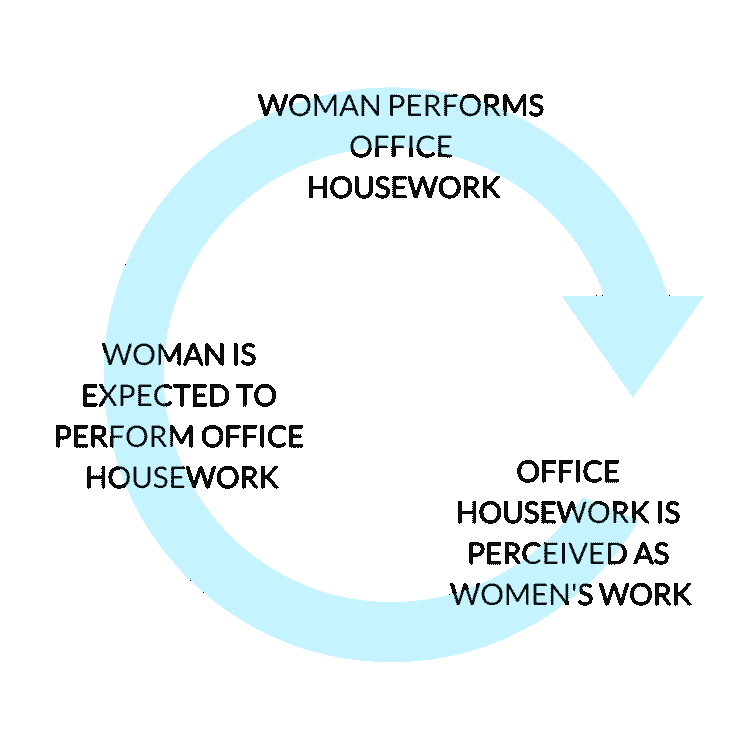

# 什么是办公室家务，为什么你应该停止志愿做家务？

> 原文：<https://betterprogramming.pub/what-is-office-housework-and-why-you-should-stop-volunteering-for-it-f750e8456b64>

## *降低不可提升任务的优先级*

由 [Patrick Perkins](https://unsplash.com/@pperkins?utm_source=unsplash&utm_medium=referral&utm_content=creditCopyText) 在 [Unsplash](https://unsplash.com/s/photos/office-housework?utm_source=unsplash&utm_medium=referral&utm_content=creditCopyText) 上拍摄的照片。

在我职业生涯的几年里，我了解了办公室家务这个术语，对我来说，这是一个“啊哈”的时刻。[哈佛商业评论](https://hbr.org/2018/03/for-women-and-minorities-to-get-ahead-managers-must-assign-work-fairly)对此做了很好的定义:

> “办公室家务发生在聚光灯之外。有些是行政工作，让事情向前发展，比如记笔记或找一个大家都能见面的时间。有些是情绪劳动(“他不高兴——解决它。”).有些是重要但被低估的工作，比如启动新流程或跟踪合同。这种任务必须由某人来完成，但它不会成就那个人的事业。"

办公室家务的一些例子:

*   组织公司和团队活动。
*   在头脑风暴会议中记笔记。
*   找一个大家都能见面的时间。
*   以及许多不属于您核心职责的类似管理任务。

# 谁在做办公室家务？

根据《哈佛商业评论》的这项研究，女性更有可能收到办公室家务请求，因为她们最有可能答应。

> ***“男人 51%的时候会接受请求；女性，76%的时候。”***

照片由[潮汐平等](http://tidalequality.com)拍摄。

# 这对你的职业生涯有什么影响？

办公室家务通常包括不可提升的任务，这些任务耗费了你本可以花在可提升的工作上的时间。时间是至关重要的，也是有限的。如果你经常举手做这样的任务，停下来。这可能会阻碍你做“魅力”工作。

## 我处理办公室家务的经验

我曾经志愿组织几乎所有的团队活动。我曾经在办公室组织过一次 80 人的活动。我的核心工作是数据科学工作，我利用业余时间做办公室家务。办公室家务确实给了我接触高层领导的机会和能见度，但这种能见度对我的职业生涯没有帮助。

自从了解了办公室家务(以及我的“啊哈”时刻)，我一直留意我志愿做的事情。我擅长某件事并不意味着我需要去做。

主持一个有 900 名与会者的会议。

上图来自我帮忙组织(办公室家务)和主持(魅力工作)的一个会议。组织这次会议是几个月的努力。我需要这么做吗？不。这个作品会出现在我的宣传片里吗？没有。不过，作为主持人主持会议确实在我的绩效评估中。我帮助组织它，因为我擅长它，也想这样做，但事后看来，我占用了其他可推广工作的时间，而这些工作本来会在我的推广文件上结束。注意你如何使用你的时间。

# **外卖**

*   留意你是如何利用工作时间的。办公室家务举手次数多了吗？聪明地工作，而不是努力。
*   办公室家务应该由每个人平均分担。
*   注意你的时间和精力。

# **延伸阅读**

## **书籍**

*   好女孩不会得到角落里的办公室
*   Greg McKeown 的《本质主义:对更少的自律追求》
*   不是你的工作妻子

## **文章**

*   《哈佛商业评论》[为什么女性会自愿去做不会带来晋升的工作](https://hbr.org/2018/07/why-women-volunteer-for-tasks-that-dont-lead-to-promotions)
*   有色人种女性被要求做更多的“办公室家务”—《哈佛商业评论》讲述了他们如何说不
*   谁在做办公室的家务？由潮汐相等
*   女人们，不要再志愿做办公室家务了！纽约时报

# 结论

感谢阅读。我希望这有所帮助！