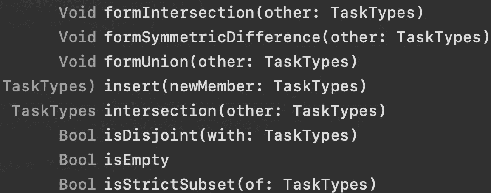

# Swift 中的 OptionSet 是什么，您应该何时使用它？

> 原文：<https://betterprogramming.pub/what-is-optionset-in-swift-and-when-you-should-use-it-419777f3c39>

## 通过实际的列举比较

照片由[丘特尔斯纳普](https://unsplash.com/@chuttersnap?utm_source=medium&utm_medium=referral)在 [Unsplash](https://unsplash.com?utm_source=medium&utm_medium=referral) 上拍摄

在这个简短的教程中，我们将了解 Swift 中的`OptionSet`是什么，以及何时我们可能希望在我们的 iOS 应用中使用它。

我们使用`OptionSet`来表示一组相关成员(或选项)，并以类型安全的方式工作。它的概念类似于`enum`，但是它有一些非常有用的特性，这些特性在简单的枚举中是不可用的。

# 我们开始吧

假设我们正在开发一个项目管理工具，并且希望有不同重要性和难度的任务。做到这一点的标准方法是使用枚举:

为了实例化一个`TaskType`，我们编写以下代码:

但是如果我们想让我们的`Item`既*不急*又*轻松*呢？我们必须使`taskType`属性成为一个数组，并将其签名改为`taskTypes`:

现在，为了检查该项目是否既不紧急又简单，我们编写了这个相对较长的`if`语句:

我们还希望`taskTypes`数组只包含唯一的成员(不允许有两个`.notUrgent`)。所以我们把这个数组转换成一个`Set`:

这么简单的事情，步骤太多了？所以我们有了更好的选择— `OptionSet`。

# 选项集实现

让我们执行上面的任务，但是用`OptionSet`代替`enum`。首先，我们应该创建`TaskTypes`结构:

当我们符合`OptionSet`协议时，要求我们为该结构提供一个`rawValue`。根据[苹果的文档](https://developer.apple.com/documentation/swift/optionset)，我们可以使用符合`FixedWidthInteger`的类型，比如`Int`，或者`UInt8`。

如果我们查看`urgent`属性，我们会看到下面的模式:`1 << 0`。左边的值表示一个整数乘以右边值的 2 的幂。为了澄清，1 应该以零的幂乘以 2:1 *2⁰= 1。

相应地，`notUrgent`的`rawValue`就是`1 << 1`。所以 1 乘以 2 的 1 次方:1 * 2 = 2。由于这种位运算，集合中的每个成员都有一个唯一的值。

清楚了这一点，让我们进入下一部分——实例化和使用创建的`OptionSet`。

# 使用选项集

让我们定义一个`Item`并实例化它:

代码现在更简洁了，但是通过`OptionSet`我们获得了一些其他的好处:

*   我们现在可以执行与集合相关的操作，如`intersection`:

*   或者`union`:

这段代码打印 9 的值，因为`.urgent`对应于 1，而`.hard`对应于 8。它们的和是 9，这是唯一的，只有在与`.urgent`和`.hard`进行 union 时*才能得到。*

*   和许多其他方便的操作:

# 包扎

要了解关于`OptionSet`的更多信息，请参考 Apple 官方文档:

 [## 选项集

### 声明使用协议来表示位集类型，其中各个位表示一个集合的成员。采用…

developer.apple.com](https://developer.apple.com/documentation/swift/optionset) 

非常感谢您的阅读！