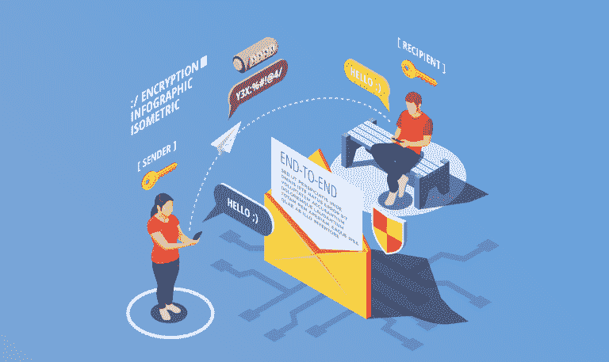
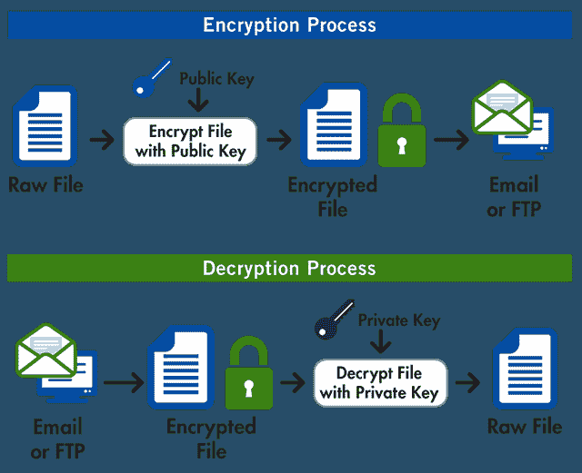

# PGP 是什么？

> 原文：<https://betterprogramming.pub/what-is-pgp-80e6c7808143>

## 将加密隐私和认证应用于在线通信的良好隐私

PGP 代表*相当好的隐私*。这是一个加密程序，将加密隐私和认证应用于在线通信。PGP 最常用于保持电子邮件内容的加密和私密性。OpenPGP 是 PGP 的开源版本，已经被广泛使用。

# PGP 是如何工作的？

PGP 对电子邮件的内容进行加密，这样不需要的第三方就无法查看您的电子邮件。通常，用户会在他们的电脑上安装一个程序，该程序将与 Gmail 或 Outlook 等电子邮件客户端一起工作，并对他们发送的电子邮件应用 PGP 加密。

谷歌让 Chrome 用户用 Chrome 的浏览器扩展实现 PGP。雅虎还提供加密版的电子邮件服务，这种服务使用了很好的隐私保护。

PGP 使用一个*公钥* 和一个*私钥*。公钥允许任何人在发送消息之前对其内容进行加密。私钥是让消息的接收者解密消息内容的东西。

目前生产中有多个版本的 PGP。Diffie-Hellman 和 RSA 版本都是 PGP，但是它们不能互相使用，因为加密算法是唯一的。

PGP 对你的电子邮件内容进行加密，但是它不会对你的邮件主题进行加密。不要在邮件的主题中包含敏感信息，这一点至关重要。

PGP 加密结合使用哈希、数据压缩、对称密钥加密和最终的公钥加密。流程中的每一步都使用一种受支持的算法

# **PGP 加密消息的示例**

———BEGIN PGP MESSAGE——
版本:PGPfreeware 6.5.8 非商业使用
<http://www.pgp.com>
HQ EMA+C7 envfymalaqf/ymlqlve 7 jyfqnytmqxav 6 p 2 prgc 94 nyrbviva+ojxubdzfcqcgvbn 6k 07 o/lddsxxfs 4 hibsviniz 3 iae 4 afmjerbqty t 4 ozfillob 9 wrk 6 fvq 3

# PGP 的限制

随着其他密码学应用的发展，PGP 的某些方面面临着批评。长而复杂的 PGP 公钥使得 PGP 的使用稍微复杂一些。在这一长串字符中只混淆一个字符会使密钥无用。

相当好的隐私本身很简单，但是对计算机和技术有入门知识的用户将很难使用这项技术。

尽管 PGP 是一种备受推崇的保护电子邮件的加密协议，但它尚未被广泛采用。最后，PGP 缺乏完美的前向保密性，因为如果有人在任何时候发现用户的私钥，他们就可以解密该用户的通信。

# 如何使用 PGP