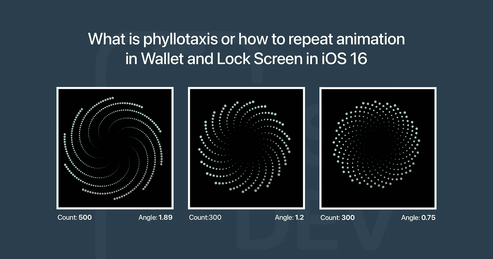
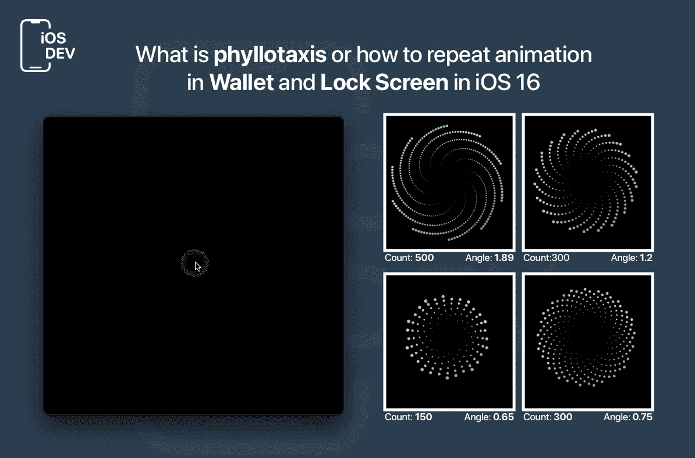

# iOS 16 中的叶序(或者说如何在钱包和锁屏中重复动画)是什么

> 原文：<https://betterprogramming.pub/what-is-phyllotaxis-or-how-to-repeat-animation-in-wallet-and-lock-screen-in-ios-16-a15ad4fc9bc9>

## 一些 SwiftUI 代码和达芬奇谜语

叶序示例

在新的 iOS 中，许多人注意到在锁定屏幕之间切换时的酷动画。菲利普·戴维斯在推特上补充道，这个数字与叶序非常相似。那么这是一部什么样的动画呢？

# 是时候了解新的事实了

叶序是自然之谜之一，自达芬奇时代就为人所知。这个名字来自古希腊语，意为“叶子的排列”

神秘之处在于植物界观察到的几何学上正确的排列。例如，想象一下向日葵的样子。

如果我们计算表面上相同螺旋的数量，很有可能我们会得到由两个相邻斐波那契数列组成的一对。

# 这个谜语的伪代码

为了简化术语:`n`是种子的索引(在我们的例子中，它只是一个圆，`baseAngle`是一些起始角度，`r`是半径，`x`和`y`是我们应该放置种子的位置)。

## 好吧，让我们试着用雨燕复制自然现象！

1.  创建一个`GeometryReader`，`proxy.size`将是字段的大小。`xCenter`和`yCenter` 是中心坐标，这是我工作的地方。
2.  可以使用下面的公式计算半径。`maxWidth` 是种子的宽度(靠近田边的那些)。
3.  根据字段中“种子”的最大数量，用`CircleInside`填充字段。
4.  水龙头上还有一个小`animation effect` : `scaleEffect`和`rotationEffect`。

最终结果就是你在 gif 中看到的:

叶序的结果

我把我的代码上传到了 [Github](https://github.com/Viktorianec/phyllotaxis) 。你可以随意修改。

# 资源

1.  [http://www . math recreation . com/2008/09/phyllo taxis-spires . html](http://www.mathrecreation.com/2008/09/phyllotaxis-spirals.html)
2.  [https://en.wikipedia.org/wiki/Phyllotaxis](https://en.wikipedia.org/wiki/Phyllotaxis)
3.  [https://rpubs.com/iPhuoc/Phyllotaxis](https://rpubs.com/iPhuoc/Phyllotaxis)

*感谢阅读。敬请关注更多内容！*