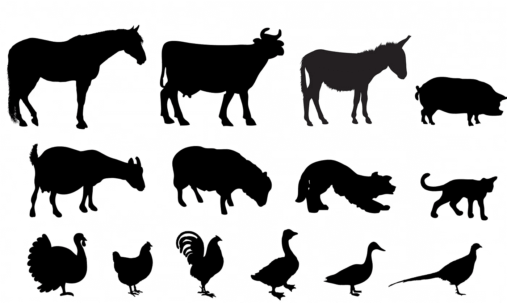
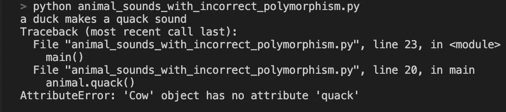
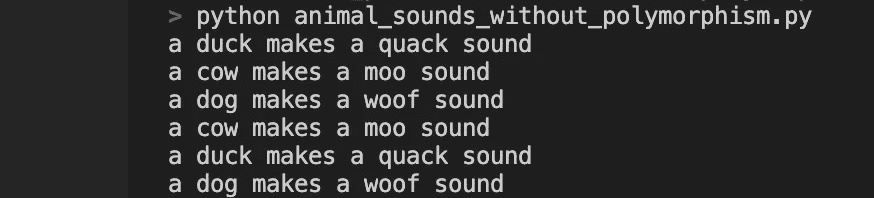
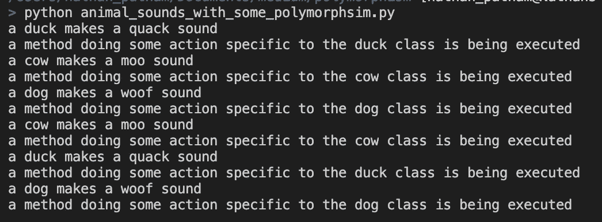

# 什么是多态性——我们如何在 Python 中实现它？

> 原文：<https://betterprogramming.pub/what-is-polymorphism-and-how-to-implement-it-in-python-391683307543>

## 一种软件设计原则，有助于降低实现具有相似行为的类的复杂性

图片由[卡伦·阿诺德](https://www.publicdomainpictures.net/en/view-image.php?image=271016&picture=farm-animals-silhouette-set)在[公共领域图片](https://www.publicdomainpictures.net/en/index.php)上提供

多态性是我在讨论中经常听到人们谈论的一个概念，但我从来不知道它意味着什么。如果你去谷歌搜索这个词，你可能会得到一个定义，比如“[一种语言通过单一、统一的接口处理各种类型和类别的对象的能力。](https://www.sitepoint.com/quick-guide-to-polymorphism-in-java/)

在这个定义中有许多术语，但是它的核心是，多态能够通过一个公共接口以相同的方式对待不同的对象。一个类比是，虽然卡车和高尔夫球车是两种不同的车辆(在我们的例子中是不同的对象)，但我们可以用相同的方式驾驶它们，因为它们都有油门踏板、刹车和方向盘(一个公共接口)。

# Python 中的多态性

既然我们对什么是多态有了一个高层次的了解，让我们深入到 Python 中的一个具体例子。为了澄清，这篇文章将通过在不同类的方法中使用通用名称而不是通过使用继承来实现 Python 中的多态性。

假设我们有一堆代表动物的不同类，每个动物类都有一个打印出它们发出的声音的方法。在我们的`main()`函数中，我们有一个名为`animals`的变量，它是动物对象的列表。问题变成了，我如何遍历每一个不同的对象，并打印出它们发出的声音？

我们的三个动物类都有自己的发声方法

如果我试图天真地在每个对象上调用类似于`quack()`的方法，它将对列表中的第一项有效，因为它是一个`Duck`对象，但是我们会得到一个错误，因为类`Cow`和`Dog`没有`quack()`方法。

duck 对象能够调用它的 quack()方法，但是我们得到一个错误，因为其他类没有这个名称的方法

那么我们该如何解决这个问题呢？

一种方法是添加一个名为`type`的成员变量，我们将在每个类的构造函数中创建并初始化这个变量。这个变量将帮助我们处理`main()`函数中的特殊情况逻辑。当我们运行它时，我们会得到正确的输出。

然而，这看起来像是很多额外的代码，我们必须编写这些代码来调用每个类中做同样事情的方法。由于每种方法背后的思想是打印出每种动物发出的声音，因此更好的方法是概括每种方法的名称，并将其称为同一事物，因此:

这里的美妙之处在于，作为一名程序员，当我们迭代`animals`时，我并不关心`animal`是什么类型的对象。由于`animals`中的每个对象都是三个已定义类中的一个，它们都有一个已定义的`make_sound()`方法，我们可以在 for 循环的每次迭代中简单地调用该方法。这就是多态性，因为我们有三个不同的对象(`Duck`、`Cow`和`Dog`)，我们通过一个公共接口以同样的方式对待它们，这就是`make_sound()`方法。

现在你可能会说，“但是 Nathan，虽然我的一些逻辑可能足够相似，可以保证概括一些方法名，但我仍然可以编写特定于类的代码吗？”

那个问题的答案是绝对。我们可以将之前取出的代码放回原处(我们在每个类中添加了一个名为`type`的类成员变量),并使用它在我们的`main()`函数中添加特例操作。一个可行的例子是:

当实现具有非常相似(就行为而言)方法的多个类时，多态性是一个很好的设计原则，可以用来减少样板代码。虽然我们可能会因为泛化方法的名称而丢失一些信息，但是我们会通过减少代码和提高可读性来弥补这些信息。感谢您阅读本文，希望您喜欢。

如果你能活着看到我制作的一个视频，在那里我做了一个现场编码会话，你可以在这里查看。