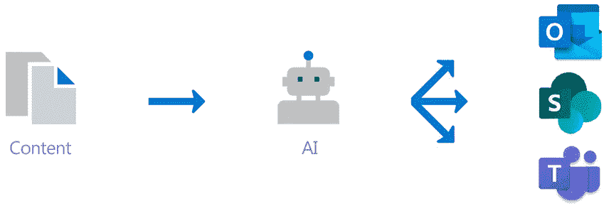
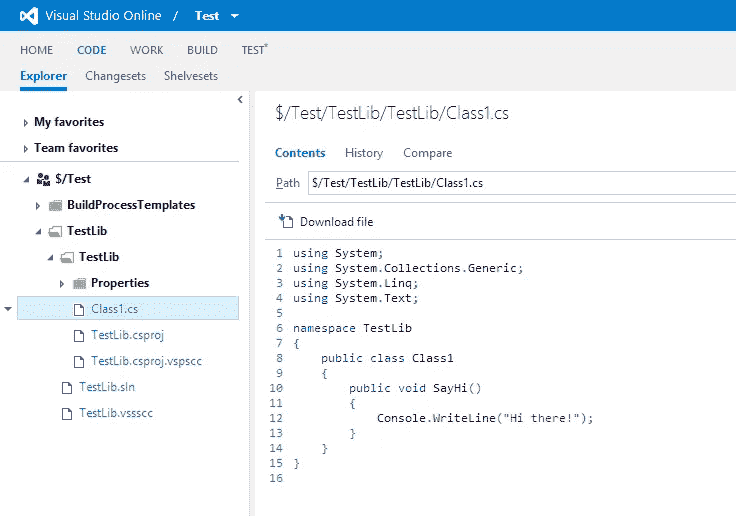

# 什么是皮质项目？以及微软 Ignite 2019 的另外两个更新

> 原文：<https://betterprogramming.pub/what-is-project-cortex-and-2-other-updates-from-microsoft-ignite-2019-bb8636eafebd>

## 从 Project Cortex 到 Chromium，微软正在构建现代化的解决方案

**照片由** [**乌列尔拍摄**](https://unsplash.com/@soberanes?utm_source=unsplash&utm_medium=referral&utm_content=creditCopyText) **上** [**下**](https://unsplash.com/s/photos/technology?utm_source=unsplash&utm_medium=referral&utm_content=creditCopyText)

两周前，许多著名的决策者和 IT 专业人士聚集在一起参加一个非常重要的会议:微软 Ignite Conference 2019。

这个年度会议不仅是关于消费者的，也是关于开发者的。

会议涵盖了微软服务和软件的更新。特别是，微软推出了几个项目，旨在通过在办公生态系统中实施人工智能来提高公司的生产力。

那么微软在这次活动中宣布的最重要的更新是什么呢？让我们来看看一些杰出的大项目:

# 启动管理信息的 Cortex 项目

[来源](https://resources.techcommunity.microsoft.com/project-cortex-microsoft-365/)

微软将推出 Cortex 项目，这是一个为公司创建知识网络的系统。

Project Cortex 分析您公司的所有内部数据源，然后将它们显示在 Office 和 Microsoft 应用程序中。这将是微软 365 推出团队以来的首个商业服务。该产品将基本上利用 SharePoint 基础设施作为一种方法来帮助管理表面文档。

使用机器学习和人工智能，这个系统将分析你公司的合同和存储库的文档，包括其他第三方应用程序。微软看到了这样一个机会，即组织拥有的非结构化和结构化数据遍布于消费者和员工创建的文档中，并且管理起来非常困难。

作为曾经负责从合同和其他内部文件中搜集信息的人。我意识到这是多么令人畏惧和单调。

这就是 Project Cortex 通过构建一个主动呈现相关信息的知识图来帮助企业的地方。不仅如此，该软件还可以帮助用户找到你可能正在处理的专家和相关文档。

目标是在不同的系统中利用人工智能并识别内容类型。

通过这样做，该系统可以提取有用的信息，然后自动将数据组织到产品、项目、客户和流程中。

这个项目基于不同人、主题和内容之间的关系创建了一个知识图(网络)。

使用微软的人工智能构建，这种特殊的软件将成为 SharePoint 的领先内容服务之一。因此，现在您可以通过 Project Cortex 自动进行数据分类和管理，同时 it 同时关注合规性和安全性。

# Visual Studio 网络版简介

微软宣布，Visual Studio environment 的网络版即将推出。作为一名开发人员，这是一个让代码更具协作性并集成到我们其余工作流中的绝佳机会。

其中一个很棒的特性是集成到 Github 中，这也是现在的预览版(对于那些不喜欢使用 Git/Github 的人来说)。我们已经看到这一功能越来越多地出现(例如，在 SaturnCloud.io 这样的产品中，数据科学家可以自动跟踪他们的工作)。

如此良好的集成有助于简化整个工作流程，并提高开发人员的效率。

有了 Visual Studio 的这个在线版本，开发人员将能够为他们的多个存储库快速构建一个完全配置好的开发环境。

这个时代的开发人员变得更加协作，因此这种更加集成和开放的工作流方法将允许他们在项目和代码库之间快速切换，而不会损失他们的生产力。

# 基于 Chromium 的 Edge 浏览器的新隐私特性

基于 Chromium 的微软 Edge 版本将于 2020 年 1 月 15 日推出。

这款浏览器将为 Edge 浏览器提供新的隐私功能，如 InPrivate 浏览模式。

类似于谷歌 Chrome 浏览器的隐私浏览模式，这种模式将保护你的在线身份和搜索隐私。

在 InPrivate 模式下，关闭浏览器后，浏览会话的所有信息都将从本地计算机中删除。

Microsoft Edge 还将默认启用跟踪防护，以保护您的数据。

在当前时代，公司正在努力建立严格的隐私控制，但当许多网站依赖 cookies 和跟踪来提高性能时，这些控制通常会引起问题。

现在，在完全专注于速度近十年后，微软已经将注意力转移到隐私上。或许这一切都是为了对抗谷歌 Chrome 本身。

在大会上，微软强调用户将能够通过 Edge 更新后的 Bing 引擎从深度整合中受益。

现在，微软 Edge 的新 Chromium 版本只是一个基本的预览，但是，嘿，这个版本似乎提供了非常企业友好的计划。

这款开源浏览器将专门针对 Windows 10 用户。现在你将能够在一个单独的浏览器窗口中打开遗留页面，这与谷歌 Chrome 的 IE 标签扩展非常相似。

微软现在将这一功能与额外的隐私控制相结合，将限制第三方跟踪用户在浏览器会话中的行为。

这项新功能预计将有三个设置:平衡，严格和无限制。所以现在，强调隐私将使微软与市场领先的谷歌 Chrome 区分开来。

为了量化这种体验，企业将给出一个微软生产力分数，它将检查员工如何工作，以及技术如何使他们工作或不工作。

这一生产率得分将使企业获得洞察力，以采取进一步的行动。最近的许可证变更以及新的端点管理器不仅旨在简化品牌，还旨在改善最终用户的体验。现在，企业将方便地让您在一个视图中共同管理超过 1.9 亿台设备。

# 最后

总而言之，这次业界领先的会议大获成功。

会议涵盖了从开发人员工具到云技术的重要方面，重点关注管理基础设施、联系行业领导者和构建解决方案。

由于微软管理层的前瞻性思维，许多管理工作负载和将数据迁移到云的现代化方法被探索出来。

公告看起来非常有希望，尤其是对企业而言，所以让我们希望这个解决方案最终以尽可能平稳的方式满足最终用户的需求。