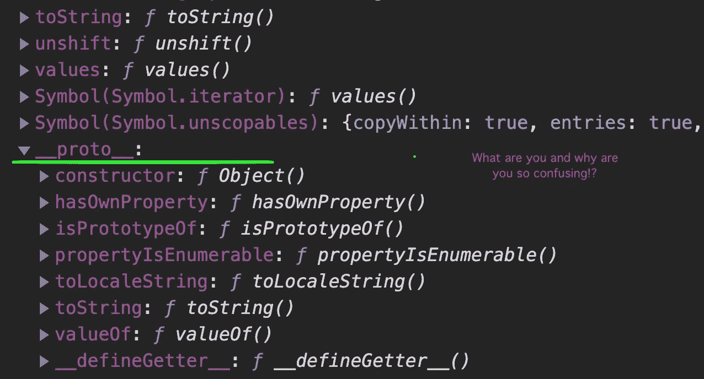
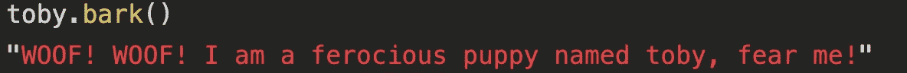
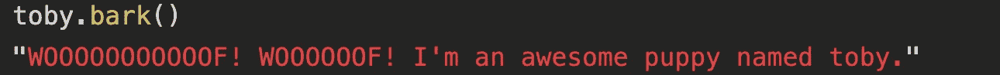
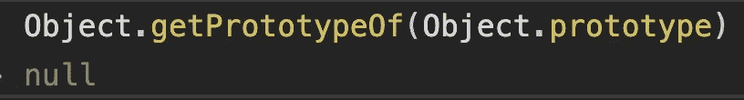

# JavaScript 中的 _proto_ 是什么？

> 原文：<https://betterprogramming.pub/what-is-proto-970978bee7c3>

## 你有没有在调试一些 JavaScript 代码的时候注意到 _proto_ property？


卡斯帕·卡米尔·鲁宾在 [Unsplash](https://unsplash.com?utm_source=medium&utm_medium=referral) 上拍摄的照片。

在我学习 JavaScript 的旅途中，我记得这样做过，并且很快被展开`_proto_`下拉菜单后显示的选项所淹没。这就是为什么我决定解释`_proto_`和`prototype`之间的区别，以及它们与原型继承的关系。



# **原型继承**

为了理解神秘的`_proto_`，我们必须从讨论 JavaScript 的原型继承开始。在 JavaScript 中，对象可以通过对象原型继承属性和方法。

对象原型是当我们声明一个函数时自动初始化的对象。然后，该对象可以用作蓝图来声明方法和属性，这些方法和属性将由使用该对象的构造函数创建的任何对象自动继承。

所有的函数都有一个原型，在继承树的最高层，我们可以找到 JavaScript 的`Object.prototype`。将对象原型视为所有对象的曾曾祖父。一切都可以最终追溯到对象原型。你可以通过阅读官方的 [MDN 文档](https://developer.mozilla.org/en-US/docs/Web/JavaScript/Reference/Global_Objects/Object)来了解更多，并且你可以通过阅读[这篇文章](https://medium.com/@warren.wilsonjr89/javascript-fundamentals-working-with-objects-6be28208880)来更新你的对象知识，但是对于这篇文章来说，我们将关注于构造函数、继承和`_proto_`。

那么`_proto_`在这一切中扮演什么角色呢？

让我们通过一个例子来帮助我们想象当我们使用构造函数创建一个新对象时会发生什么。希望到最后这一切都有意义。

# **创建一个构造函数**

让我们创建一个构造函数:

```
We’re creating a function to create puppy instances. function Puppy(name) {
this.name = name
  }*Our function name is capitalized as this standard practice, but it has no effect on code functionality. 
```

一旦我们声明了上面的函数，就会为我们的`Puppy`函数创建一个原型对象。这个原型对象用两个属性初始化:


1.  上面声明的原始构造函数。
2.  对`Object.prototype`到`_proto_`的引用。

我鼓励你打开你的控制台，尝试一下。

# **创造一只小狗**

下面，我们声明一个名为`toby`的变量，创建一个新的`Puppy`对象，并将其命名为`toby`:

```
const toby = new Puppy(‘toby’);
```

当我们创建这个新的`Puppy`对象时，下面的事情会在幕后发生:

1.  JavaScript 创建一个空对象。
2.  它创建了`_proto_`属性作为新对象的附加属性。此属性是对构造函数的属性的直接引用。
3.  它评估我们的`Puppy`构造函数中的构造函数，作为这个关键字的结果，它返回一个 name 属性设置为`toby`的对象。然后这个对象被分配给我们的常量`toby`。

由于我们正在尝试理解`_proto_`，我希望你能跟上，我鼓励你在你的控制台上键入以下内容:

```
Object.getPrototypeOf(toby) === Puppy.prototype
//this will return true because our toby __proto__ references the Puppy prototype.toby.__proto__ === Puppy.prototype
//this comparison will also return true, but using the __proto__ is not recommended as it's been deprecated, and replaced by Object.getPrototypeOf(object name here). You can also set the prototype of an object with Object.setPrototypeOf(prototype name here), but this is not recommended due to the performance and compability issues this may create.
```

此时，对我们的构造函数原型所做的任何更改都将反映在使用该函数创建的对象中。让我们通过向构造函数的原型添加一个新方法来看看下面的操作:

```
Puppy.prototype.bark = function() {return `WOOF! WOOF! I am a ferocious puppy named ${this.name} , fear me! `}
```

我们现在可以在`toby`上调用我们的`bark`方法。我们的方法将返回下面的代码片段:



但是如果我们决定`toby`超级牛逼，他有一套非常独特的技能和一种特别的叫声呢？我们可以简单地为`toby`定义一个本地方法:

```
toby.bark = function() {
return `WOOOOOOOOOOOF! WOOOOOOF! I'm an awesome puppy named ${this.name}`
  } 
```

现在，当我们调用`toby.bark`时，JavaScript 将看到有一个本地 bark 方法，因此它将执行本地方法，而不是遍历原型链:



然而，如果`toby`决定再次改变他的树皮风格，我们可以删除本地的`bark`方法，JavaScript 将使用`toby`对象中的`_proto_`引用，并开始沿着原型链再次寻找`bark`方法。它将遍历原型链并返回我们上面的第一个例子。

如果我们删除了这两个`bark`方法，JavaScript 将使用`_proto_`引用遍历原型链，一直回到 JavaScript 的对象原型。它没有一个`bark`方法或者一个额外的`_proto_`引用，此时它将返回`null`。

您可以通过在控制台上键入以下代码来验证这一有趣的事实:



```
Object.getPrototypeOf(Object.prototype)
// This returns null because nothing else exists after the Object.prototype. The end of the road. 
```

# TLDR

1.  `_proto_`是在所有 JavaScript 对象中自动创建的属性。该属性引用创建它的原型。
2.  原型是为所有功能自动创建的对象。该原型可用于声明方法和属性，这些方法和属性将由使用该构造函数创建的所有对象继承。
3.  `Object.prototype`是所有其他对象继承的父对象。
4.  这是对 JavaScript 继承的一个简要的抽象解释。要获得更深入的解释，请查看 [MDN 文档](https://developer.mozilla.org/en-US/docs/Learn/JavaScript/Objects/Inheritance)。