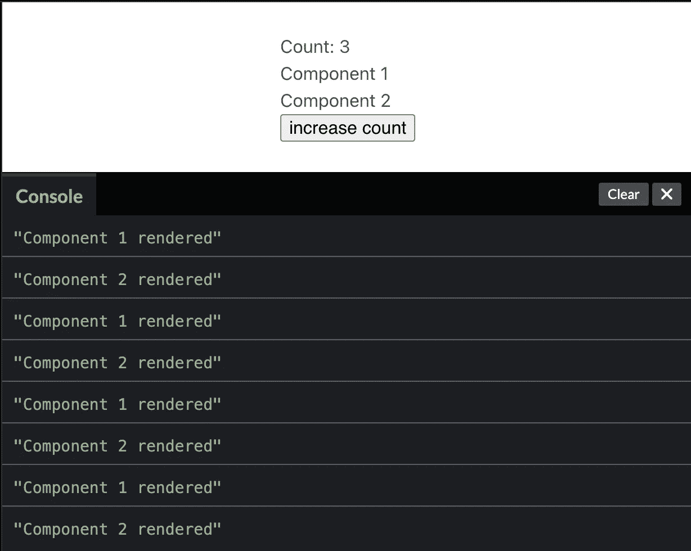
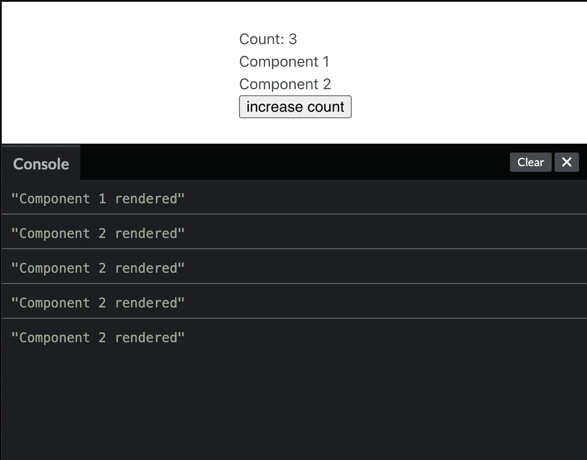
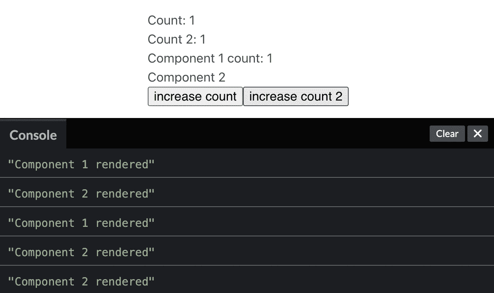

# 什么是 React.memo，它是如何工作的？

> 原文：<https://betterprogramming.pub/what-is-react-memo-and-how-does-it-work-f49b031bba75>

## 为您的 React 应用程序添加更多性能提升

`React.memo`是一个 React 高阶组件，用于跳过重新渲染。

`React.memo`中的“备忘录”指的是计算术语记忆化

> 记忆化是一种[优化](https://en.wikipedia.org/wiki/Optimization_(computer_science))技术，主要用于通过存储昂贵的[函数调用](https://en.wikipedia.org/wiki/Subroutine)的结果并在相同的输入再次出现时返回缓存的结果来加速[计算机程序](https://en.wikipedia.org/wiki/Computer_programs)。

当您用`React.memo`包装一个组件时，React 将使用该组件的最后一个渲染版本。

我在我的 React 应用程序中一直使用内存化来提高性能。

我将回顾一些关于`React.memo`如何工作的简单例子，以及我在自己的项目中发现它有用的地方。

# 入门指南

在上面的例子中，有两个组件在渲染和重新渲染时会写入控制台。`MemoExample`组件包含`Component1`、`Component2`并有一个`counter`状态变量，当它改变时，将触发两个组件重新呈现。

在将计数器更新为 3 之后，每个组件有 4 个日志。一次用于初始渲染，另外三次用于计数器变量的每次更改。

如果我不想让`Component1`在`counter`变量改变时重新渲染，我可以使用`React.memo`跳过它。

现在 Component1 已经被 React.memo 包装好了，让我们看看它是如何工作的。

现在我们让`Component1`为它的初始渲染写一个控制台日志，但是之后就没有了。

# 性能

记忆组件可以像其他组件一样接收道具。如果一个属性值改变，组件将像平常一样重新渲染。

我已经更新了我的示例，添加了第二个计数器，并添加了初始计数器作为组件 1 的属性。

当`counter`增加时，我们应该在控制台中看到组件 1 的日志。当我增加`counter2`时，`Component1`应该像以前一样跳过它的重渲染。

我的控制台显示了两个初始渲染的日志，另外两个是在增加`counter`的值后，只有一个是在`counter2`增加时。

理想情况下，记忆成分应该是纯的。我只建议在记忆化的组件中添加很少改变的属性。

# 跳跃点

如果你正在寻找用`React.memo`练习的方法，应用程序栏是我第一次使用记忆化的地方。

如上图所示的应用程序栏是`React.memo`的绝佳候选，因为它们主要由静态内容组成。如果你正在寻找一个开始记忆的地方，我建议你先去那里看看。

如果你从未在你的应用程序中使用过内存化，你应该能找到一些可以使用它的地方。

希望这对于那些希望为他们的 React 应用程序增加更多性能提升的人来说是常见的。