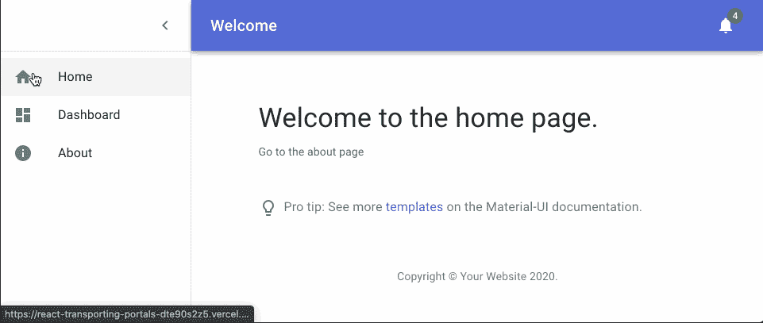

# 什么是反应传送？

> 原文：<https://betterprogramming.pub/what-is-react-teleportation-7d9c5f6eacee>

## 通过门户将 React 组件传输到其他 React 组件

由[paweczerwiński](https://unsplash.com/@pawel_czerwinski?utm_source=unsplash&utm_medium=referral&utm_content=creditCopyText)在 [Unsplash](https://unsplash.com/?utm_source=unsplash&utm_medium=referral&utm_content=creditCopyText) 上拍摄的照片

你有没有想过在应用程序的一个完全不同的部分呈现一个 React 组件？在本文中，我将向您展示如何在第一个组件中控制它的同时做到这一点。

如果你看下面的例子，我们有一个`PortalIn`组件，它将接受传入它的任何内容，并在`PortalOut`组件所在的位置呈现出来。为了实现这一点，两个 React 组件需要有相同的`portalType`(我使用`headerPortal`作为标识符)*。他们还需要被包裹在`PortalProvider`里。*

看看下面的动画。标题中有一个门户，位于通知铃的左侧。有几件事要记住:

*   欢迎页面不向标题门户发送任何内容。
*   仪表板页面向标题门户发送一个计数器按钮，更新页面上的计数。
*   “关于”页面将“呼叫我”按钮发送到标题门户中。

通过内部门户对应用程序做出反应

我们将使用 [React 上下文 API](https://reactjs.org/docs/context.html) 创建一个`PortalProvider`和另外两个 React 组件`PortalIn`和`PortalOut`。

先从`PortalOut`组件说起吧。您会注意到我们可以访问一个`PortalContext`，上面有一个`portalMap`对象，这是一个 JavaScript [Map](https://developer.mozilla.org/en-US/docs/Web/JavaScript/Reference/Global_Objects/Map) 对象，用于跟踪门户组件，这允许我们在`portalType`的帮助下重用`PortalIn` / `PortalOut`组件。当`PortalOut`渲染时，它要么渲染来自`portalMap`的 React 组件，要么什么都不渲染，因为没有与`portalType`匹配的组件。

查看`PortalIn`组件，您可以看到我们从`PortalContext`访问了`addPortalItem`和`removePortalItem`函数。

*   在 [React.useEffect](https://reactjs.org/docs/hooks-reference.html#useeffect) 中，我们通过`addPortalItem`函数将`portalType`和`children`发送给`PortalProvider`，在那里它们被添加到`PortalOut`中的`portalMap`对象中。
*   还要注意，在`useEffect`中，当`PortalIn`组件在 React 应用程序中被卸载时，我们调用`removePortalItem`。这将从`PortalOut`中移除组件。
*   最后，注意我们返回了`null`,所以没有呈现任何东西，因为我们不想在这个组件中显示任何东西。这是`PortalOut`组件的工作。

最后，让我们看看如何使用 [React 上下文提供者](https://reactjs.org/docs/context.html#contextprovider)来创建我们的`PortalProvider`。我们使用 [React.useState](https://reactjs.org/docs/hooks-reference.html#usestate) 和 [Map](https://developer.mozilla.org/en-US/docs/Web/JavaScript/Reference/Global_Objects/Map) 来持有键值对，也就是我们通过 [React.children](https://reactjs.org/docs/react-api.html#reactchildren) 和`portalType`道具传入的`portalType`和`component`。

希望这是有意义的，但是如果你想知道为什么我们每次都需要创建一个`new Map`，那是因为我们需要`useState`在调用`addPortalItem`或`removePortalItem`函数时触发更新。

查看 [Next.js 示例](https://react-transporting-portals-dte90s2z5.vercel.app/)和/或[源代码](https://github.com/codeBelt/react-transporting-portals)。

如果你喜欢这篇文章，请分享它，关注我，阅读我的其他[文章](https://medium.com/@robertsavian)和/或用我下面的推荐链接注册 Medium。谢谢！

 [## 通过我的推荐链接加入 Medium—Robert S(代码带)

### 作为一个媒体会员，你的会员费的一部分会给你阅读的作家，你可以完全接触到每一个故事…

medium.com](https://medium.com/@robertsavian/membership)