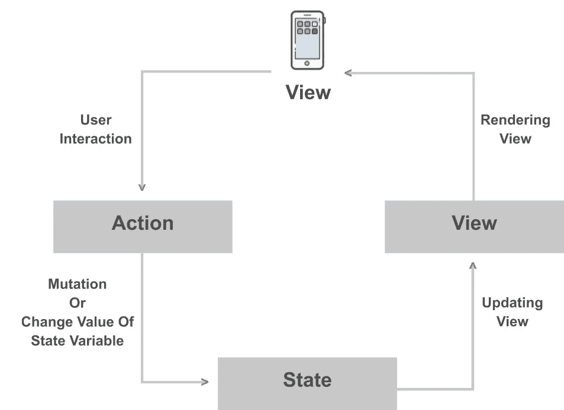
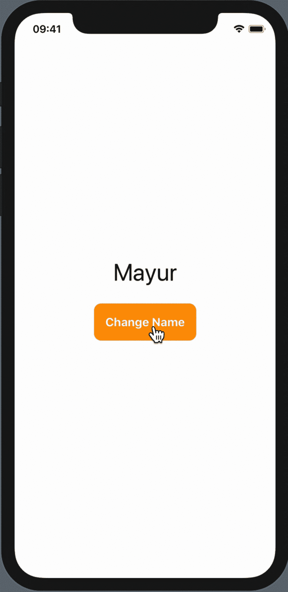
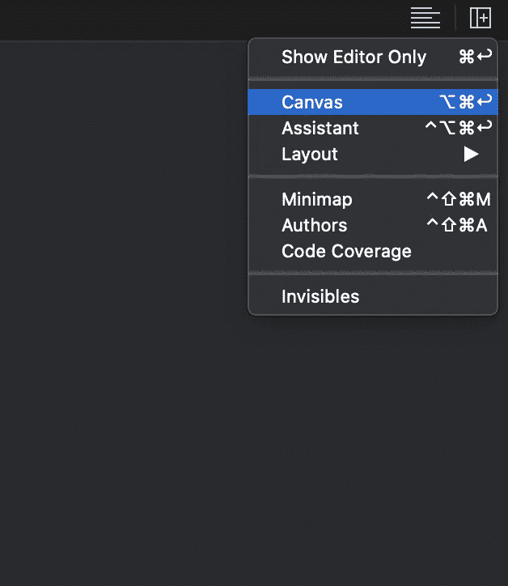
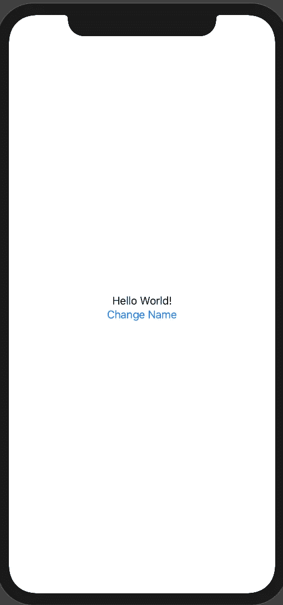
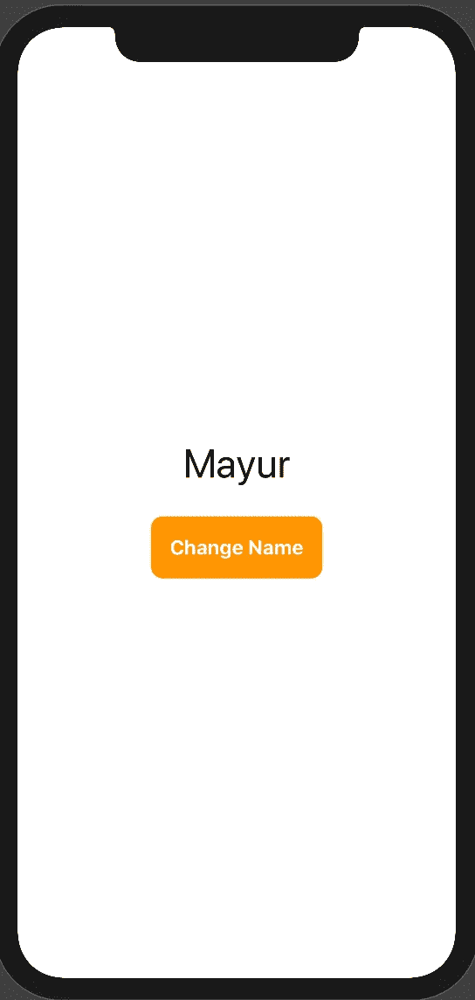

# SwiftUI 中的状态是什么以及我们如何使用它？

> 原文：<https://betterprogramming.pub/what-is-state-in-swiftui-and-how-to-use-it-cc672de85188>

## SwiftUI 中最重要的概念之一的解释


众所周知，苹果发布了 SwiftUI，利用 Swift 的力量在所有苹果平台上构建用户界面。在我向您展示我们将在本文中构建什么之前，让我解释 SwiftUI 开发中最重要的概念之一:状态。

# 什么是国家？

> 状态表示与视图关联的数据。它可以用布尔、字符串、Int 等基本类型来表示，也可以用视图模型等复杂对象来表示。假设你是一个用户，你以某种方式进行交互——你点击按钮，触发一个动作，改变`@State`变量的值。然后它会自动更新用户界面。

## 它如何自动更新用户界面？

使用`View`时，`Content View`符合`View`协议，我们必须写`Body`属性。因此，每当我们更改`@State`变量的值时，它都会更新`View`并且再次评估`body`属性，因此`View`会再次重新渲染。



理论到此为止。让我们看看如何在 XCode 中使用`@State`变量，并了解我们将构建什么。



# 第 1 步:如何创建 SwiftUI 项目

在 XCode 中，转到文件→新建→项目→单视图应用程序→下一步→选择用户界面→ SwiftUI →下一步→选择要保存此项目的项目位置→完成

# 第 2 步:ContentView.swift

默认`SwiftUI(ContentView)` 文件会出现以下代码:

```
**import** SwiftUI**struct** ContentView: View {
**var** body: **some** View {
    Text(”Hello World!”)
  }
}**struct** ContentView_Previews: PreviewProvider { **static** **var** previews: **some** View {
     ContentView()
   }
}
```

在右侧，您可以看到用户界面的预览。如果看不到预览，进入右上方的**调整编辑器选项**，选择**画布**或按 ***选项+命令+回车。*** 然后确保画布正在显示用户界面预览。



# 第 3 步:创建用户界面

定义`ContentView`体内的垂直堆栈。这将包含`Text`和`Change Name`按钮。



代码:

```
VStack {Text(”Hello World!”)Button(“Change Name”)
   {
   //Button action goes
here}
}
```

对于最终的输出，我们想定制文本字体大小，按钮字体大小，背景颜色，文本颜色，我们想使按钮的边缘呈圆形。

首先，我们修改按钮代码，以便可以访问按钮的文本属性。修改后，代码将如下所示:

```
VStack{
   Text(”Hello World!”)
   Button(action: {
   //Button action goes here
   }){
      Text(“Change Name”)
     }
}
```

现在，让我们看看我们将用来实现预期输出的属性。

我们可以使用属性`.font()` ***来改变字体大小。***

```
Text(name)
   .font(.largeTitle) // Font type
```

我们可以使用属性`.background(Color.COLOR_NAME)`改变背景颜色

```
Text(“Change Name”) // Button Text
   .background(Color.orange) // Button Background Color
```

要改变文本颜色，我们可以使用属性`.foregroundColor(Color.COLOR_NAME)`

```
Text(“Change Name”) // Button Text
   .foregroundColor(Color.white) // Button text color
```

为了使边缘呈圆形，我们可以使用属性`.cornerRadius(CORNER_RADIUS_VALUE)`

```
Text(“Change Name”) // Button Text
   .cornerRadius(10.0) // Button corner radius property
```

如果我们将上述所有属性应用于文本和按钮，我们的代码将如下所示:

```
//Vertical Stack
VStack {
   //Text or label of the name
   Text(name)
      .font(.largeTitle) // Font type
      .padding() // Padding to the name text Button(action : { //Button action goes here }){
      //Button Text Properties
      Text(“Change Name”) // Button Text
         .fontWeight(.heavy) // Button Text Weight
         .padding() // Padding to the button
         .background(Color.orange) // Button Background Color
         .foregroundColor(Color.white) // Button text color
         .cornerRadius(10.0) // Button corner radius property
      }
   }
```

输出:



现在我们的 UI 已经准备好了，让我们看看如何使用`@State`变量。

# 步骤 04:如何使用 [@State](http://twitter.com/State) 变量

现在我们声明状态变量。要声明一个状态变量，我们必须在声明变量之前使用`@State`关键字。查看下面一行，更好地理解如何声明状态变量:

```
@State **var** name = “Mayur”
```

每当用户单击按钮时，我们都希望更改状态变量值。为此，我们需要改变`Button ACTION` 块中变量的值。要访问按钮动作方法中的状态变量，我们需要定义`self.STATE_VARIABLE_NAME` ，如下所示:

```
**self**.name = “Rathod”
```

当用户点击按钮时，它改变状态变量值。当状态变量值改变时，它再次呈现视图并改变显示的文本值。

# 祝贺你成功实现了你的输出。

整个代码如下所示:

```
//
//  ContentView.swift
//  State-Demo
//
//  Created by Mayur on 14/10/19.
//  Copyright © 2019 Mayur Rathod. All rights reserved.
//

import SwiftUI

struct ContentView: View {

    @State var name = "Mayur"

    var body: some View {
        //Vertical Stack
        VStack {

            //Text or label of the name
            Text(name)
                .font(.largeTitle)  // Font type

            Button(action : {
                /*
                 - When user clicks on the button this block will be executed
                 - When user click on the button  View will rendered again since we are changing or mutating the @State variabl value
                */
                self.name = "Rathod"
            }){
                //Button Text Properties
                Text("Chnage Name") // Button Text
                    .fontWeight(.heavy) // Button Text Weight
                    .padding()          // Padding to the button
                    .background(Color.orange)   // Button Background Color
                    .foregroundColor(Color.white)   // Button text color
                    .cornerRadius(10.0) // Button corner radius property
            }
        }
    }
}

struct ContentView_Previews: PreviewProvider {
    static var previews: some View {
        ContentView()
    }
}
```

# 资源

*   在 [Github](https://github.com/rathodmayur93/SwiftUIStateDemo) 上的项目回购