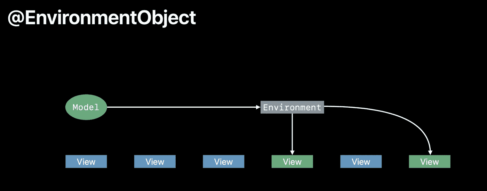
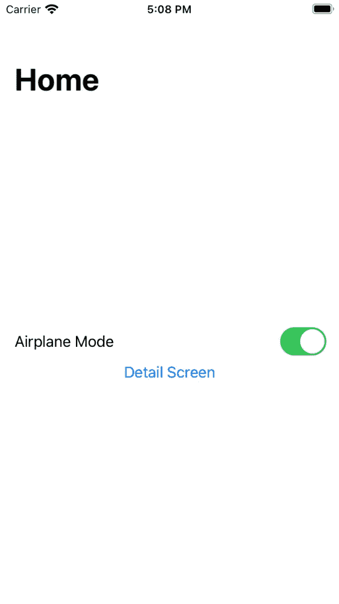
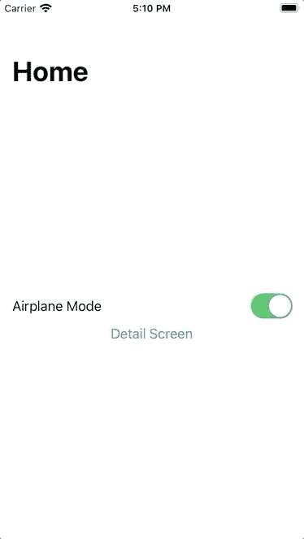

# SwiftUI 的@EnvironmentObject 是什么？

> 原文：<https://betterprogramming.pub/what-is-swiftuis-environmentobject-4eb4aee8fc38>

## 如何以及何时在您的 SwiftUI 项目中使用它


照片由[吕山德元](https://unsplash.com/@lysanderyuen?utm_source=unsplash&utm_medium=referral&utm_content=creditCopyText)在 [Unsplash](https://unsplash.com/s/photos/central?utm_source=unsplash&utm_medium=referral&utm_content=creditCopyText) 上拍摄

您可能认为`@EnvironmentObject`是共享数据，多个视图可以使用它来获取数据。如果您的数据将在应用程序的许多部分共享，则应使用此选项。

> "由父视图或祖先视图提供的可观察对象的属性包装类型."— *苹果文档*

在本教程中，您将了解 SwiftUI 中的`@EnvironmentObject`是什么。您将了解到:

*   如何使用`@EnvironmentObject`。
*   何时使用`@EnvironmentObject`。

# 先决条件

要跟随本教程，您需要对 Swift 有一个基本的了解，并至少具备 Xcode 11 的一些基础知识。

# 何时使用@EnvironmentObject

给定一个场景，视图 A 创建一个对象并将其放入环境中，任何视图都应该能够在需要时访问该对象。这样就省去了很多屏幕间传递的麻烦。



但是，如果没有正确配置，就会有一个陷阱。当你在代码中声明`@EnvironmentObject`时，SwiftUI 会自动寻找该对象，如果找不到，你的应用会立即崩溃。

请注意，当您使用`@EnvironmentObject`时，您实际上是在说一个对象存在，并且您应该始终确保它确实存在。

# 如何使用@EnvironmentObject

通过`@EnvironmentObject`，SwiftUI 允许您在应用程序中的所有视图之间进行共享。对我来说，这听起来很像是一个独生子，但事实并非如此。

`@EnvironmentObject`更实际的应用是用户从视图 A 移动到视图 B，然后到视图 C，再到视图 D，信息在屏幕间传递。视图 A 可以将数据传递给环境，而不是在屏幕之间传递，然后您可以在视图 d 中从环境中检索数据，这样您的代码看起来会更整洁。

您正在构建一个应用程序，您想知道是否切换了黑暗模式。您首先创建一个`ObservableObject`:

```
class DeviceSetting: ObservableObject {
    @Published var isDarkMode = false
}
```

接下来，在`SceneDelegate`中，初始化`DeviceSetting`:

```
var deviceSetting = DeviceSetting()
```

并按如下方式将其与您的`ContentView`连接:

```
let contentView = ContentView().environmentObject(deviceSetting)
```

您将要操作的第一个屏幕是`ContentView`。这有点像你的主页。

在这里你可以根据自己的需要切换黑暗模式。



下一个屏幕是详细屏幕，您可以在其中设置黑暗模式的状态。

```
@EnvironmentObject var deviceSetting: DeviceSettingvar body: some View {
    HStack {
        Text("Dark Mode is")
        self.deviceSetting.isDarkMode ? Text("Enabled") : Text("Disabled")
    }.navigationTitle("Setting Screen")
}
```

看看这是如何做到的:

