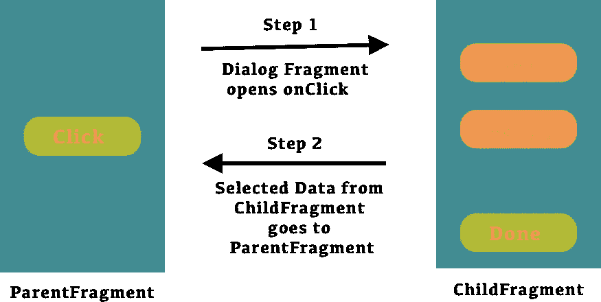

# 什么是目标碎片？

> 原文：<https://betterprogramming.pub/what-is-target-fragment-da0e7c7f345c>

## 如何在 Android 中有效地从 ChildFragment 传递到 ParentFragment



片段是可以放在活动中的应用程序用户界面或行为的一部分。

与片段的交互是通过 FragmentManager 完成的，可以通过`Activity.getFragmentManager()`和`Fragment.getFragmentManager()`获得。

片段与其所在的活动密切相关，不能脱离活动单独使用。尽管一个片段定义了它自己的生命周期，但是这个生命周期依赖于它的活动。如果活动停止，它内部的任何片段都不能启动。当活动被销毁时，所有碎片都将被销毁。

片段之间有多种通信方式，如接口、共享`ViewModel`等。

但是你知道吗，通过使用标准方法`setTargetFragment()`和`getTargetFragment()`，我们可以很容易地从子片段到父片段进行通信，并在父片段的`onActivityResult()`中接收回调。

## **用例**

当我们打开一个对话框片段时，用户需要从可用选项列表中选择一个选项，然后当他们单击 OK 按钮时，我们需要将所选选项返回到父片段。

# 步伐

1.  如果我们想从一个片段与另一个片段通信，那么从`ParentFragment`开始，我们必须使用`setTargetFragment` ( `ParentFragment`实例，`RequestCode`)。
2.  之后，我们调用对话框片段上的`show()`方法来显示可用选项的列表。
3.  然后用`onActivityResult` ( `RequestCode`，`Activity.RESULT_OK`，意图)。因此，来自`ChildFragment`的回调可以在`ParentFragment`的覆盖方法`onActivityResult`中接收。
4.  从`ChildFragment`开始，我们必须使用`getTargetFragment()`，如果使用`setTargetFragment()`设置了任何东西，它将返回`ParentFragment`实例。

让我们用一个例子来更好地理解它。

第 1 步:让我们调用父片段中的`showOptionsDialog()`,它显示了一个带有选项列表的`OptionsDialogFragment`。

第二步:在`ParentFragment`中实现`onActivityResult()`，在这里我们接收来自`ChildFragment`的回调，并根据结果执行一个动作。

第三步:当用户点击`OptionsDialogFragment`中的一个选项时，调用`onExit(selection: String)`，我们编写逻辑将回调返回到`ParentFragment`。

来自文档`setTargetFragment()`。

来自文档`getTargetFragment()`。

```
*/**
 * Return the target fragment set by {#setTargetFragment}.
 */* @Nullable
final public Fragment getTargetFragment() {
  ............
}
```

请让我知道你的建议和意见。

感谢阅读！