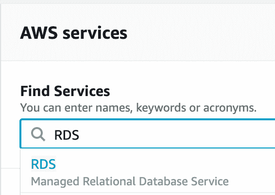
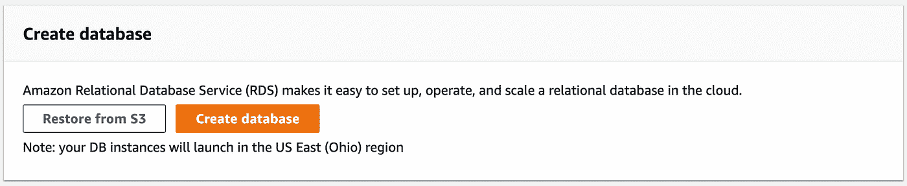
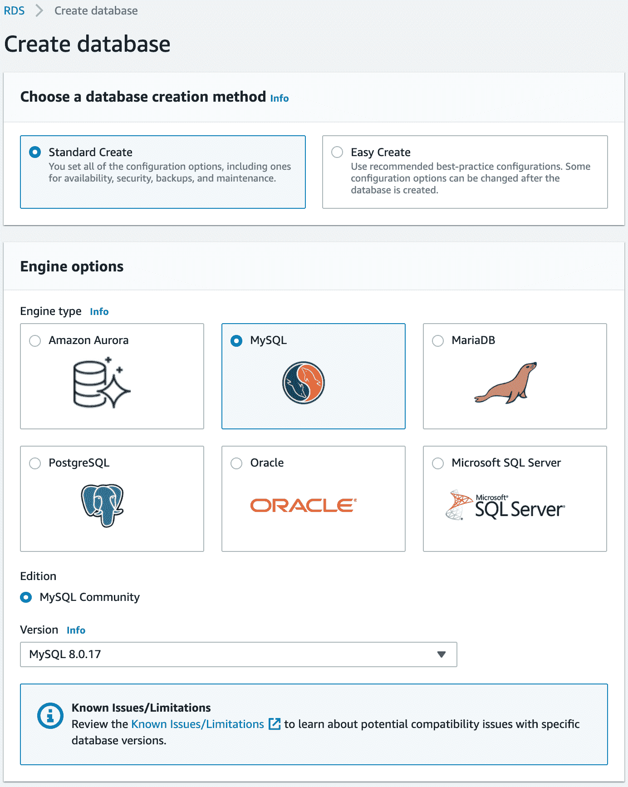
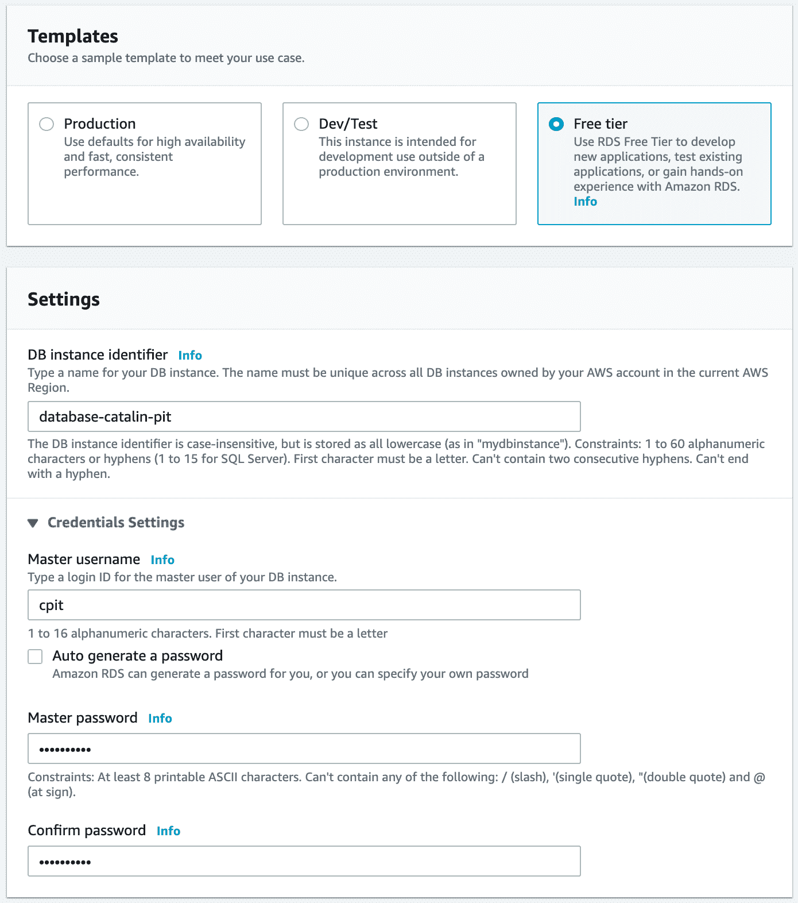
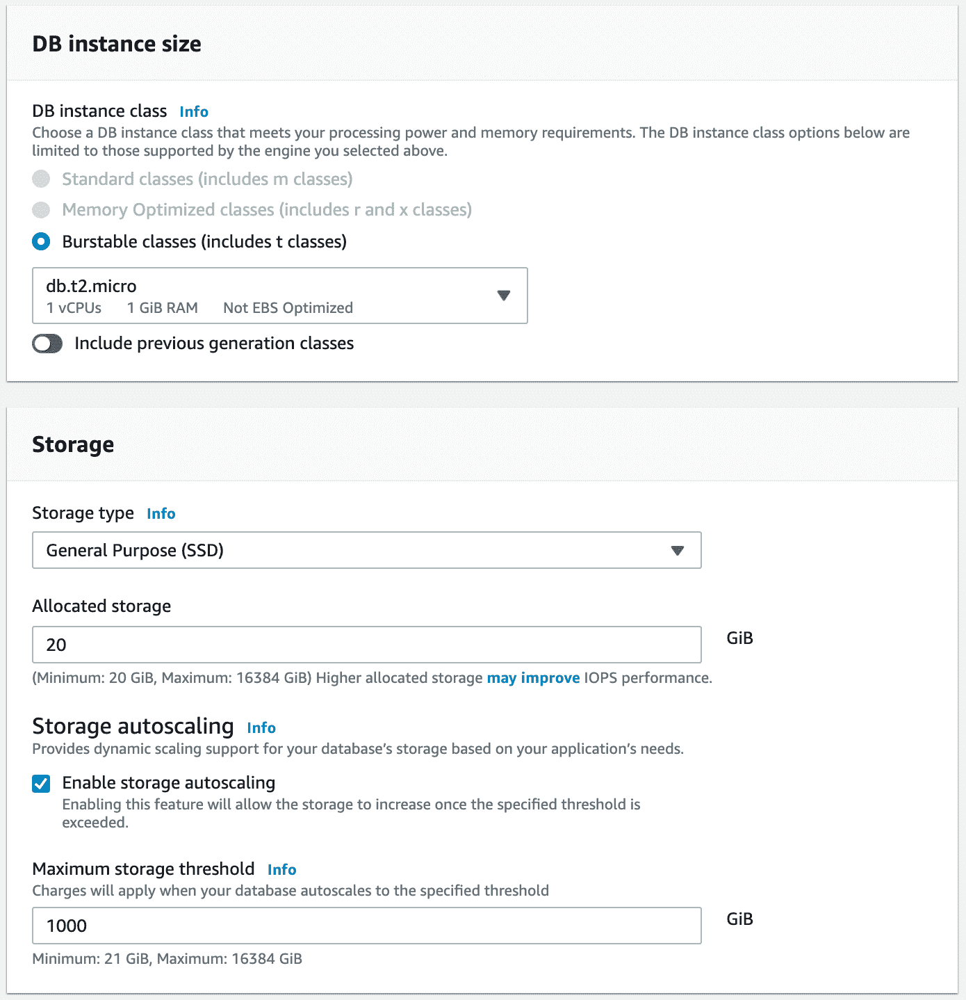
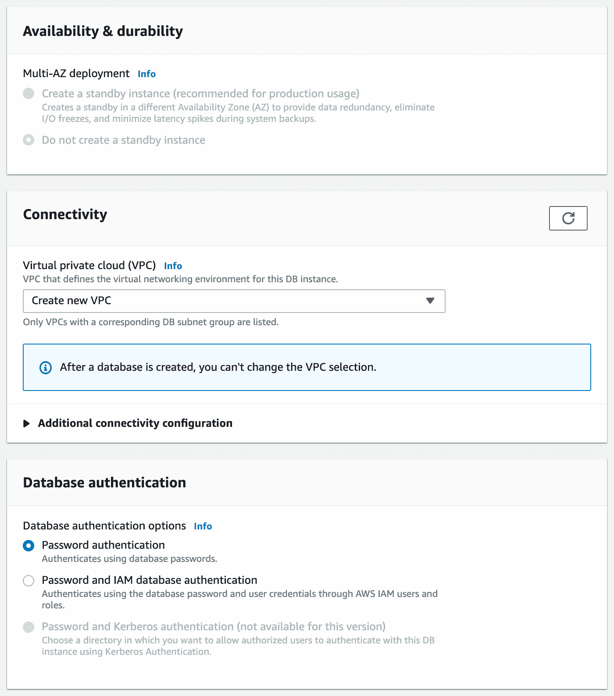

# 什么是亚马逊关系数据库服务？

> 原文：<https://betterprogramming.pub/what-is-the-amazon-relational-database-service-853e19875ac>

## AWS RDS 的基础知识

亚历克斯·马查多在 [Unsplash](https://unsplash.com?utm_source=medium&utm_medium=referral) 上的照片。

Amazon 关系数据库服务允许我们在云中创建、运行和管理关系数据库。使用 RDS，您可以从六个著名的关系数据库引擎中进行选择:

1.  Aurora (AWS 的关系数据库)
2.  关系型数据库
3.  一种数据库系统
4.  SQL Server
5.  MariaDB
6.  Oracle 数据库

您为什么会选择使用 AWS RDS？RDS 将复杂的任务抽象化，让您专注于最重要的任务。例如，RDS 自己管理备份、修补、故障检测和恢复。

因此，你可以专注于更重要的任务，而不是花时间去做所有这些。如您所见，AWS RDS 为我们提供的不仅仅是一个数据库。

# RDS 备份

最重要的主题之一是数据库备份。原因是如果我们的数据库发生了不好的事情，我们不想丢失所有的数据。首先，RDS 默认启用备份。其次，我们可以通过两种方式在 RDS 中备份数据:

1.  自动备份
2.  手动快照

## 自动备份

使用自动备份，数据最多可存储七天。您可以将该限制增加到最长 35 天。此外，您可以定义希望备份过程运行的时间窗口。在备份过程中，存储 I/O 可能会暂停。除此之外，AWS RDS 每五分钟备份一次事务日志。事务日志代表所有的数据库修改。

因此，通过自动备份，您可以将数据库还原到过去的任何时间点。

## 手动快照

用户必须手动拍摄快照。此外，您可以根据需要存储手动快照。

因此，当您希望长期存储数据库备份时，手动快照非常有用。

# 加密

AWS RDS 的所有数据库引擎都支持静态加密。在继续之前，让我们澄清一下“静止”是什么意思。就本文而言，有两种类型的加密。静态加密*指的是对数据库中的数据进行加密。另一方面，传输中的加密*意味着在不同实体之间移动时对数据进行加密。例如，两个服务之间的数据。**

让我们回到 AWS RDS。如果您打开静态加密，它还会加密自动备份、快照和读取副本。加密使用 AWS 密钥管理服务(KMS ),并允许您加密主副本和读取副本。警告是:

*   您必须在启动时加密它们。
*   如果不加密主文件，就不能加密读取副本。

## 在途/飞行加密

为了加密在不同实体之间移动的数据，我们必须使用 SSL 证书。我这么说是什么意思？当连接到数据库时，我们需要提供带有信任证书的 SSL 选项。

# 读取副本和多可用性区域

读取副本和多可用性区域是两个不同的概念。使用读取副本，您可以从原始数据库中分担一些负载。例如，应用程序在原始数据库上写入数据(例如，添加新记录)并从副本中读取数据。原始数据库的第二个副本称为读取副本，其唯一目的是允许应用程序读取数据。我们为什么要这么做？当对数据库的请求太多时，我们这样做是为了避免降低速度。最多可以有五个读取副本，它们仅用于读取数据。

说到多可用性区域，我们在两个不同的区域中有相同的数据库。例如，AZ 1 中的数据库正在发生读写操作。然后其中的每一个变化都被复制到 AZ 2 中的另一个数据库。多 AZ 非常适合灾难恢复。如果主数据库关闭，备用(辅助)数据库将成为主数据库。

因此，如果您想从数据库中分担一些负载，请创建一个读取复制副本。另一方面，如果希望避免数据库无响应，可以使用多 AZ 选项。

# 如何创建和配置数据库

首先，登录你的 AWS 账户，在下拉菜单中搜索 RDS 服务。图 1 展示了一个例子:

图 1

单击服务后，您将被带到一个新页面，在这里您可以创建数据库。你可以在左侧点击“数据库”选项，然后点击“创建数据库”或者您可以向下滚动页面并点击“Create database”按钮，如图 2 所示。无论你选择哪个选项都可以。

图 2

之后，您将转到另一个页面，在那里您可以选择并配置数据库引擎。如图 3 所示，我们必须首先选择一个数据库创建方法。因为本教程的目的是学习如何创建数据库，所以我们选择“标准创建”选项。如果我们选择另一种方法，AWS 将为我们完成大部分配置。

然后，下一步是选择数据库引擎。除了 Aurora，我们可以选择任何数据库引擎。原因是它不包含在免费层中。所以，我随机选择了 MySQL。

图 3

下一步，我们需要为我们的数据库选择一个模板。因为我们只想用一个数据库来测试它，所以我们选择了“自由层”选项。

然后，我们选择数据库的名称、用户名和密码，如图 4 所示。

图 4

当我们继续选择数据库大小时，如图 5 所示，它将我们限制在仅仅`db.t2.micro`。原因是我们正在使用免费层。然而，如果您从图 4 中选择“生产”或“开发/测试”模板，您可以选择任何大小。

说到存储，20GB 的 SSD 对于我们的数据库来说已经足够了。此外，我们让“启用存储自动扩展”保持启用状态。这意味着当存储空间已满时，AWS 会自动增加存储容量。

图 5

如果我们选择“生产”或“开发/测试”，我们可以选择多 AZ 部署。建议您为生产数据库选择多 AZ。原因是如果您的数据库发生问题，在另一个区域中有一个副本可用。但是，由于我们使用的是免费层，因此此选项不可用。

谈到连接，您可以选择现有的 VPC 或创建一个新的。对于本教程，我保留默认选项。也就是说，它创造了一个新 VPC。此外，默认情况下，数据库是不公开的。如果你想让它公开，你必须指定。

最后，您必须选择数据库认证。通过保持默认启用，这意味着您使用数据库密码进行身份验证。

图 6

最后一步是单击“创建数据库”按钮，数据库将启动并运行。在 AWS 上创建第一个关系数据库做得很好！

# 结论

在本文中，您了解了 AWS RDS，这是另一项重要的 AWS 服务。您还在云中创建了一个关系数据库。让我们看看这篇文章的要点:

*   RDS 是一种允许我们在云中创建、运行和管理关系数据库的服务。
*   您可以在六个流行的引擎中进行选择:Aurora、MySQL、PostgreSQL、MariaDB、SQLServer 和 Oracle Database。
*   有两种类型的备份:自动备份和手动快照。
*   有两种类型的加密:静态和转换/飞行中。
*   您可以使用读取副本运行数据库的多个副本。它通过将读取定向到副本数据库来承担主数据库的负载。
*   多 AZ 有助于灾难恢复。如果主数据库丢失，辅助数据库将成为主数据库。

*如果对 JavaScript 教程感兴趣，我推荐* [*前端高手*](https://catalins.tech/frontend-masters-membership-is-it-worth-it) *！*

*如果你想用技术写作赚钱，就去查查* [*那些付钱让你写*](https://catalins.tech/websites-that-pay-you-to-write-technical-articles) *技术文章的网站吧！*

*如果你想学习 JavaScript，我推荐这些* [*5 资源作为初学者学习 JavaScript*](https://catalins.tech/5-best-resources-to-learn-javascript-as-a-beginner)*！*

*谈判你的工资是必不可少的——学习* [*作为一名开发人员如何谈判你的工资*](https://catalins.tech/how-to-negotiate-your-salary-as-a-developer) *！*

*用* [*Git 别名*](https://catalins.tech/git-aliases-what-are-they-and-how-to-use-them) *加速你的开发。*

*如果你想以开发者的身份* [*开博客*](https://catalins.tech/how-to-start-your-blog-as-a-developer) *，我推荐阅读《* [*如何以开发者的身份开博客*](https://catalins.tech/how-to-start-your-blog-as-a-developer) *》一文！*

你是否很难跟上科技领域的最新消息？参见 [*作为开发者保持最新状态的一种方法*](https://catalins.tech/one-way-to-stay-up-to-date-as-developer) *！*

*学习* [*如何在 JavaScript*](https://catalins.tech/how-to-use-asyncawait-in-javascript) *中使用 Async/Await！*

GitHub 简介目前风靡一时。了解 [*如何创建 GitHub 个人资料页面*](https://catalins.tech/how-to-create-a-kickass-github-profile-page) *！*

*查看这 7 个* [*资源，帮你通过求职面试*](https://catalins.tech/7-github-repositories-to-help-you-crush-your-job-interviews) *！*

*查看*[*JavaScript ECMAScript 2021 es 2021*](https://catalins.tech/javascript-es2021-you-need-to-see-these-ecmascript-2021-features)*即将推出的新功能！*

*你是初学程序员吗？查看这些* [*编程项目思路适合初学者*](https://catalins.tech/10-programming-project-ideas-for-beginners) *！*

你是在学习编码还是打算做编码？查看 [*免费学习编程的最佳地点*](https://catalins.tech/20-best-places-to-learn-programming-for-free) *！*

[*用这 9 个浏览器扩展提高你的开发者生产力*](https://catalins.tech/my-9-must-have-browser-extensions-for-increased-developer-productivity) *！*

*如果你是 Node.js 的开发者，我建议你查看 Node.js* *中的这些* [*4 种创造性的设计模式！*](https://catalins.tech/the-4-creational-design-patterns-in-nodejs-you-should-know)

*查看这些惊人的*[*JavaScript ECMAScript 2020 特性*](https://catalins.tech/javascript-es2020-the-features-you-should-know) *！*