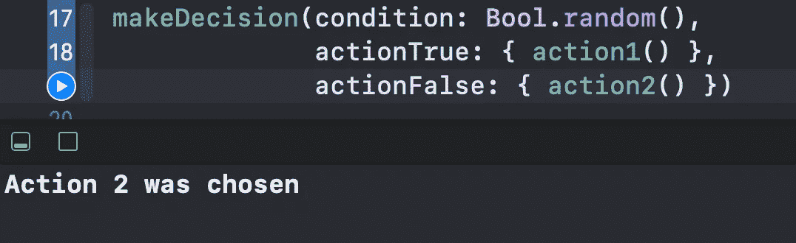

# Swift 中的@autoclosure 属性是什么？

> 原文：<https://betterprogramming.pub/what-is-the-autoclosure-attribute-in-swift-5e9aebc47135>

## 让你的代码更加简洁高效

照片由[韦斯·希克斯](https://unsplash.com/@sickhews?utm_source=medium&utm_medium=referral)在 [Unsplash](https://unsplash.com?utm_source=medium&utm_medium=referral) 上拍摄

在这个简短的教程中，我们将探索 Swift 中的 autoclosure 是什么，以及如何在一个简单的 [Xcode Playground](https://developer.apple.com/swift-playgrounds/) 示例中使用它。我们将学习:

*   如何使用闭包来延迟代码的执行
*   如何应用`@autoclosure`属性使你的代码更加健壮

# 我们开始吧

首先，考虑这个接受一个`Bool`值和两个闭包的函数:

这里，基于传递的`condition`值，我们或者调用`actionTrue`或者`actionFalse`闭包。在这种情况下，使用闭包作为参数允许我们确保只有一个作为参数传递的函数会被调用。

让我们为每种情况添加几个函数:

现在我们可以如下调用`makeDecision`函数:

如果我们运行操场，我们会看到只有`action2()`被调用，正如我们所需要的:

这很好，但是我们是否总是必须将我们传入的每个函数的`actionTrue`和`actionFalse`参数包装在一个闭包里？

这就是`@autoclosure`属性的用处。让我们更新`makeDecision`函数如下:

现在我们可以在调用`makeDecision`时简单地传递`actionTrue`和`actionFalse`参数中的函数:

这消除了将每个函数包装在闭包中的必要性，并使您的代码更容易理解。

# 包扎

要了解更多关于闭包的知识，即什么是转义/非转义闭包，它们的缩写形式，什么是值捕获，等等，请访问这篇由[崔永](https://medium.com/u/88ff1e2545d0?source=post_page-----5e9aebc47135--------------------------------)撰写的文章。

感谢阅读！