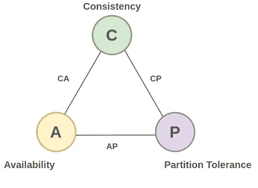
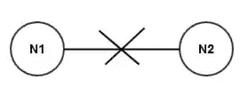

# 什么是 CAP 定理，用在哪里？

> 原文：<https://betterprogramming.pub/what-is-the-cap-theorem-and-where-is-it-used-363475aa8db6>

## 一致性、可用性、分区容差

迈克尔·泽兹奇在 [Unsplash](https://unsplash.com?utm_source=medium&utm_medium=referral) 上的照片。

CAP 定理，也称为 Brewer 定理，指出任何[分布式数据库](https://nlogn.in/what-is-database-sharding-and-how-is-it-done/)系统都不可能同时提供以下两个以上的属性:

*   一致性
*   有效性
*   分区容差

CAP 定理

随着并行处理和分布式系统的进步，横向扩展[或拥有更多机器变得更加常见，CAP 定理是这种架构的支柱。下面我们来详细探讨一下 CAP 定理的特点。](https://nlogn.in/horizontal-scaling-and-vertical-scaling/)

# 一致性

一致系统是指所有节点同时看到相同数据的系统。换句话说，如果我们在多次写操作之后执行读操作，那么一致的系统应该为所有读操作和最近的写操作返回相同的值。

请注意，CAP 定理中定义的一致性与 [ACID](https://en.wikipedia.org/wiki/ACID) [数据库事务](https://en.wikipedia.org/wiki/Database_transaction)中保证的一致性有很大不同。

# 有效性

高可用性分布式系统是指在 100%的时间内保持运行的系统。发出的每个请求都应该被接受并收到一个(无错误的)响应。注意:响应不需要包含最新的写入值(即系统不需要一致，但应该始终可用)。

# 分区容差

它指出，即使节点之间的连接延迟或中断，系统也应该继续运行。注意:这并不意味着节点已经关闭。节点已启动，但无法通信。

假设我们两个节点(N1 和 N2)都连接在一起。现在假设连接两个节点的网络出现故障(网络被分割)。节点 N1 和 N2 都已启动并正常运行，但是在节点 N1 发生的更新无法再到达节点 N2，反之亦然。

在现代分布式系统中，分区容差更像是一种需要，而不是一种选择，因此我们无法避免 CAP 中的“P”。所以我们必须在一致性和可用性之间做出选择。

# 可用组合

1.  CP(consistency and partition tolerance):**所有节点间数据一致，节点维护分区容差。去同步节点将不接受任何请求。一些请求将被丢弃，而不是返回不一致的(最新的)信息。假设我们有两个节点，其中一个节点(N2)在检测到连接系统的网络被分区后停止处理读/写请求。这意味着系统将节点 N2 视为不再可用，此节点上的任何请求都将被拒绝，因为它最终将返回数据的旧/过时拷贝。因此，这种系统提供了一致性和分区容差。例子:Google Bigtable，Hbase，MongoDB，MemcacheDB，Redis。**
2.  **AP(可用性和分区容忍度):分布式系统是高度可用的，系统是分区容忍度的，所以每个读请求不能保证是最新的信息，但是会被处理。
    例子:伏地魔，SimpleDB，CouchDB。**
3.  **CA(一致性和可用性):这在任何分布式架构中都是不可能的。它只能在一些不可扩展的整体架构中找到。**

# **进一步阅读**

**谷歌文档和 Gmail 以可用性为代价来加强一致性。您在不同设备上看到的结果将是相同/一致的。**

**谷歌搜索、Twitter 和 YouTube 关注可用性和宽松的一致性——因此你看到的结果将取决于响应你的请求的服务器的状态，不同的服务器可能有不一致的状态。这就是为什么你有时会在 YouTube 或 Twitter 上看到不一致的喜欢或观点结果。**