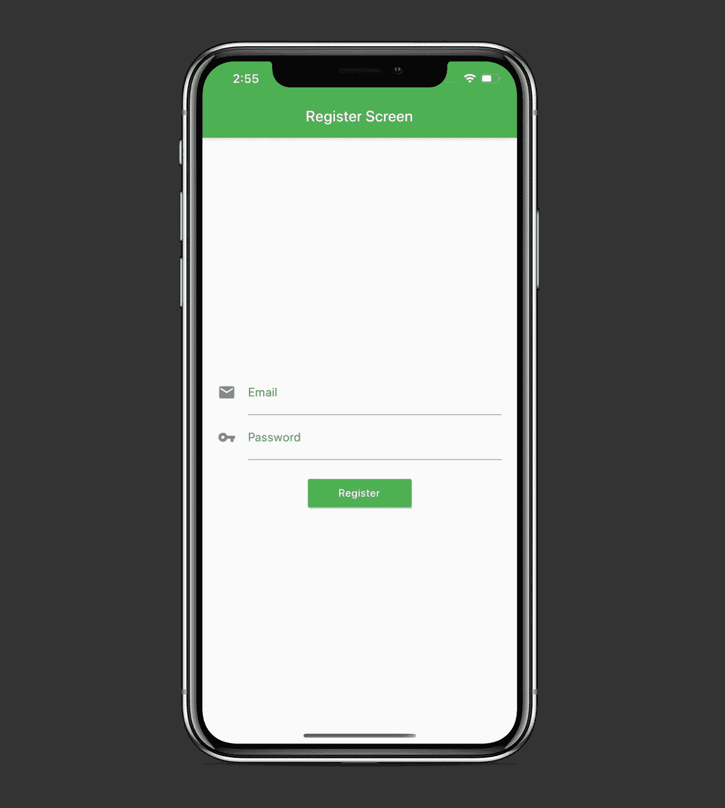
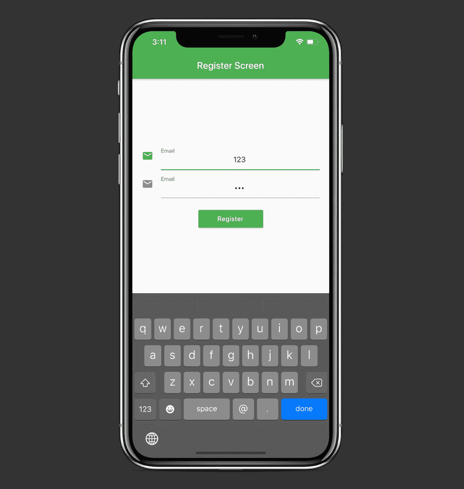

# Flutter 中的' copyWith()'操作是什么？

> 原文：<https://betterprogramming.pub/what-is-the-copywith-operation-in-flutter-2567e4d924bf>

## 通过一些修改重用现有的小部件

[布鲁斯洪](https://unsplash.com/@hongqi?utm_source=medium&utm_medium=referral)在 [Unsplash](https://unsplash.com?utm_source=medium&utm_medium=referral) 上拍照

在本教程中，我们将学习在 Flutter 中方便的`copyWith()`操作。

它允许我们获得现有小部件的副本，但有一些特定的修改。

该项目的源代码可以在文章的底部找到。

# 我们开始吧

考虑以下布局:

我们可以看到，我们有两个外观相似的文本字段和一个按钮。我们如何在不编写重复代码的情况下使这些文本字段具有相同的样式？

让我们直接进入代码，探索一下`copyWith()`操作。

这是我们的`main.dart`文件:

而实际的`RegisterScreen`小部件:

我们可以看到在两个`TextField`窗口小部件中，我们写了几乎相同的`InputDecoration`代码。我们如何缩短我们的代码呢？

让我们在一个新的`constants.dart`文件中创建一个名为`kTextFieldDecoration`的常量:

现在，我们可以在文本字段中使用它(不要忘记在顶部导入`constants.dart`文件):

但是现在我们有一个问题——两个文本字段现在都显示`‘Email’`作为提示:

这里是`copyWith()`函数派上用场的地方。现在，我们能够复制现有的`kTextFieldDecoration`并且只改变它的一些属性:

我们可以看到我们更改了`icon`、`hintText`和`labelText`属性。两个文本字段的`labelStyle`属性保持不变。

注意，当我们创建`Theme`小部件时，我们还使用了`copyWith()`操作来指定某种颜色并复制其他属性。

# 资源

该项目的源代码可以在 GitHub 上找到:

 [## zafarivaev/copywithfutter

### 新的颤振应用。这个项目是颤振应用的起点。一些资源让你…

github.com](https://github.com/zafarivaev/CopyWithFlutter) 

# 包扎

想了解更多关于旋舞镖的知识？请随意查看我的其他相关作品:

 [## 在 Flutter 中创建跨平台的选项卡式应用程序

### 使用 MaterialApp、AppBar 和 BottomNavigationBar 小部件

medium.com](https://medium.com/better-programming/create-a-cross-platform-tabbed-app-in-flutter-c728ca5e30f6)  [## Flutter 中的导航仪是什么？

### 如何促进跨平台应用内部的流动

medium.com](https://medium.com/better-programming/what-is-the-navigator-in-flutter-640e864892e2)  [## 如何在 Dart 中实现委托设计模式

### 了解 Dart 中的 mixins 以及它们与 Swift 协议的比较

medium.com](https://medium.com/better-programming/how-to-implement-the-delegation-design-pattern-in-dart-d782de77c886) 

感谢阅读！