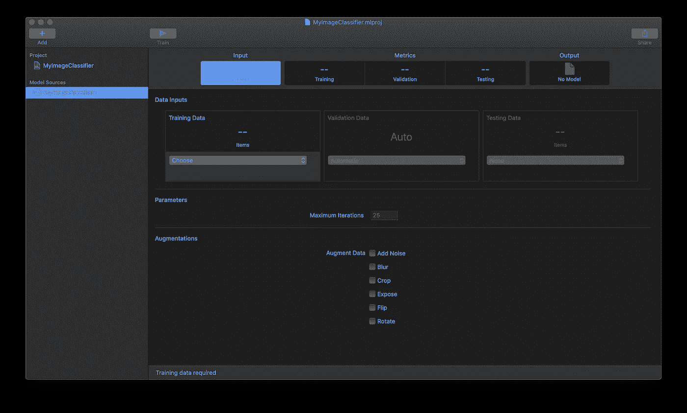
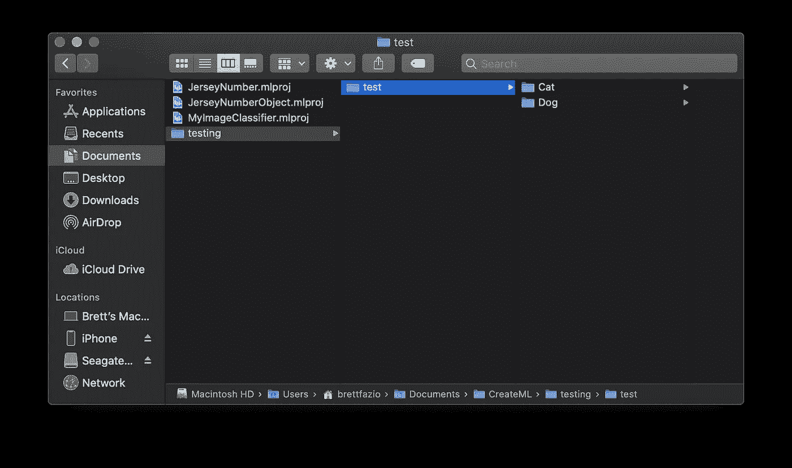
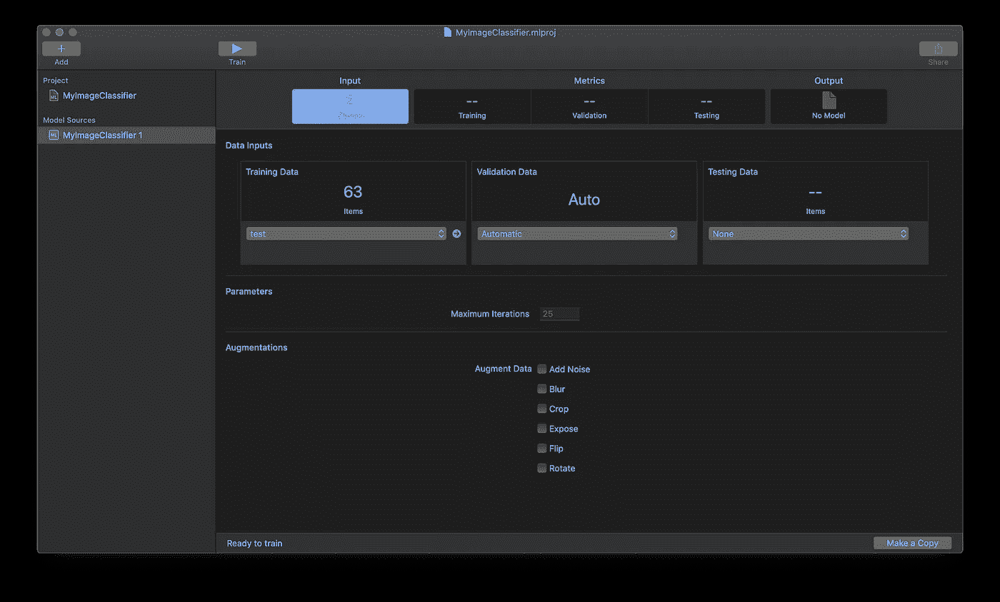
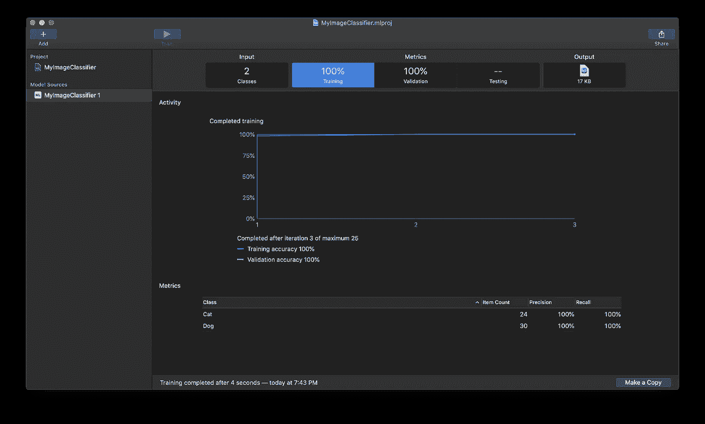

# 什么是创建 ML 框架？

> 原文：<https://betterprogramming.pub/what-is-the-create-ml-framework-d269cff60dcc>

## 了解如何创建 ML 以及如何立即开始构建模型

[丹尼尔·麦卡洛](https://unsplash.com/@d_mccullough?utm_source=medium&utm_medium=referral)在 [Unsplash](https://unsplash.com?utm_source=medium&utm_medium=referral) 上拍照。

Create ML 是苹果公司最新推出的一套强大的第一方开发工具。

从我有机会获得奖学金参加的 WWDC17 开始，苹果推出了 Core ML——他们的第一方 ML 框架，使 ML 模型能够无缝嵌入到 iOS 和 macOS 应用程序中。Create ML，既是框架又是应用，在一年后的 WWDC18 上亮相。

根据 [Core ML 文档](https://developer.apple.com/documentation/coreml)，Core ML 的目的是“将机器学习模型集成到你的应用程序中。”太好了！但是，如果您是一名经过培训的 iOS 开发人员，并且没有任何 Python/TensorFlow 技能来自己创建模型，该怎么办呢？那么，创建 ML 作为一个补充。

[Create ML 的文档](https://developer.apple.com/documentation/createml)称 Create ML 的目的是“创建在你的应用中使用的机器学习模型。”因此，现在 iOS 和 macOS 开发人员有了一个端到端的途径来创建用于他们应用程序的模型。

# 在 Create ML 中可以创建哪些类型的模型？

Create ML 支持五种不同类别的模型:

*   图像
*   声音
*   移动
*   文本
*   桌子

在图像中，用户可以建立分类和检测模型。声音和动作只支持分类。文本支持分类和标记。表支持创建分类器、回归器和推荐器模型。

# 在 Create ML 中制作一个模型有多简单？

为了演示，我将创建一个图像分类模型来分类图像是猫还是狗。

随着 Create ML 的打开，我创建了一个新的`Image Classifier`项目:

一个空白的创建 ML 项目

在我的第一个模型源上，我将上传一个包含我所有训练数据的文件夹。我上传的文件夹名为`test`，基本结构如下:

训练数据的结构

`Cat`文件夹包含我所有的猫的训练图像，我的`Dog`文件夹包含我所有的狗的训练图像。

上传我的训练数据后，创建 ML 看起来是这样的:

一个创建 ML 项目准备培训

此时，模型已经准备好进行训练，尽管您可以扩充数据，设置要用作验证的数据量，并添加测试数据。

现在，您只需单击“Train ”,就会创建一个模型。

使用创建 ML 的培训结果

如您所见，输出是一个名为 a 的 Create ML 模型，类型为`.mlmodel`。

# 在 iOS 应用程序中的使用

要在你的 iOS 应用程序中使用你新创建的`.mlmodel`，你只需将那个`.mlmodel`拖放到你的 iOS 应用程序中，然后集成就是一个简单的一行程序:

`CatDogClassifier`是你的名字`.mlmodel`。

要在您的应用中使用您的模型，您将使用一个`VNCoreMLRequest`对象:

这个对象调入`processClassifications`，可以这样定义:

在这个函数中，如果有超过 90%的把握认为请求是一个特定的标签，它将打印到控制台。使用`VNClassificationObservation`，我们可以使用`.confidence`访问置信度，使用`.identifier`访问标签。

# 结论

归根结底，Create ML 是一种简单有效的方法，可以创建简单的 ML 模型用于 iOS 和 macOS 产品。创建模型本身不需要编码(尽管将它集成到应用程序中需要一些编码)。您所需要的是，可能的话，调整模型并将数据组织到文件夹中。

如果你正在为苹果产品开发软件，这是一个快速启动并运行模型的好方法——所有这一切都有无缝的第一方体验。