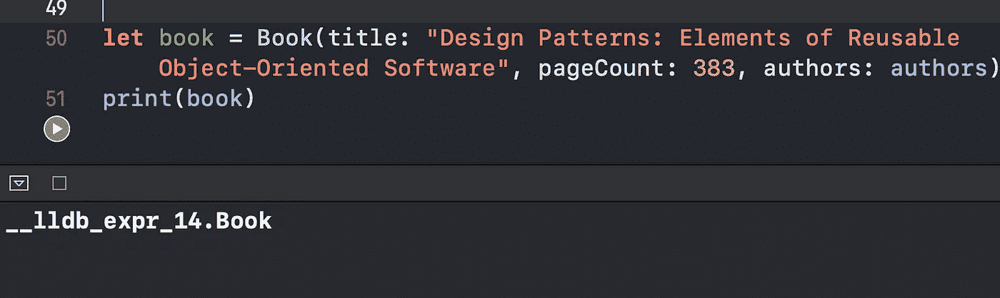
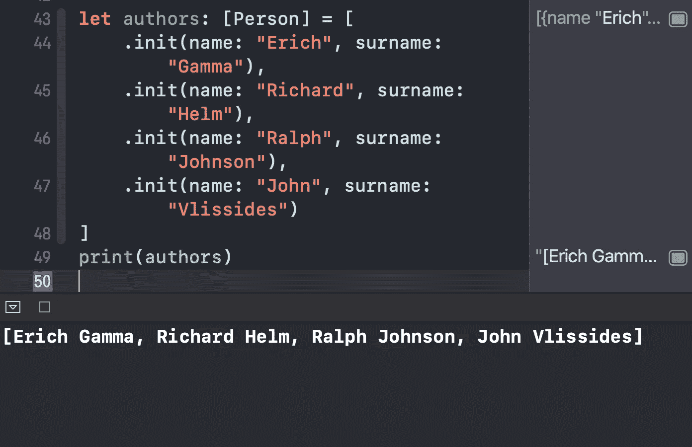
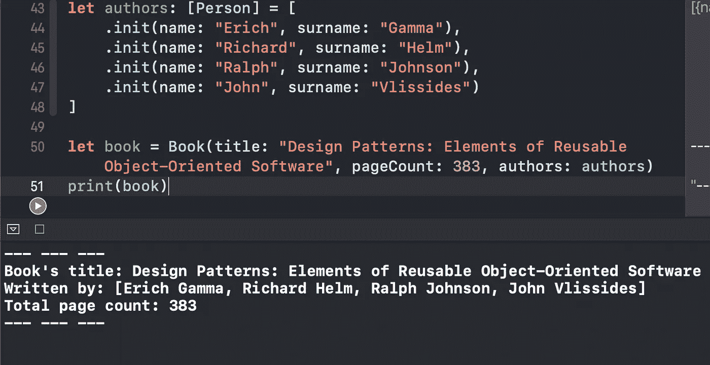

# Swift 中的 CustomStringConvertible 协议是什么？

> 原文：<https://betterprogramming.pub/what-is-the-customstringconvertible-protocol-in-swift-4b7ddbc5785b>

## 剧透:它让调试 Swift 对象变得容易多了

由[克里斯托弗·高尔](https://unsplash.com/@cgower?utm_source=medium&utm_medium=referral)在 [Unsplash](https://unsplash.com?utm_source=medium&utm_medium=referral) 上拍摄的照片

在本教程中，我们将探索 Swift 中的`CustomStringConvertible`协议，以及它为何如此有用。我们将通过在 Xcode Playground 中快速创建和使用示例对象来实现这一点。

# 我们开始吧

假设我们正在开发一个读书应用程序，有两个简单的类:person:

并预订:

现在我们想以下面的方式实例化并打印一个`Book`对象:

我们看到的信息并不丰富:

如果我们想获得更多关于打印对象的信息，最重要的是，以一种人类可读的方式？为此，我们有一个很好的工具——T2 协议。

# 符合 CustomStringConvertible

首先，让我们遵守`Person`类中的协议:

`description`是协议所要求的，当使用`print()`语句时，我们在其中编写的字符串将被打印在控制台中:

现在让我们对`Book`类做同样的事情:

最后，让我们打印之前实例化的`Book`对象，看看结果:

太好了！现在我们能够以更好的、人类可读的方式调试`Book`对象。

# 包扎

像往常一样，要了解更多信息，最好参考苹果官方文档:

 [## CustomStringConvertible

### 符合 CustomStringConvertible 协议的类型可以提供自己的表示形式，以便在…

developer.apple.com](https://developer.apple.com/documentation/swift/customstringconvertible) 

感谢阅读！