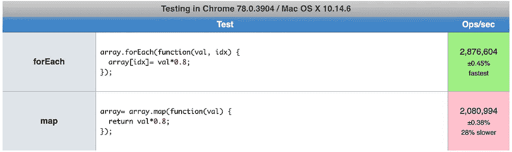
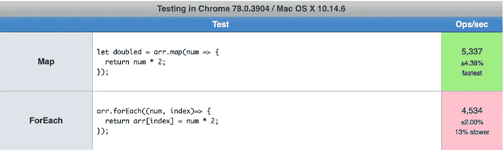

# JavaScript 中 map()和 forEach()有什么区别？

> 原文：<https://betterprogramming.pub/what-is-the-difference-between-map-and-foreach-in-javascript-9bc49afa2703>

## 用法、速度比较等等


照片由[尼克·费因斯](https://unsplash.com/@jannerboy62?utm_source=unsplash&utm_medium=referral&utm_content=creditCopyText)在 [Unsplash](https://unsplash.com/s/photos/difference?utm_source=unsplash&utm_medium=referral&utm_content=creditCopyText) 上拍摄

JavaScript 中一些最受欢迎的函数可能是`map`和`forEach`。它们都是从 ECMAScript 5 或者简称为`es5`开始存在的。

在这篇文章中，我将谈论它们之间的主要区别，并向你展示一些它们的用法。

# 阅读前

基本上，在 JavaScript 中遍历一个对象取决于该对象是否是一个`iterable`。默认情况下，数组是可迭代的。

`map`和`forEach`都包含在`Array.prototype`里，所以我们不需要考虑`iterable`。如果你想进一步学习，我建议你看看 JavaScript 中的`iterable`对象是什么！

# 什么是`map()`和`forEach()`？

`map`和`forEach`是 array 中的 helper 方法，可以很容易地循环数组。我们曾经在一个数组上循环，如下所示，没有任何帮助函数。

从 JavaScript 时代一开始，循环就伴随着我们。它需要 3 个表达式:初始值、条件和最终表达式。

这是循环数组的经典方式。自 ECMAScript 5 以来，新的函数似乎让我们更快乐。

## 地图

`map`与`for`循环做的完全一样，除了`map`创建一个新数组，结果是在调用数组中的每个元素上调用一个提供的函数。

它有两个参数:一个回调函数，稍后调用`map`或`forEach`时会调用这个函数，另一个是上下文变量`thisArg`，回调函数在调用时会用到这个变量。

回调函数可以如下使用。

```
arr.map((str) => { console.log(Number(str)); })
```

`map`的结果不等于原数组。

```
const arr = [1];
const new_arr = arr.map(d => d);arr === new_arr; // false
```

您也可以将对象作为`thisArg`传递给`map`。

对象`obj`变成了`map`的`thisArg`。但箭头回调函数无法获取`obj`作为其`thisArg`。

这是因为箭头函数的工作方式不同于普通函数。访问[这篇文章](https://www.geeksforgeeks.org/difference-between-regular-functions-and-arrow-functions/)看看箭头函数和普通函数有什么不同。

## 为每一个

`forEach`是数组的另一个循环函数，但是`map`和`forEach`在使用上有所不同。有两个参数`map`和`forEach`可以接受——一个回调函数和`thisArg`,它们将这两个参数用作它们的 *this。*

那么，有什么不同呢？

`map`返回原数组的新数组。然而`forEach`却没有。但两者都保证了原对象的不变性。

```
[1,2,3].map(d => d + 1); // [2, 3, 4];
[1,2,3].forEach(d => d + 1); // undefined;
```

**~~编辑~~**

`forEach`如果您更改数组内部的值，不会确保数组的不变性。这个方法只在你不接触里面的任何值的时候保证不变性。

```
[{a: 1, b: 2}, {a: 10, b: 20}].forEach((obj) => obj.a += 1);
// [{a: 2, b: 2}, {a: 11, b: 21}]
// The array has been changed!
```

上面的例子来自于[肯尼·马丁·里格斯](https://medium.com/u/34f1ed47628d?source=post_page-----9bc49afa2703--------------------------------)。谢谢大家！👏

# 什么时候使用 map()和 forEach()？

因为它们之间的主要区别在于是否有返回值，所以您可能希望使用`map`来创建一个新数组，而使用`forEach`来映射这个数组。

这是一个简单的例子。

例如，在 React 中，`map`非常常用于创建元素，因为`map`在操作原始数组的数据后创建并返回一个新数组。

另一方面，`forEach`在您想对数据做一些事情而不创建新数组时很有用。顺便说一下，这个例子可以用`filter`来重构。

```
subjects.filter(subject => mySubjectId.includes(subject.id)).length;
```

总的来说，我建议您在创建将要使用的新数组时使用`map`,在不需要创建新数组时使用`forEach`,但是您需要对数据做一些事情。

# 速度比较

有些帖子提到`map`比`forEach`快。所以，我很好奇这是不是真的。我发现了这个对比结果:



[左结果 jsPerf](https://jsperf.com/foreach-v-map) 和[右结果 jsPerf](https://jsperf.com/map-vs-foreach-speed-test?source=post_page-----f38111822c0f----------------------)

代码看起来非常相似，但结果却相反。一些测试说`forEach`更快，一些测试说`map`更快。

也许你在告诉自己`map` / `forEach`比另一个更快，你可能是对的。老实说，我不确定。我认为对于现代 web 开发来说，可读性比`map`和`forEach`之间的速度更重要。

但有一点可以肯定——它们都比 JavaScript 的内置特性`for` loop 慢。

# 结论

`map`和`forEach`是循环遍历一个可迭代对象的方便函数，可能会美化你的代码，给你更多的可读性。

但是要记住的一个真正重要的基调是理解每一个都做什么以及何时使用它们。

当您想创建一个不影响原始数组的新数组时，`map`会比较好，而当您只想映射一个数组时，`forEach`会更好。

# 资源

*   [用于循环 MDN](https://developer.mozilla.org/en-US/docs/Web/JavaScript/Reference/Statements/for)
*   [地图 MDN](https://developer.mozilla.org/en-US/docs/Web/JavaScript/Reference/Global_Objects/Array/map)
*   [箭头功能与普通功能](https://www.geeksforgeeks.org/difference-between-regular-functions-and-arrow-functions/)
*   [forEach MDN](https://developer.mozilla.org/en-US/docs/Web/JavaScript/Reference/Global_Objects/Array/forEach)
*   [map vs forEach jsPerf](https://jsperf.com/foreach-v-map)—`forEach`更快
*   [map vs forEach jsPerf](https://jsperf.com/map-vs-foreach-speed-test?source=post_page-----f38111822c0f----------------------)—`map`更快