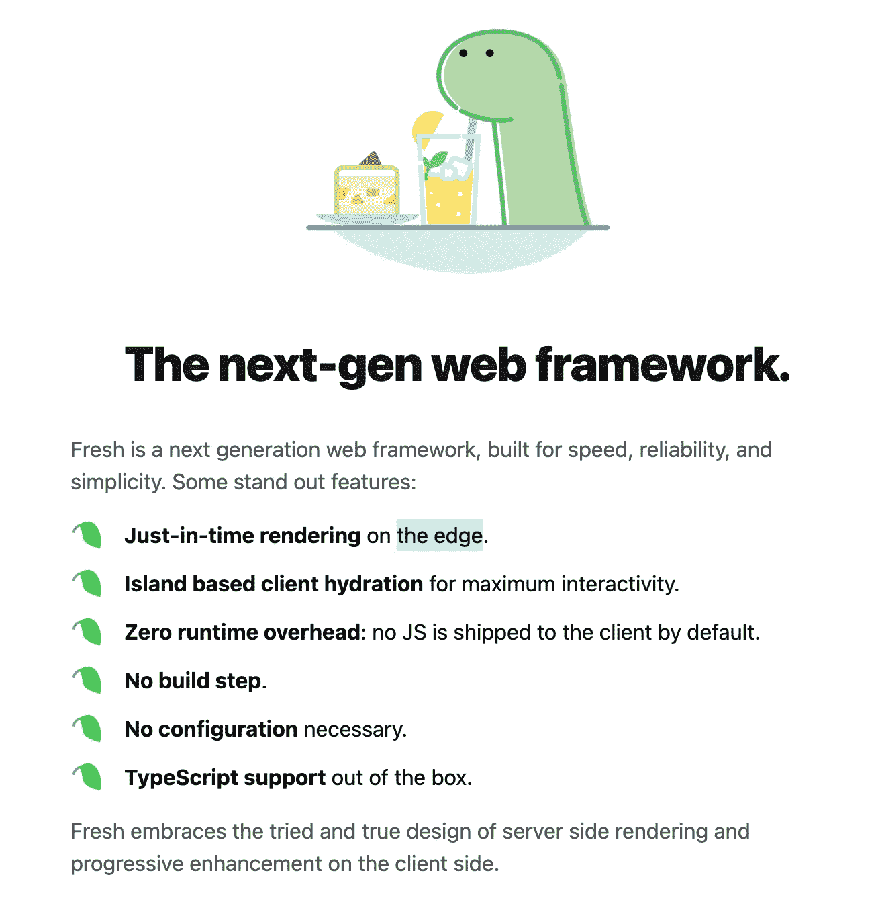
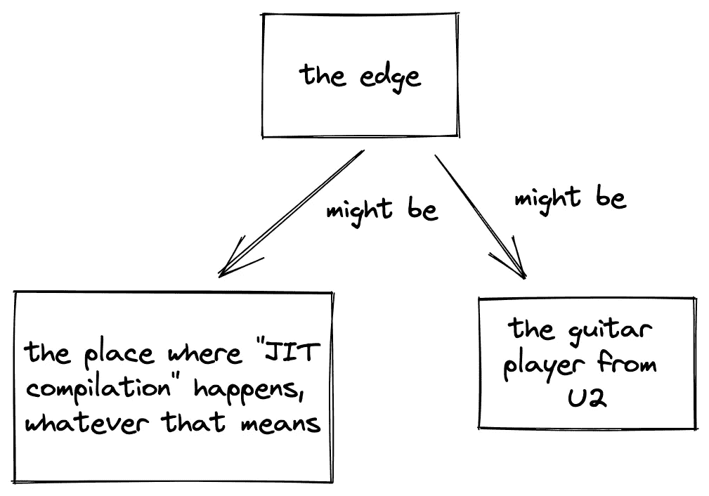
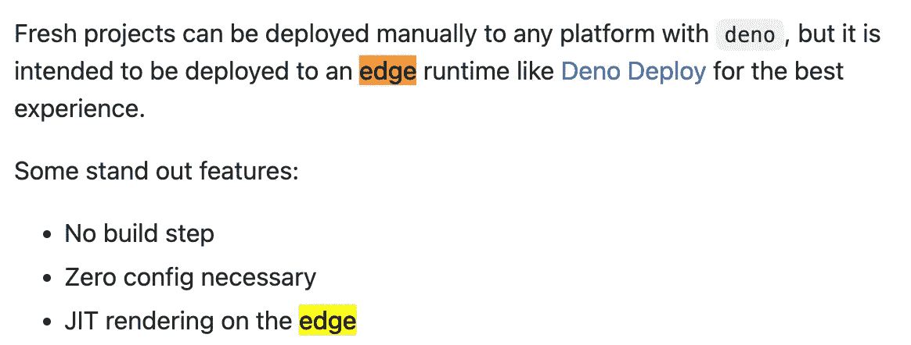
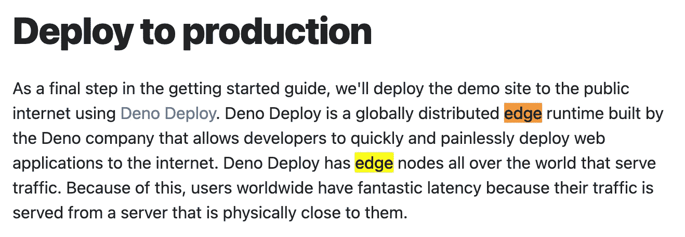
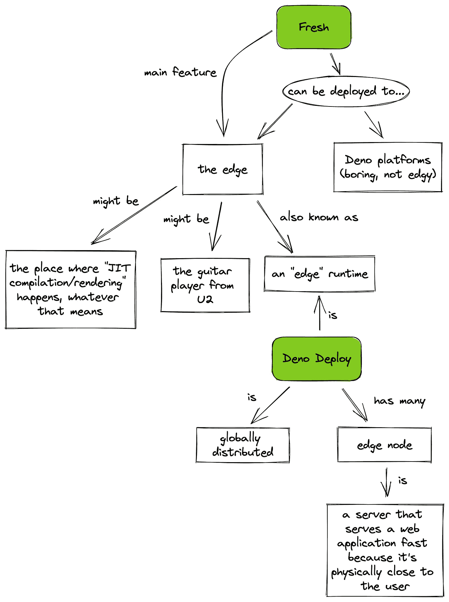

# 什么是边缘？德诺鲜的秘密。

> 原文：<https://betterprogramming.pub/what-is-the-edge-the-secret-of-deno-fresh-4b58e217b98e>

## 和我一起深入探索神秘。


如果你关注 web 开发的新闻，你可能听说过 [Deno Fresh](https://fresh.deno.dev/) 。在撰写本文时，它拥有“最新 web 框架”的恶名。

作为一名开发人员，我有义务一头扎进文档，理解每一个新的框架。为什么？因为如果我在工作中得到一个新任务，而这个新任务与我的工作完全匹配，但我不知道怎么办？那将是一场灾难。

在研究生鲜时，我发现自己贪多嚼不烂。一些黑暗势力可能在这里发挥作用。但是在到达自我的边缘之前，我们需要后退一步。

## 登录页面。


[新鲜登陆页面。](https://fresh.deno.dev/)

新鲜砰的一声打开了。主页上有一个漂亮的滴着柠檬的互动简约设计。

这一滴果汁触发了一个如此新鲜的 SVG 动画，它几乎感觉像是万维网的创造者蒂姆·伯纳斯·李(Tim Berners Lee)亲自通过你的眼孔从你的大脑中挤出 JavaScript 的每一点。

第一篇突出的文章介绍 Fresh 是“下一代 web 框架”



如此清新干净。

我不同意定冠词“the”他们是在暗示其他框架的游戏已经结束了吗？难道其他项目就不能成为下一代 web 框架，因为这个位置已经被占用了吗？

如果 Fresh 刚刚发布，它是如何击败所有竞争对手的？开发团队对框架如此有信心，以至于他们出于无限的仁慈，主动向世界宣布一个时代的结束吗？

现在，我先假定他们无罪。

向下滚动，我看到一些关于速度、可靠性和简单性的声明。当我读到这些的时候，我总是会有一种多巴胺的冲动，然后想，“也许这就是我想要的。”

一系列突出功能的第一个要点是“在*边缘*实时渲染”

现在，边缘到底是什么？

让我们暂时忽略这样一个事实，即“准时制”有点令人困惑。Just-in-time 是一种编译，但这是一个 JavaScript 框架，所以我看不出这有什么关系。

每个 JavaScript 库不都是即时的吗，因为每个 JavaScript 引擎，像 V8，都是即时的吗？如果有，在登陆页面提出来有什么意义？我错过了什么吗？这是营销策略吗？

然而，我不想让你坐立不安。让我们把重点放在核心的谜团上。

## 什么是“边缘”？



目前为止我的思维模式。

登陆页面上没有其他内容提到 edge，所以让我们直接进入文档。

在一系列的 Cmd+Fs 之后，我发现文档中只有两处提到了“边缘”,我在这里复制了一下:

1.  “新项目可以手动部署到任何使用 deno 的平台上，但它旨在部署到像 Deno Deploy 这样的 **edge** 运行时，以获得最佳体验。一些突出的特性:在**边缘的 JIT 渲染**
2.  “作为入门指南的最后一步，我们将使用 Deno Deploy 将演示站点部署到公共互联网。Deno Deploy 是由 Deno 公司开发的全球分布式 **edge** 运行时，它允许开发人员快速、轻松地将 web 应用程序部署到互联网上。Deno Deploy 在世界各地都有 **edge** 节点为流量服务。正因为如此，世界各地的用户有着惊人的延迟，因为他们的流量是由物理上靠近他们的服务器提供的。”



在边上，在拐角处



靠近边缘，在河边

有了这些信息，我对边缘的心理模型变得几乎无法控制，许多问题仍然存在。



太急躁了。

我的两个主要问题是:

1.  为什么我们把一个确定的东西(*edge)和一个不确定的东西(*edge runtime)等同起来？当上下文阐明它所代表的单个元素(例如，“国家”与“众多国家中的一个”)时，它是否类似于使用定冠词？**
2.  **为什么我们需要像“边缘”这样的术语来指代“全球分布式 web 服务器”？我们不是已经有很长时间了吗？这种“前卫感”可能与那种神秘的“即时渲染”有关吗？**

## **胡乱猜测。**

**边缘是新的宗教吗？《边缘》是现在酷孩子做的东西吗？**

**也许“边缘”是云服务提供商提供的服务的代名词，比如 AWS 或 Azure。也许软件平台被迫使用像“边缘”这样的模糊术语，以避免说出他们在幕后使用的明确的提供者。**

**如果你知道什么是边缘，为什么叫边缘，请在评论中告诉我。**

**另外，亲爱的 Fresh 团队，能否请您在您的文档中添加一个“什么是优势”部分？**

## **关闭思路。**

**当然，编写文档很难，但是我们已经过了联机帮助页的时代。我认为我们可以做得更好。**

**应该有可能写出平衡详尽信息和易于理解的文档，并加入必要数量的商业术语。**

**我们的服务器可能运行在边缘，不管这意味着什么，但是它们的文档应该在中心。完美的平衡，所有的事情都应该如此。**

**就目前而言，[这个视频](https://www.youtube.com/watch?v=yOP5-3_WFus)很好地揭开了边缘的神秘面纱。**

**[](https://sebastiancarlos.medium.com/membership) [## 加入我的介绍链接媒体-塞巴斯蒂安卡洛斯

### 阅读塞巴斯蒂安·卡洛斯(以及媒体上成千上万的其他作家)的每一个故事。您的会员费直接…

sebastiancarlos.medium.com](https://sebastiancarlos.medium.com/membership) 

```
**Want to Connect?**You can also also follow me on [Twitter](https://twitter.com/5ebastiancarlo5).
```