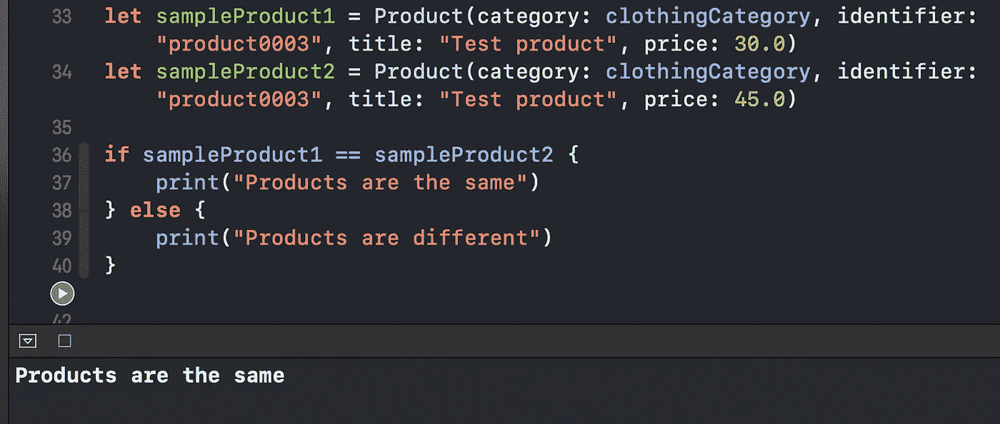

# Swift 中的等价协议是什么？

> 原文：<https://betterprogramming.pub/what-is-the-equatable-protocol-in-swift-f3238f6821d6>

## 轻松比较您的 Swift 对象的平等性

Anthony Choren 在 [Unsplash](https://unsplash.com?utm_source=medium&utm_medium=referral) 上拍摄的照片

在本教程中，我们将通过在 Xcode 操场上快速试验来了解 Swift 中的等价协议。

Equatable 允许我们提供比较我们的定制 Swift 结构和类别的功能。

# 我们开始吧

假设我们有一个列出用户可以购买的不同产品的应用程序。因此我们定义了`Product`和`ProductCategory`结构:

并实例化它们:

现在，如果我们要检查这两个乘积是否相等，我们写下下面长的`if`语句:

我们如何优化比较过程？

# 符合等效协议

让我们通过实现所需的`==`方法来符合等价协议:

现在，我们可以很容易地比较两个`Products`，而不用写那么长的`if`语句:

# 包扎

对其他比较技术感兴趣？请随意查看我关于类似协议的文章:

 [## 何时在 Swift 中使用类似协议

### 这个协议对于定制数组的排序非常方便

medium.com](https://medium.com/better-programming/when-to-use-the-comparable-protocol-in-swift-b9f137b07413) 

若要了解有关等效协议的更多信息，请访问 Apple 官方文档:

 [## 等价的

### 声明当您声明一个自定义类型时，您可以依赖协议要求的自动合成

developer.apple.com](https://developer.apple.com/documentation/swift/equatable) 

感谢阅读！