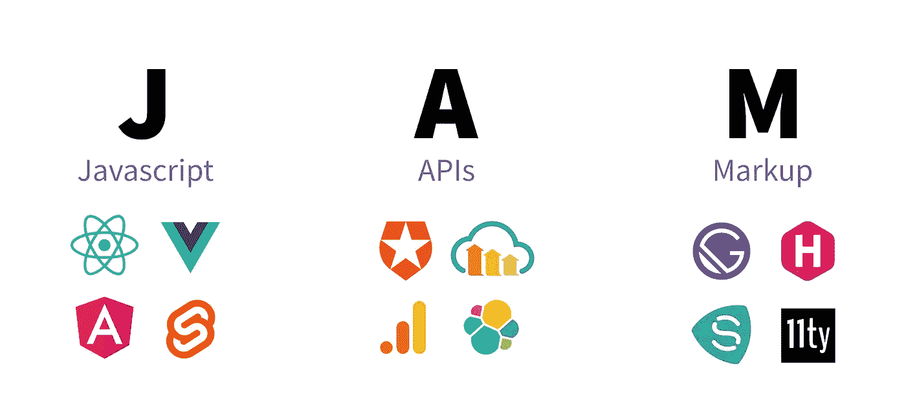
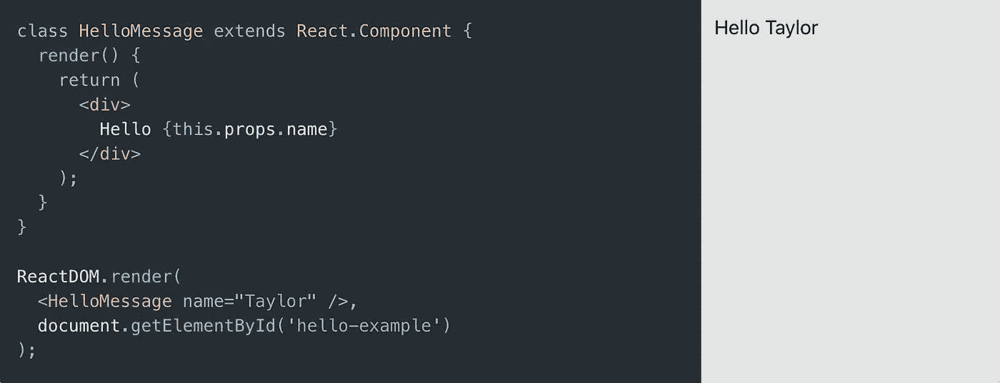
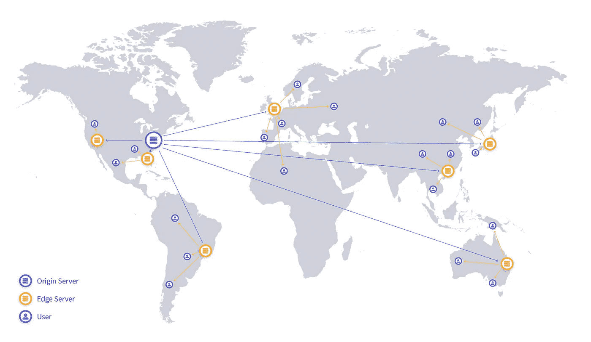
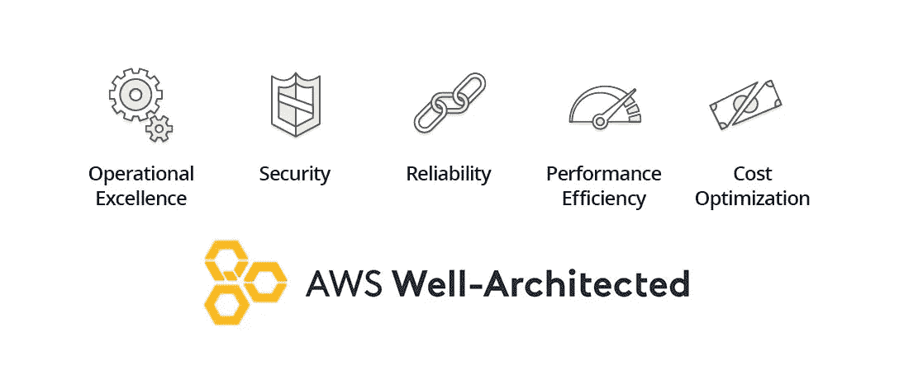
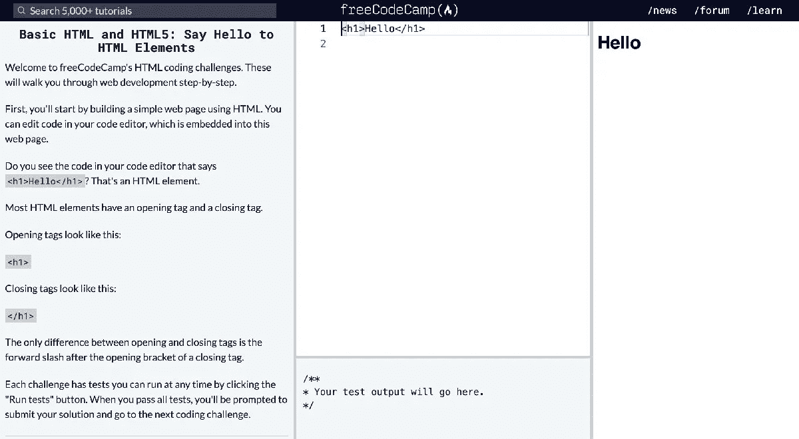
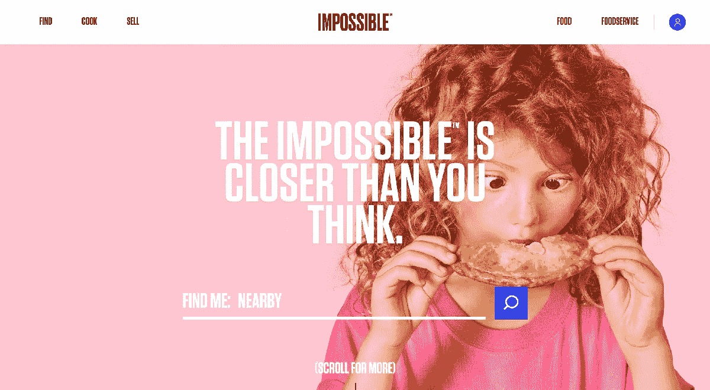
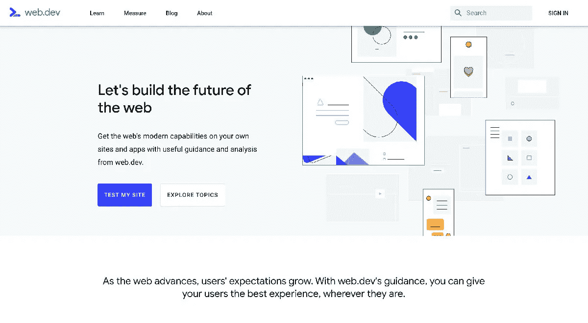

# 什么是 JAMstack，我如何开始？

> 原文：<https://betterprogramming.pub/what-is-the-jamstack-and-how-do-i-get-started-b09a05a195f1>

## 但是它到底是什么，我们如何利用它呢？

霍利·斯特拉顿在 [Unsplash](https://unsplash.com/s/photos/stack?utm_source=unsplash&utm_medium=referral&utm_content=creditCopyText) 上拍摄的照片

JAMstack 站点现在在 web 开发界非常流行。理所当然！但是它到底是什么，我们如何才能利用它的好处呢？

# 这个 JAMstack 是什么？

首先， [JAMstack](https://jamstack.org/) 是一个软件架构和哲学，它遵循以下组件:JavaScript、API 和标记。

如果这听起来很熟悉，那是因为它就是！你用 [Webpack](https://webpack.js.org/) 编译并最终从 [S3](https://aws.amazon.com/s3/) 发布的 React 应用？是的，那是一个 JAMstack 应用程序。那个简单的 HTML 文件没有 JavaScript，实际上不做任何动态的事情？是的，这也是一个 JAMstack 应用程序。

# 这不要与无服务器混淆

如果你更多的是从云的角度(想想 [AWS](https://aws.amazon.com/) 、 [GCP](https://cloud.google.com/) 、 [Azure](https://azure.microsoft.com/) )，你可能会倾向于把 [serverless](https://serverless-stack.com/chapters/what-is-serverless.html) 和 JAMstack 当做名字。

诚然，它们在管理资源的理念上有相似之处，比如在 S3 上托管一个网站。但是 JAMstack 应用并不总是无服务器应用。

考虑一个托管在您选择的云提供商的静态存储中的应用程序。是的，你可能以一种无服务器的方式为应用程序提供服务，但是你可能会处理一个利用 Wordpress 或者 Rails 的 API，这两者都不是无服务器的。

结合这些哲学可以走很长的路，但他们不应该混淆为相同的。

# JAMstack 是由什么组成的？

回到 JAMstack:它通常由三个组件组成:JavaScript、API 和标记。

它的[历史源于](https://snipcart.com/blog/jamstack)将术语“静态站点”发展成更有意义(和更有市场)的东西。因此，尽管最终的结果是一个静态站点，但它被夸大了，为每一步都提供了一流的工具。

JAMstack 故障

虽然除了简单的 HTML 之外，您不需要使用任何特定的工具集，或者任何其他工具，但是有很多很好的例子可以说明堆栈的每个部分。让我们深入了解一下每个组件。

## Java Script 语言

可能为推广 JAMstack 做了最多工作的组件是 JavaScript。我们最喜欢的浏览器语言允许我们提供所有的动态和交互式的内容，如果我们提供没有它的普通 HTML，我们可能就没有这些内容了。

在这里，你会经常看到像 [React](https://reactjs.org/) 、 [Vue](https://vuejs.org/) 这样的 UI 框架，以及像[svelite](https://svelte.dev/)这样的新人开始发挥作用。

来自[reactjs.org](https://reactjs.org/)的“简单元件”示例

它们通过提供组件 API 和工具来编译成一个简单的 HTML 文件(或一堆文件),使得构建应用程序变得更简单、更有条理。

这些 HTML 文件包括一组资产，如图像、CSS 和实际的 JS，最终通过您最喜欢的 CDN(内容交付网络)提供给浏览器。

## 蜜蜂

利用 API 的优势是如何让 JAMstack 应用程序变得动态的核心。

无论是身份验证还是搜索，您的应用程序都将使用 JavaScript 向另一个提供者发出 HTTP 请求，这最终会以某种形式增强体验。

[盖茨比](https://www.gatsbyjs.org/)创造了短语“[内容网](https://www.gatsbyjs.org/blog/2018-10-04-journey-to-the-content-mesh/)”，很好地描述了这里的可能性。

[内容网格](https://www.gatsbyjs.org/blog/2018-10-04-journey-to-the-content-mesh/)

对于一个 API，您不必只接触一台主机，但是您可以根据需要接触任意多的主机(但是不要走极端)。

例如，如果你有一个无头的 [Wordpress](https://wordpress.org/) API 来存放你的博客文章，一个 [Cloudinary](https://cloudinary.com/) 账户来存储你的专业媒体，还有一个 [Elasticsearch](https://www.elastic.co/) 实例来提供你的搜索功能，它们一起工作来为使用你的网站的人提供单一的体验。

## 利润

这是关键部分。无论是你手写的 HTML 还是编译成 HTML 的代码，这都是你提供给客户的第一部分。这是任何网站事实上的一部分，但是你如何服务它是最重要的一部分。

要被认为是 JAMstack 应用程序，HTML 需要被静态地提供，这基本上意味着不能从服务器动态地呈现。

如果你把一个页面拼凑在一起，用 PHP 提供服务，那它可能不是一个 JAMstack 应用。如果您从存储中上传并提供一个 HTML 文件，该文件用 JavaScript 构建了一个应用程序，这听起来就像一个 JAMstack 应用程序。

AWS S3 上 Gatsby 的静态输出

但这并不意味着我们必须总是在浏览器中构建 100%的应用程序。像 Gatsby 和其他[静态站点生成器](https://www.staticgen.com/)这样的工具允许我们在构建时获取部分或全部 API 源，并将页面呈现为 HTML 文件。

我想，如果你有一个 Wordpress 博客，我们可以把所有的帖子拉进来，最终为每个帖子创建一个新的 HTML 文件。这意味着我们将能够直接向浏览器提供页面的预编译版本，这通常等同于更快的[首绘](https://developers.google.com/web/tools/lighthouse/audits/first-contentful-paint)和更快的访问者体验。

# 关于“托管”的一个注意事项

如果你是这个概念的新手，在这里使用术语*主持*可能会产生误导。

是的，从技术上讲，你的网站会被托管在某个地方，但这不是传统意义上的托管。你没有一台服务器来维护你上传文件的地方，你用 [FTP](https://en.wikipedia.org/wiki/File_Transfer_Protocol) 客户端比如 [Cyberduck](https://cyberduck.io/) 。

相反，不管你是用 S3 自己做，还是通过管道把它传输到 Netlify(实际上是[多云端](https://www.netlify.com/blog/2018/05/14/how-netlify-migrated-to-a-fully-multi-cloud-infrastructure/))，你的 HTML 和静态资产都是从对象存储中获得的。

最后，你通常会有一个像 [Cloudflare](https://www.cloudflare.com/) 这样的 CDN，它会在世界各地缓存这些文件，让访问你网站的人可以更快地加载你的页面。

CDN 分布图

# 那么是什么让 JAMstack 应用如此伟大呢？

JAMstack 应用本质上满足 AWS 架构良好的框架的五大支柱中的大部分(如果不是全部的话)。这些是 AWS 认为可以提供快速、安全、高性能、弹性和高效基础设施的核心概念。

[AWS 架构良好](https://aws.amazon.com/architecture/well-architected/)

让我们看看如何…

## 速度

事实上，你直接从 CDN 上以静态文件的形式提供 JAMstack 应用程序，这使得你的应用程序很可能会加载得非常快。

服务器在响应之前必须花时间构建页面的日子已经一去不复返了；现在，你可以像普通的 HTML“原样”提供页面，或者像你在 [React](https://reactjs.org/) 中看到的那样，提供某种类型的客户端水合作用。

## 费用

通常情况下，JAMstack 站点的运行成本会比服务器端站点低。托管静态资产很便宜，现在你的页面也以同样的速度提供服务。

## 可量测性

因为你是在静态主机上提供文件，就像一个 CDN，这几乎自动给了你无限的可伸缩性。大多数提供商都会这么说，这意味着你可以毫不费力地让大量的人通过前门进入你的网站。

## 维护

静态站点的基础不是服务器，这意味着你不需要维护它。无论是 Netlify，S3，还是任何其他供应商，你的静态 HTML，CSS 和 JS 都为你维护，没有头痛。

## 安全性

加倍担心您必须亲自维护的服务器的缺乏，您真的不需要太担心锁定人们入侵的方式。

相反，你需要主要关注锁定私人内容的权限，并向你的用户保证他们的个人信息不会被公开。

## 但是这也取决于你的 API

尽管这些观点对于站点的静态方面来说是正确的，但是请记住，您仍然可能依赖于某种类型的 API 来获得客户端体验。

尽可能在编译时利用这些请求，比如使用静态站点生成器。否则，你需要权衡你对一个动态端点的点击次数，以及它如何影响你的整体体验。

# 我的网站被认为是在 JAMstack 上吗？

我们已经讨论了三个组件(JavaScript、API、标记)，但是我们没有讨论的是，为了让你的站点配得上 JAM 标签，你不一定要使用这三个组件。

事实上，这一切都归结到标记和你如何服务它。您可以在 S3 上托管一个预编译的 React 应用程序，通过一组 API 连接到 Rails，而不是由 Rails 应用程序来呈现您的 HTML。

但是你甚至不需要有 API。甚至不需要有 JavaScript！

只要你提供的 HTML 文件不需要在请求时在服务器上编译(也就是预渲染)，你就拥有了一个 JAMstack 站点。

# JAMstack 有哪些例子？

## freecodecamp.org

是啊！Freecodecamp.org 和它的学习门户网站 T2 都是建立在盖茨比基础上的 JAMstack 网站。

尽管提供一个用于学习代码课程的应用程序很复杂，但 freeCodeCamp 能够将静态站点生成器和强大的 API 结合在一起，为世界各地的人们提供学习代码的能力。

【https://www.freecodecamp.org/ 

你可以看到来自 freeCodeCamp 的 Quincy 在 [2018 JAMstack_conf](https://www.youtube.com/watch?v=e5H7CI3yqPY) 上更多地谈到了这一点。

注意:新闻和论坛门户网站目前不是 JAMstack 网站。

## 不可能的食物

不可能的食物的主要网站就是一个盖茨比的网站！从他们的食谱到他们的位置查找器，一切都是通过我们最喜欢的“快得惊人”的静态站点生成器编译的。

[https://impossiblefoods.com/](https://impossiblefoods.com/)

## 网络开发

谷歌的 [web.dev](https://web.dev/) 资源中心是利用不断增长的 [11ty](https://www.11ty.dev/) 构建的。你甚至可以在 [GitHub](https://github.com/GoogleChrome/web.dev) 上找到开源代码。

[https://web.dev/](https://web.dev/)

# 我可以使用哪些工具来构建 JAMstack 站点或应用程序？

好消息是，目前有大量的工具可用，还有更多工具正在开发中。

他们可能仍然有点粗糙，但这是因为这是一个勇敢的新工具世界，需要一些平滑处理才能得到正确的结果。

## 构建您的应用程序

这是有趣的部分。你将如何构建你的应用程序？

有了图中的[斯卡利](https://github.com/scullyio/scully) [，你几乎可以挑选你最喜欢的 UI 框架风格，并开始运行。这里有几个流行的开始，但绝不是详尽的。](https://www.netlify.com/blog/2019/12/16/introducing-scully-the-angular-static-site-generator/)

*   [11ty](https://www.11ty.dev/)
*   [盖茨比](https://www.gatsbyjs.org/)
*   [雨果](https://gohugo.io/)
*   [Nift](https://www.nift.cc/)
*   [史考莉](https://github.com/scullyio/scully)(给你们这些棱角分明的粉丝)
*   [还有更多……](https://www.staticgen.com/)

需要我挑一个吗？从盖茨比和 [bootstrap 开始，用一个简单的启动器](https://github.com/colbyfayock/gatsby-starter-sass)。

## 为您的应用服务

根据你的设置，我认为这是最简单的部分。

像 Netlify 和 Zeit 这样的工具使这种配置变得轻而易举，只要挂钩到 GitHub repo，就可以随时构建新的提交，当然，如果您想要更多的控制，也可以选择 AWS。

*   [AWS](https://aws.amazon.com/getting-started/projects/host-static-website/)
*   [蔚蓝色](https://docs.microsoft.com/en-us/azure/storage/blobs/storage-blob-static-website)
*   [GCP](https://cloud.google.com/storage/docs/hosting-static-website)
*   [GitHub 页面](https://pages.github.com/)
*   网络生活
*   [激增](https://surge.sh/)
*   [Zeit](https://zeit.co/)

需要我挑一个吗？从 Netlify 开始，[花五分钟部署](https://www.netlify.com/blog/2016/09/29/a-step-by-step-guide-deploying-on-netlify/)Gatsby 站点。

## 让您的应用充满活力

实际上，这可以是任何可以用作从浏览器发出请求的 API 的东西。我不会为每种类型列出一堆例子，但是这里有一些工具和地方可以找到一些资源。

*   [认证 0](https://auth0.com/) —认证
*   [云栖](https://cloudinary.com/) —媒体管理
*   [谷歌分析](https://analytics.google.com/analytics/web/#/) —网络流量分析
*   headlesscms.org——无头 CMS 的无尽清单
*   [理智](https://www.sanity.io/) — CMS
*   [无服务器框架](https://serverless.com/) — DIY，易于部署，无服务器资源
*   [Snipcart](https://snipcart.com/) —电子商务
*   [条纹](https://stripe.com/) —支付管理
*   [和一堆其他资源……](https://github.com/agarrharr/awesome-static-website-services)
*   [还有一堆其他 CMS 的选择…](https://headlesscms.org/)
*   [以及一些通用信息和工具……](https://jamstack.wtf/)

## 一般的学习资源怎么样？

在 JAMstack 世界中，您可以找到许多快速启动和运行的资源。

*   [如何托管和部署静态网站或 JAMstack 应用到 AWS S3 和 CloudFront](https://www.freecodecamp.org/news/how-to-host-and-deploy-a-static-website-or-jamstack-app-to-s3-and-cloudfront/)
*   分步指南:盖茨比谈网络生活
*   使用 filament group 的 Eleventy 从头开始创建自己的博客
*   如何用 AWS 托管你的静态网站——来自 freeCodeCamp 的初学者指南
*   [Hugo 教程:如何从 SnipCart 构建&主机一个(非常快的)静态电子商务网站](https://snipcart.com/blog/hugo-tutorial-static-site-ecommerce)
*   [如何使用来自 freeCodeCamp 的 Gatsby 和 Netlify](https://www.freecodecamp.org/news/building-jamstack-apps/) 构建认证的无服务器 JAMstack 应用

# 期待看到更多

类似于它的无服务器版本，JAMstack 的时代还很年轻。随着时间的推移，我们将看到工具的成熟和扩展，为我们快速构建任何人都可以使用的快速网站提供新的令人兴奋的方法。

# 遗漏了什么？

缺少您最喜欢的 JAMstack 工具或令人敬畏的示例？请在下方留言评论。