# 什么是原生付款申请 API？

> 原文：<https://betterprogramming.pub/what-is-the-native-payments-request-api-905c60a996e8>

## 您知道吗，许多现代浏览器都有内置的支付请求 API

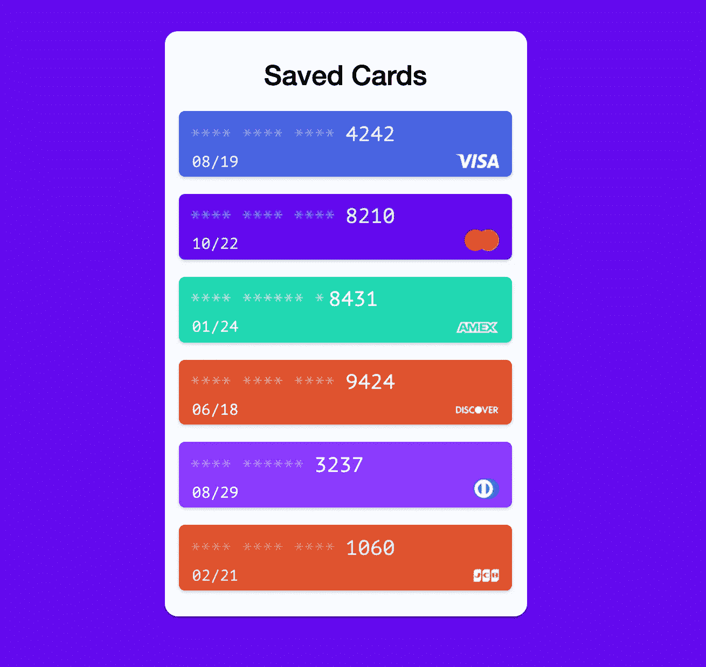

[保存的信用卡显示](https://codepen.io/DevUncoded/pen/rGjpXG)

[支付请求 API](https://www.w3.org/TR/payment-request/)—W3C 浏览器标准促进了支付和联系信息的交换。

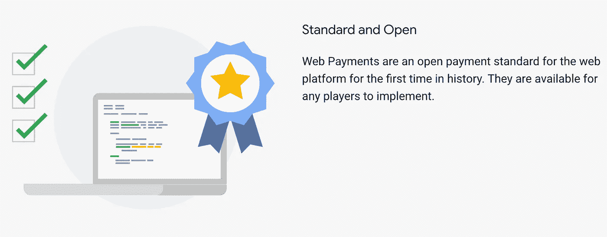

[网络支付概述](https://developers.google.com/web/fundamentals/payments/)

[支付请求 API](https://developer.mozilla.org/en-US/docs/Web/API/Payment_Request_API) 提供了一种基于浏览器的方法，将用户及其首选支付系统和平台连接到需要支付商品和服务的首选商家。

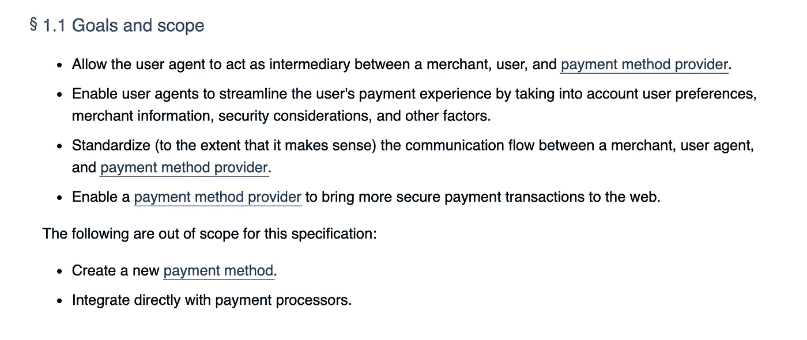

[付款申请 API 目标](https://www.w3.org/TR/payment-request/#goals)

这是一个聪明的选择，因为支付 API 背后的想法是标准化我们如何支付东西，减少实现接受支付时的摩擦，并产生更少的易变错误。

PaymentRequest API 看起来像什么:

如您所见，我们用构造函数方法创建了一个新的支付 API 实例。付款构造函数采用两个强制参数和一个可选参数:

*   `methodData` —包含支付提供商相关信息的对象，如支持何种支付方式等。
*   `details` —包含关于特定支付的信息的对象，例如总支付金额、税款和运费
*   `options`(可选)—包含与支付相关的附加选项的对象


出于明显的安全原因，支付请求 API 只适用于 HTTPS 协议。

# 付款 API 演示

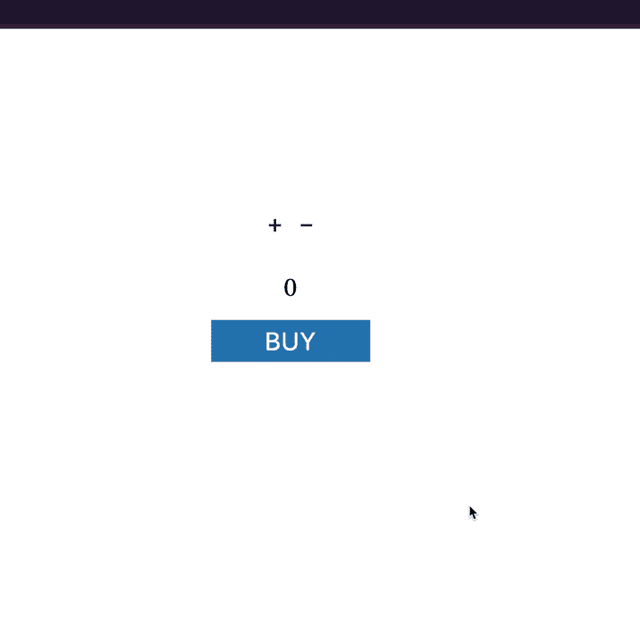

付款 API 演示

我们可以看到，支付是直接集成到浏览器中的。不再有不安全的第三方重定向或 API 调用，一切都直接发生在浏览器中！

## 入门指南

支付 API 是实验性的技术，将来可能会改变。我仍然鼓励熟悉这个新的 API，因为我相信这个提议是强有力的，并且会一直存在下去；也许会增加一些额外的新功能。

如果您希望跟随示例，请获取存储库的副本。

```
git clone [https://github.com/indreklasn/payments-request-api-example.git](https://github.com/indreklasn/payments-request-api-example.git) && yarn && yarn start
```

这个 shell 命令将克隆 repo，安装依赖项，并在`localhost:3000`启动服务器

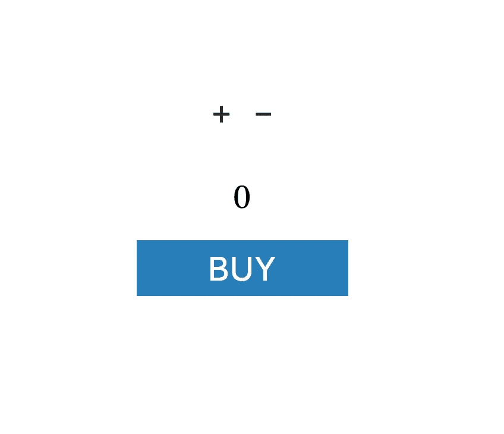

您应该会看到一个非常简单的柜台，上面有一个购买按钮

*注意:出于测试目的，支付 API 在本地主机上工作。*

由于我们的应用程序很简单，我们将把所有与支付相关的逻辑放到`app.js`文件中。

这里有一些样板代码。我们抓取 DOM 元素并用增量和减量按钮将它们连接起来。我们还向用户显示最终的计数。

想象一下*递增*是向购物篮中添加商品，*递减*是从购物篮中移除商品，*计数*显示购物车结账的总价格。

## 实施支付

一旦用户点击 *BUY* 按钮，我们就会创建一个新的付款请求实例。现在我们需要定义`buildSupportedPaymentMethodData`和`buildShoppingCartDetails`方法。

**第一个参数** `**buildSupportedPaymentMethodData**` **是一个返回所有支持的支付方式的对象数组的方法。**

**第二个参数** `**buildShoppingCartDetails**` **显示了用于建立购买的信息。**

这构成了例如用户正在购买的东西；花了多少钱；总数是多少？

注意这次我们返回一个对象，而不是一个对象数组。

好了，我们准备向用户显示支付请求窗口。让我们在`request`实例上调用`show`方法。这返回一个`paymentResponse`承诺。如果你不太熟悉承诺，看看这篇文章。

如果我们按下*购买*按钮，我们应该会看到这个提示:

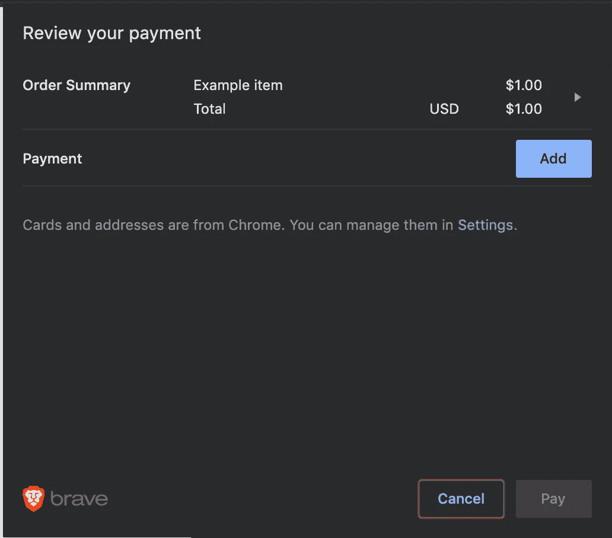

检查您的付款

你可能需要加一张支付卡。我推荐使用 Visa 测试卡。插入号码、你的名字和地址。这些不一定对测试有效。

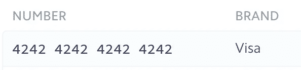

Visa 测试卡

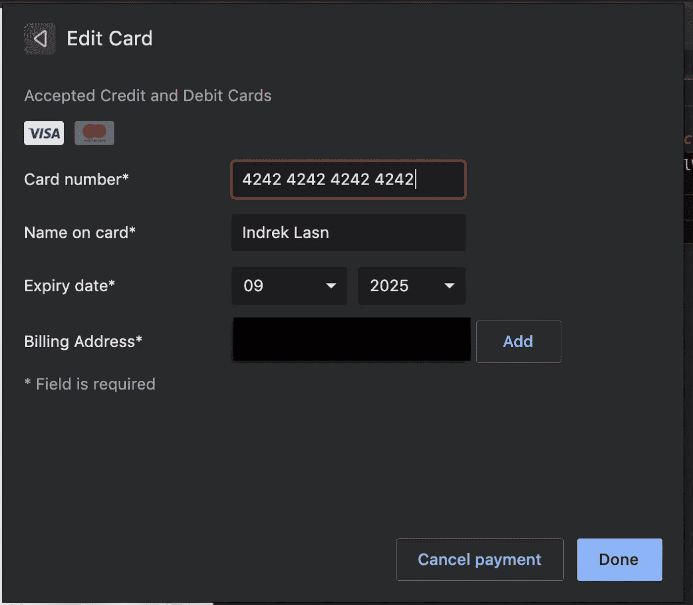

添加 Visa 测试卡

## 处理付款

一旦我们插入一张卡并批准付款，我们将从承诺请求中获得一个返回的`paymentResponse`。

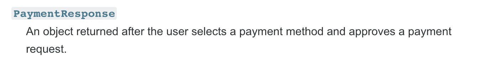

[支付响应](https://developer.mozilla.org/en-US/docs/Web/API/PaymentResponse)

因为现在付款已经完成，所以`paymentResponse`对象上的所有方法和属性都是只读的。

让我们调用`paymentResponse.complete()`向用户表明一切都按预期进行。

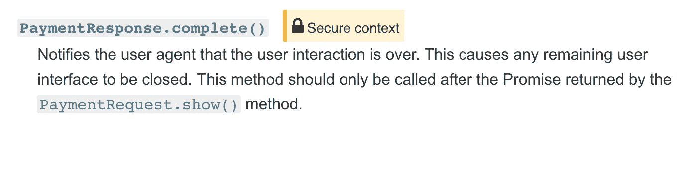

`[**PaymentResponse.complete()**](https://developer.mozilla.org/en-US/docs/Web/API/PaymentResponse#Methods)`

瞧啊。这就是我们超级简单的购物车所需的全部代码。

## 全额付款演示

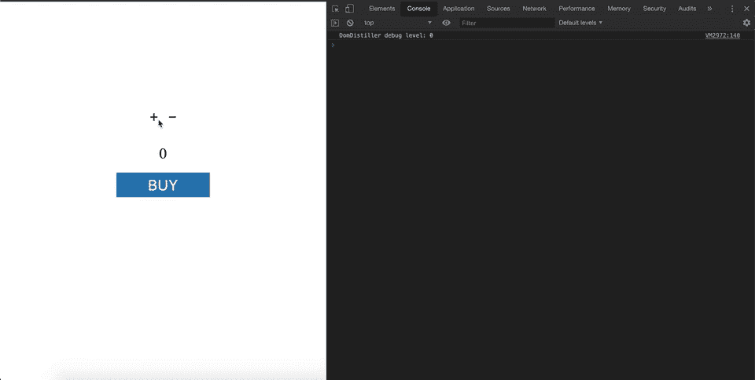

仅使用付款 API 进行付款

这里有[源代码](https://github.com/indreklasn/payments-request-api-example)，以防你想更深入地了解。

[](https://github.com/indreklasn/payments-request-api-example) [## indreklasn/付款-请求-API-示例

### 通过在 GitHub 上创建一个帐户，为 indreklasn/payments-request-API-example 开发做出贡献。

github.com](https://github.com/indreklasn/payments-request-api-example) 

## 浏览器支持

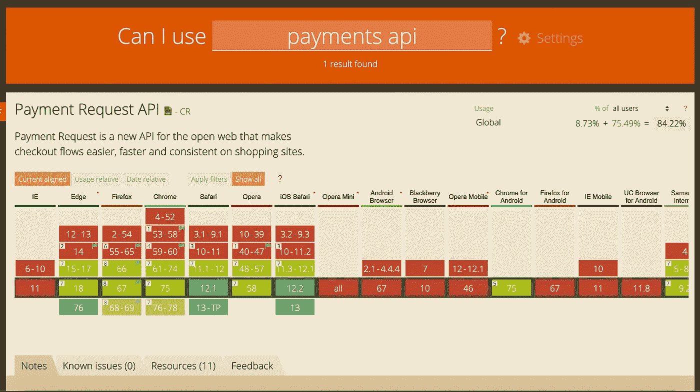

[是否支持支付 API？](https://caniuse.com/#search=payments%20api)

由于这是一个相对较新的 API，它还没有得到很好的支持。Brave、Chrome、Safari、Firefox 和 Edge 都支持新的支付 API，你已经可以用你的浏览器尝试一下了。

另一方面，显然，新的支付 API 需要做更多的工作，特别是对于移动浏览器。我还不会太依赖这个移动 API。

# 从这里去哪里？

在如此短的时间里有如此多的东西要学。我强烈推荐阅读以下内容:

*   *[*支付生态系统如何运作*](https://developers.google.com/web/fundamentals/payments/basics/how-payment-ecosystem-works)*
*   ***[W3C 候选人推荐](https://www.w3.org/TR/payment-request/#introduction)***
*   ***MDN " [付款申请概念和用法](https://developer.mozilla.org/en-US/docs/Web/API/Payment_Request_API)"***
*   ***Stripe " [付款申请 API](https://stripe.com/docs/payment-request-api) "文章***

# ***Web 组件基础***

***这些都是非常有用和清晰的资源，可以让你了解更多关于支付 API 的知识。***

***[](https://developer.mozilla.org/en-US/docs/Web/API/Payment_Request_API) [## 付款申请 API

### 支付请求 API 为商家和用户提供了一致的用户体验。这不是一种新的方式…

developer.mozilla.org](https://developer.mozilla.org/en-US/docs/Web/API/Payment_Request_API) [](https://developers.google.com/web/fundamentals/payments/merchant-guide/deep-dive-into-payment-request) [## 深入了解支付请求 API |网络基础| Google 开发者

### 如何实现并充分利用付款申请 API？

developers.google.com](https://developers.google.com/web/fundamentals/payments/merchant-guide/deep-dive-into-payment-request) 

*额外收获:*如果你想让你的 JavaScript 能力更上一层楼，我推荐你阅读“ [*你不知道的 JS*](https://amzn.to/2LSDpG6) ”系列丛书。

感谢阅读——快乐编码！❤***