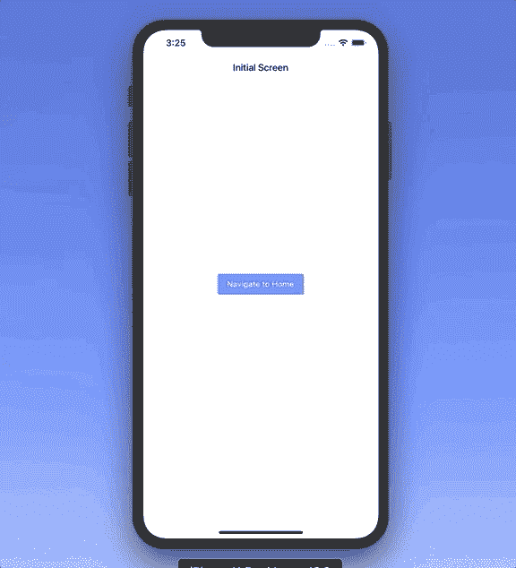

# Flutter 中的导航仪是什么？

> 原文：<https://betterprogramming.pub/what-is-the-navigator-in-flutter-640e864892e2>

## 如何促进跨平台应用内部的流动

[缺口缺口](https://unsplash.com/@jannerboy62?utm_source=medium&utm_medium=referral)在[缺口](https://unsplash.com?utm_source=medium&utm_medium=referral)处拍照。

在本教程中，我们将通过在一个简单的示例应用程序中查看其实现来了解 Flutter 中的`Navigator`类。

`Navigator`帮助我们创建和使用应用程序屏幕间的导航。使用这个工具，我们可以轻松地推送和弹出某些屏幕。

该项目的源代码可以在文章的底部找到。

# 我们开始吧

首先，让我们考虑下面的屏幕:

我们有一个简单的`CupertinoPageScaffold`，它包含一个`CupertinoNavigationBar`和一个`RaisedButton`。我们创建了`id`属性来标识这个屏幕的命名路径。

我们可以看到在`RaisedButton`的`onPressed`参数里面。我们将使用`Navigator`小部件将`HomeScreen`推到导航堆栈上。

现在让我们来探索一下`HomeScreen`:

类似地，它包含`id`属性来描述屏幕的路线标识符。然而，这一次，我们在`onPressed`参数中弹出当前屏幕。

为了连接这些屏幕，让我们在`main.dart`文件中编写以下内容:

`home`参数描述了我们应用程序的初始屏幕。`routes`包含对应于每个屏幕的所有路径标识符。

因此，我们的应用程序中有以下行为:

# 资源

该项目的源代码可以在 GitHub 上找到:

 [## zafarivaev/FlutterNavigator

### 新的颤振应用。这个项目是颤振应用的起点。一些资源让你…

github.com](https://github.com/zafarivaev/FlutterNavigator) 

# 包扎

想了解更多关于旋舞镖的知识？请随意查看我的其他相关作品:

 [## 在 Flutter 中创建跨平台的选项卡式应用程序

### 使用 MaterialApp、AppBar 和 BottomNavigationBar 小部件

medium.com](https://medium.com/better-programming/create-a-cross-platform-tabbed-app-in-flutter-c728ca5e30f6)  [## Flutter 中的' copyWith()'操作是什么？

### 通过一些修改重用现有的小部件

medium.com](https://medium.com/better-programming/what-is-the-copywith-operation-in-flutter-2567e4d924bf)  [## 如何在 Dart 中实现委托设计模式

### 了解 Dart 中的 mixins 以及它们与 Swift 协议的比较

medium.com](https://medium.com/better-programming/how-to-implement-the-delegation-design-pattern-in-dart-d782de77c886) 

感谢阅读！