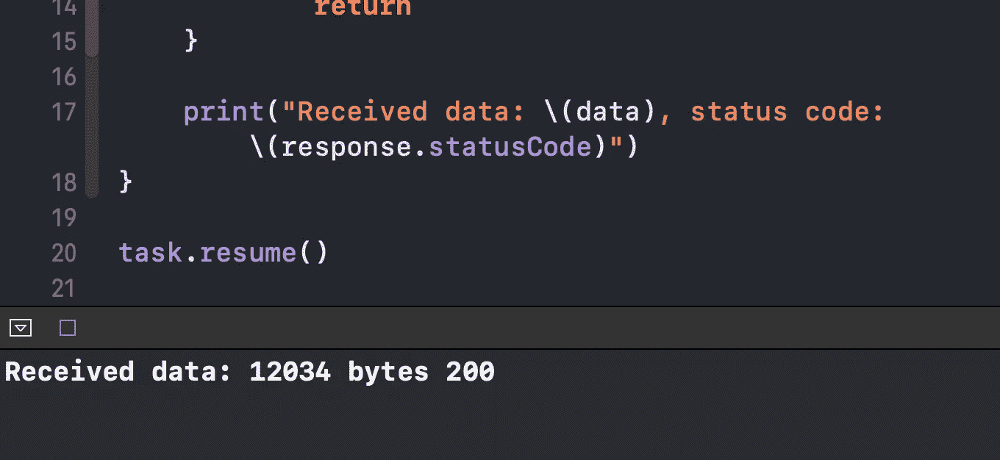
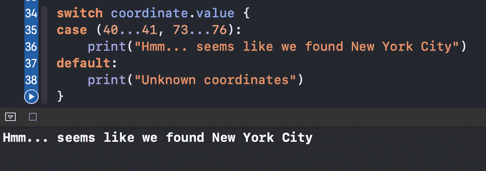

# Swift 中的~=运算符是什么？

> 原文：<https://betterprogramming.pub/what-is-the-operator-in-swift-7f6bc7623023>

## 搜索某个范围内的值

照片由 [Rishi Deep](https://unsplash.com/@_rishideep_?utm_source=medium&utm_medium=referral) 在 [Unsplash](https://unsplash.com?utm_source=medium&utm_medium=referral) 上拍摄

今天，我们将通过一些真实的例子来了解 Swift 中一家不太知名的运营商:`~=`。

简而言之，当我们想要检查一个范围是否包含某个值时，我们使用这个操作符。

# 我们开始吧

考虑下面的常见情况:我们想发起一个网络请求，如果没有遇到任何错误就打印出数据，所以我们创建一个`URLSessionDataTask`，如下所示:

我们可以看到如何使用`~=`来检查状态码的整数值是否在 200 和 300 之间(不包括 200 和 300)，这意味着结果是成功的。否则，我们将打印一条错误消息。

如果我们更改`print`语句并启动任务，我们会看到，我们确实有一个有效的响应，状态代码是 200:

代码是在 Xcode 操场上运行的

让我们看看另一个在幕后使用的`~=`操作符的例子。假设我们有一个简单的`Coordinate`结构，并像这样实例化它:

我们要检查这个坐标是否位于纽约市的坐标范围内(这个例子是简化的)。所以我们使用`switch`语句:

我们指定纬度和经度值的范围。在引擎盖下，`~=`运算符使用`==`运算符将范围内的每个值与我们的`coordinate`值进行比较:

# 包扎

对 Swift 更多鲜为人知的功能感兴趣？请随意查看我的其他相关文章:

*   [Swift 中的 ExpressibleByIntegerLiteral 协议是什么？](https://medium.com/cleansoftware/what-is-the-expressiblebyintegerliteral-protocol-in-swift-e71ad4a37a96)
*   [Swift 中的价值绑定模式是什么？](https://medium.com/better-programming/what-is-the-value-binding-pattern-in-swift-a644be3e0597)
*   [Swift 中的 vDSP 框架是什么？](https://medium.com/better-programming/what-is-the-vdsp-framework-in-swift-fe2539693e9a)
*   [Swift 中的 CustomStringConvertible 协议是什么？](https://medium.com/better-programming/what-is-the-customstringconvertible-protocol-in-swift-4b7ddbc5785b)
*   [Swift 中的类和静态有什么区别？](https://medium.com/better-programming/what-is-the-difference-between-class-and-static-in-swift-3493848ed831)

感谢阅读！