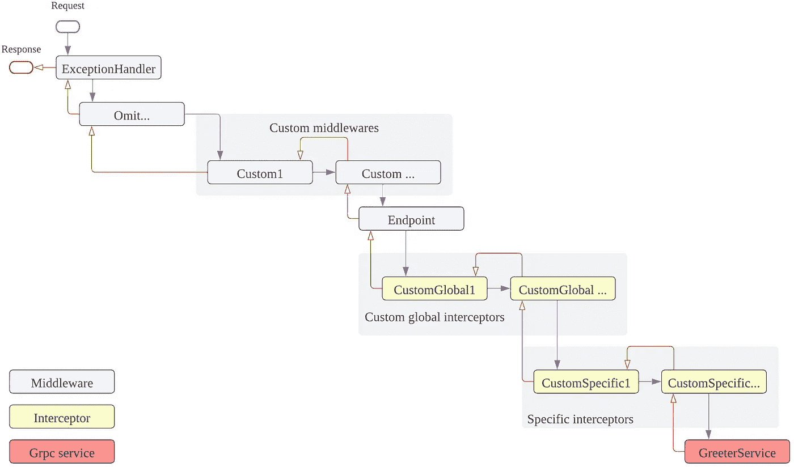

# ASP 中 GRpc 拦截器的顺序是什么？网？

> 原文：<https://betterprogramming.pub/what-is-the-order-of-the-grpc-interceptor-in-asp-net-2cda5d42285f>

## 通过测试您的代码了解


[阿尔瓦罗·雷耶斯](https://unsplash.com/@alvarordesign?utm_source=medium&utm_medium=referral)在 [Unsplash](https://unsplash.com?utm_source=medium&utm_medium=referral) 上拍摄的照片

在我之前的文章[在 ASP.NET 实现 gRpc 全局异常处理程序](https://medium.com/@lovemath288772/implement-grpc-global-exception-handler-in-asp-net-e371fb35b7b7)中提到，如果全局异常处理程序中间件和 gRpc 全局异常处理程序拦截器同时存在，它能工作吗？

问题的关键是在 gRpc 请求进入 gRpc 服务之前发生了什么。

[微软官方文件](https://docs.microsoft.com/en-us/aspnet/core/fundamentals/middleware/?view=aspnetcore-6.0#middleware-order)显示中间件顺序。

我们想知道拦截器的实际顺序，以及拦截器在图中的位置。

让我们通过测试代码来确定顺序。

# 中间件和拦截器的测试代码

首先，创建一个定制的中间件，如下所示。

这是一个简单的中间件；记录调用和完成的中间件。

定制中间件

其次，创建一个全局定制拦截器。

在这个例子中，我们使用一元 gRpc 调用。

因此，我们覆盖了`UnaryServerHandler`并记录了调用和完成的拦截器。

全局自定义拦截器

第三，将定制中间件和拦截器注册到请求管道。

```
var builder = WebApplication.CreateBuilder(args);

// Add services to the container.
builder.Services
    .AddGrpc(c => c.Interceptors.Add<GlobalCustomInterceptor>());var app = builder.Build();// Configure the HTTP request pipeline.
app.UseMiddleware<CustomMiddleware>();

app.MapGrpcService<GreeterService>();

app.Run();
```

最后，调用 gRpc `Greeter.SayHello`，我们得到了下面的日志。

```
info: Microsoft.AspNetCore.Hosting.Diagnostics[1]
      Request starting HTTP/2 POST info: GrpcRequestOrder.CustomMiddleware[0]
       --- Custom Middleware Invoked ---info: Microsoft.AspNetCore.Routing.EndpointMiddleware[0]
      Executing endpoint 'gRPC - /greet.Greeter/SayHello'info: GrpcRequestOrder.GlobalCustomInterceptor[0]
       --- Global Custom Interceptor Invoked ---info: GrpcRequestOrder.Services.GreeterService[0]
       --- Say Hello ---info: GrpcRequestOrder.GlobalCustomInterceptor[0]
       --- Global Custom Interceptor Completed ---info: Microsoft.AspNetCore.Routing.EndpointMiddleware[1]
      Executed endpoint 'gRPC - /greet.Greeter/SayHello'info: GrpcRequestOrder.CustomMiddleware[0]
       --- Custom Middleware Completed ---info: Microsoft.AspNetCore.Hosting.Diagnostics[2]
      Request finished HTTP/2 POST 
```

如您所见，请求是通过订单的`CustomMiddleware`、`EndpointMiddleware`、`GlobalCustomInterceptor`和`GreeterService`来完成的。

因此，如果您在`GreeterSerivice`中抛出异常，我们可以在拦截器中捕获异常；中间件不会捕捉异常。

这就是为什么`GlobalExceptionHanldeMiddleware`和`GlobalExceptionHandleInterceptor`可以同时存在的原因。

## 另一个问题，是否存在像 UseWhen 这样的方法来指定特定 gRpc 服务的拦截器？

答案是肯定的。

有些 gRpc 服务在某些场景中需要拦截器，但有些不需要。

我们可以使用`AddServiceOptions`扩展方法来处理这个场景。

创建一个特定的 gRpc 服务拦截器，并将其注册到`AddServiceOptions`。

再次调用 gRpc `Greeter.SayHello`，我们得到了下面的日志。

特定拦截器的顺序在全局拦截器之后。

```
info: Microsoft.AspNetCore.Hosting.Diagnostics[1]
      Request starting HTTP/2 POSTinfo: GrpcRequestOrder.CustomMiddleware[0]
       --- Custom Middleware Invoked ---info: Microsoft.AspNetCore.Routing.EndpointMiddleware[0]
      Executing endpoint 'gRPC - /greet.Greeter/SayHello'info: GrpcRequestOrder.GlobalCustomInterceptor[0]
       --- Global Custom Interceptor Invoked ---info: GrpcRequestOrder.SpecificGrpcServiceInterceptor[0]
       --- Specific GrpcService Interceptor Invoked  ---info: GrpcRequestOrder.Services.GreeterService[0]
       --- Say Hello ---info: GrpcRequestOrder.SpecificGrpcServiceInterceptor[0]
       --- Specific GrpcService Interceptor Completed---info: GrpcRequestOrder.GlobalCustomInterceptor[0]
       --- Global Custom Interceptor Completed ---info: Microsoft.AspNetCore.Routing.EndpointMiddleware[1]
      Executed endpoint 'gRPC - /greet.Greeter/SayHello'info: GrpcRequestOrder.CustomMiddleware[0]
       --- Custom Middleware Completed ---info: Microsoft.AspNetCore.Hosting.Diagnostics[2]
      Request finished HTTP/2 POST 
```

# 结论

我们找出了 gRpc 请求的顺序，并在下图中画出了顺序。



顺序是定制中间件、定制全局拦截器和特定拦截器。

这是[中间件订单图的后半部分。](https://docs.microsoft.com/en-us/aspnet/core/fundamentals/middleware/?view=aspnetcore-6.0#middleware-order)

理解中间件和拦截器中的请求顺序将有助于找出未知的问题。

使用全局拦截器可以减少代码库中的重复代码，比如 gRpc 请求-响应日志、微服务中的分布式日志跟踪等。

下面几篇文章，我将展示如何在微服务中解决分布式日志追踪；很方便的快速弄清楚你的微服务发生了什么。

希望这篇文章能解决你的困惑。

# 参考

[https://docs . Microsoft . com/en-us/aspnet/core/fundamentals/middleware/？view=aspnetcore-6.0](https://docs.microsoft.com/en-us/aspnet/core/fundamentals/middleware/?view=aspnetcore-6.0)

[https://docs . Microsoft . com/en-us/aspnet/core/grpc/interceptors？view = aspnetcore-6.0 # grpc-拦截器与中间件](https://docs.microsoft.com/en-us/aspnet/core/grpc/interceptors?view=aspnetcore-6.0#grpc-interceptors-versus-middleware)