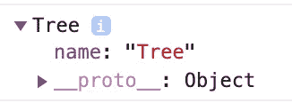
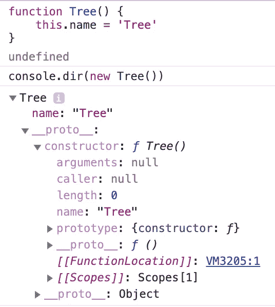
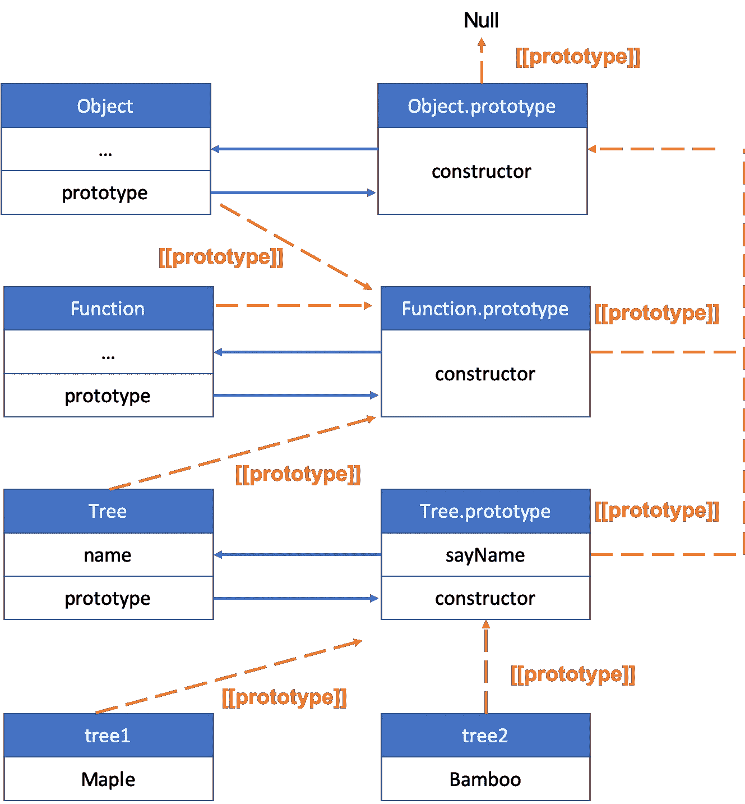

# JavaScript 中的原型是什么？

> 原文：<https://betterprogramming.pub/what-is-the-prototype-in-javascript-a17329f3a364>

## JavaScript 基础知识


阿尔瓦罗·雷耶斯在 [Unsplash](https://unsplash.com?utm_source=medium&utm_medium=referral) 上拍摄的照片

JavaScript 中的原型是什么，它们是如何工作的？在这篇文章中，我将讨论 JavaScript 中的原型。

# JavaScript 中的构造函数是什么？

要了解原型，先说构造函数。

JavaScript 中的`Constructor`函数是返回对创建实例对象的对象的引用的函数。例如，如果您的对象是数组的实例，其构造函数将引用该数组。这个构造函数总是指向函数本身。

```
let a = [];
a.constructor === Array; // true
```

假设有一个名为 Tree 的函数。使用树函数创建一个新对象:

```
function Tree() {
  this.name = 'Tree';
}const tree = Tree();
console.dir(tree); // undefined
```

在上面的例子中，`tree`中没有存储任何东西，因为 Tree 不返回任何值。在 JavaScript 中，构造函数是一个函数对象，只有在使用`new`关键字调用函数 Tree 时才会被调用。

```
const tree = new Tree();
console.dir(tree); 
```



console.dir 的结果(树)

我们可以看到属性`name`是在我们用`new`关键字调用 Tree 之后设置的。那么当我们用`new`调用一个函数时会发生什么呢？

基本上，有两种通过调用函数来创建对象的方法。第一种方法是每个懂 JavaScript 的人可能都知道的——就像下面这样称呼它。

```
tree();
```

一旦你这样调用它，那么函数 Tree 的新的词法环境将被创建，JavaScript 引擎将从上到下执行`tree`中的所有代码。如果有 return 语句，那么`tree`返回特定的值。如果没有，则默认返回`undefined`。

但是，使用`new`关键字，引擎会执行几个步骤。

1.  创建一个空对象`{}`，并将其分配给`this`。
2.  将函数中像这样表示的所有值赋给`this`。`this.name = 'Tree'`
3.  返回`this`并将其存储到一个采用`new Tree()`返回值的变量中。

所以，如果你用`new`调用一个函数，代码是这样的。

```
function Tree() {
  this = {};
  this.name = 'Tree';
  return this;
}
```

## 我如何知道函数是否是用“new”调用的？

从 ECMAScript 2015 开始，一个新的特性出来了；`new.target`。这是一个非常简单的特性，让您知道这个函数是否是用`new`调用的。`new.target`返回对函数构造函数的引用。

```
function Tree() {
  if (!new.target) { 
    console.log('Need new !!!');
  }
}Tree(); // Need new !!!
new Tree(); // Tree {}
```

## 我明白什么是构造函数，但这有什么关系呢？

所以，如果我们用`new`调用 Tree，那么结果看起来是这样的。

```
function Tree() {
  this.name = 'Tree';
  this.age = 13;
}const tree = new Tree();
// same as
const tree = {
  name: 'Tree';
  age: 13
};
```

但是，想象一下，我们想再创造 10 棵树。如果我们每次都必须用一个*字面上的*对象来创建一个对象，这难道不令人讨厌吗？
简单地将每个变量或方法放入一个构造函数中，然后用`new`调用创建一个新对象。这不仅有利于维护代码，而且还可以重用。


照片由[photo-nic.co.uk NIC](https://unsplash.com/@chiro?utm_source=medium&utm_medium=referral)在 [Unsplash](https://unsplash.com?utm_source=medium&utm_medium=referral) 上拍摄

# 什么是原型？

先说样机。原型是一个函数对象的所有实例之间的共享属性。当使用`new`调用一个函数时，会生成一个名为`prototype`的新属性，然后将其设置为`this`。有趣的是，函数本身的构造函数是原型对象的默认属性。而每一个对象，除了`Object.create(null)`创建的对象，都有它的原型对象。



这是您在创建树的新实例时可以看到的。如果您不熟悉 JavaScript 中的 prototype，请记住这一点:prototype 只是一个对象，它的名为 constructor 的属性引用它所属的函数。

虽然树没有`sayName`函数作为它的属性，但是`tree1`和`tree2`有`sayName`。



树的原型链

这是树的原型链的全图。我知道，这看起来很混乱。我一个一个解释。

1.  树具有`prototype`属性，用于与从树继承属性的所有实例共享属性，例如变量和函数。
2.  正如我前面提到的，`prototype`只是一个内部包含`constructor`函数的对象，我们在这篇文章的前面已经讨论过了。而`constructor`指向函数本身。树的`prototype`有链接到`Tree`函数的`constructor`。
3.  每个对象都包含一个名为`[[prototype]]`的属性。在大多数浏览器中，它被称为`__proto__`。`[[prototype]]`表示的是函数从其继承属性的对象的`prototype`属性。比如看图。树的`[[prototype]]`引用`Function.prototype`，因为树是函数的实例。
4.  最高的`prototype`是`Object.prototype`。`Object.prototype`不指任何东西。所以`Object.prototype.__proto__`就是`null`。
5.  当一个变量或方法被调用或引用时，JavaScript 通过从最底层到最顶层查看所有原型来寻找它，直到它找到它要找的东西或者它从`Object.prototype`到达`null`。这个过程叫做`Prototype Chain`。

```
tree1.sayName(); // Maple
```

`tree1`没有`sayName`作为它的属性。

```
tree1.hasOwnProperty('sayName'); // false
```

调用`sayName`时，JavaScript 在`tree1`的范围内寻找，但是找不到。然后 JavaScript 寻找连接到`Tree.prototype`的`tree1`的`[[prototype]]`。JavaScript 可以在`Tree.prototype`的范围内找到`sayName`，并执行。如果在`Tree.prototype`中没有`sayName`，那么 JavaScript 再次寻找连接到`Function.prototype`的`Tree`的`[[prototype]]`。JavaScript 会一直这样做，直到找到它要找的东西或者到达`null`。

## 即使我已经用“new”创建了一个对象，我还能在原型中添加方法吗？

绝对的。看例子。

您可以随时在 Tree 的原型中添加或删除变量或函数。当它的所有实例试图访问它时，它们将动态地引用更新的原型。

## 我可以替换原型吗？

当然可以。您可以用新的原型对象重新分配它。

正如你在结果中看到的，Tree 的原型被换成了另一个，我做了`tree3`。但好玩的地方在于`tree1`和`tree2`仍然指出之前的`sayName`打印`this.name`的功能，而`tree3`则指出新的`sayName`。因此，在用新的原型替换现有的原型之前，您应该确保这一点。因为现有实例仍然引用原始原型，所以它们不会像您预期的那样工作。此外，垃圾收集器 GC 不会清理原始原型，因为它仍然被其他人引用，在本例中是`tree1`和`tree2`。因此，改变原型并不被认为是最佳实践。

# 结论

原型是 JavaScript 中一个非常漂亮的特性，因为它允许许多对象彼此共享数据。但是，您应该小心处理原型，因为如果您更改原型，已经创建的实例必须手动更新，并且很容易产生副作用。下一篇文章，我将使用原型讨论 JavaScript 中的继承。

# 资源

*   [TC39 — Object.constructor](https://tc39.es/ecma262/#sec-object-constructor)
*   [MDN 中的新目标](https://developer.mozilla.org/en-US/docs/Web/JavaScript/Reference/Operators/new.target)
*   [JavaScript 信息—构造函数](https://javascript.info/constructor-new)
*   [MDN 中的 object . prototype](https://developer.mozilla.org/en-US/docs/Learn/JavaScript/Objects/Object_prototypes)