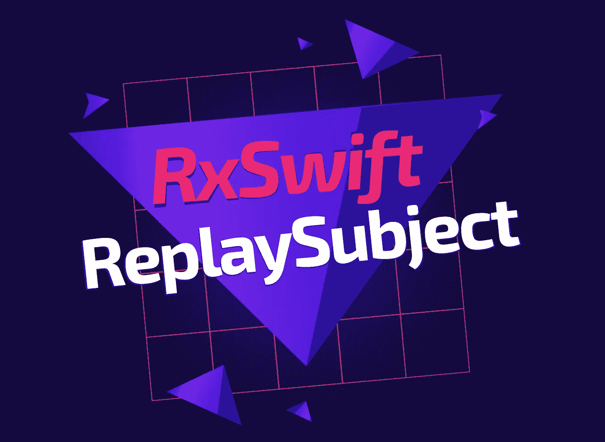
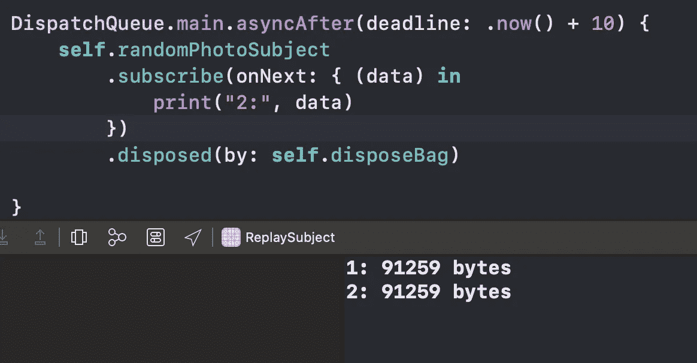

# RxSwift 中的 ReplaySubject 是什么？

> 原文：<https://betterprogramming.pub/what-is-the-replaysubject-in-rxswift-57b0f32d3660>

## 以及如何缓存您的数据

作者照片。

在本文中，我们将了解到 [RxSwift](https://github.com/ReactiveX/RxSwift) 的便捷`ReplaySubject`。

简而言之，它允许我们向未来的观察者重放发射的元素。我们可以定义一个`bufferSize`来指定要重放的元素的最大数量。

当您希望存储接收到的数据并将其提供给所有未来的订阅者时，它会很有用。这正是我们在这篇文章中要达到的目的。

# 我们开始吧

首先，用 1 的指定`bufferSize`初始化`ReplaySubject`:

现在让我们创建一个方法，从 Unsplash 中检索一个随机图像，并将`Data`发送到`randomPhotoSubject`:

注意，我们也在`viewDidLoad()`方法内部调用它。

现在最有趣的部分来了:为这个主题订阅两个观察者。让我们在触发`getRandomPhoto()`方法后立即添加第一个订阅，十秒钟后添加另一个订阅:

结果正是我们想要的:即使请求已经完成，第二个观察者也会收到与第一个观察者相同的数据:

正如我们所见，`ReplaySubject`使得缓冲数据变得容易。它还消除了创建侧属性来获取以前发出的数据的需要，这使得我们的代码对读者来说更加简洁明了。

# 包扎

对更多 RxSwift 文章感兴趣？那么你可能会发现这些很有帮助:

*   [用 RxSwift 替换委托](https://medium.com/better-programming/replace-delegation-with-rxswift-32ad18d75140)
*   [如何用 RxDataSources 实现 UITableView 和 UICollectionView】](https://medium.com/better-programming/how-to-implement-uitableview-and-uicollectionview-with-rxdatasources-1afcd68729bf)
*   [在 Swift 5 中实施反应式 MVVM 架构](https://medium.com/better-programming/mvvm-in-swift-infinite-scrolling-and-image-loading-d47780b06e23)
*   [如何在 RxSwift 中创建定时器](https://medium.com/better-programming/how-to-create-a-timer-in-rxswift-578bf8712678)
*   [RxSwift 单元测试在 2 分钟内说明](https://medium.com/better-programming/rxswift-unit-testing-explained-in-3-minutes-c024b7a26d)

感谢阅读！