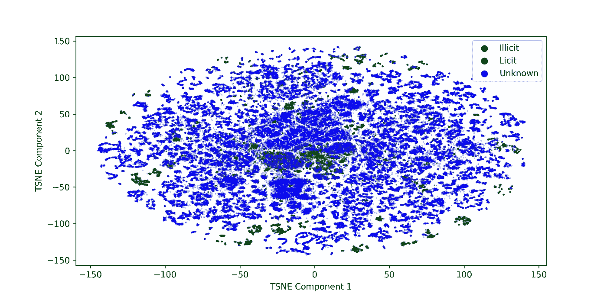
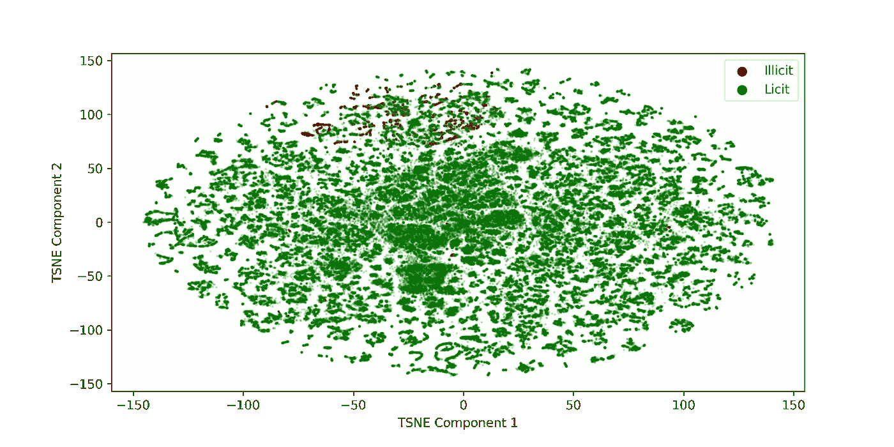

# 数据科学在 Web3 环境中的角色是什么？

> 原文：<https://betterprogramming.pub/what-is-the-role-of-data-science-in-the-context-of-web3-c6de6764d36e>

## 非法比特币交易检测为区块链、机器学习和 web3 数据科学提供了一个很好的用例


照片由 [Pierre Borthiry](https://unsplash.com/@peiobty?utm_source=unsplash&utm_medium=referral&utm_content=creditCopyText) 在 [Unsplash](https://unsplash.com/s/photos/blockchain?utm_source=unsplash&utm_medium=referral&utm_content=creditCopyText) 上拍摄

“万维网的未来”

“一个去中心化的世界。”

“公平透明。”

“只是另一个流行词。”

这些是人们用来指 Web3(或 Web 3.0)的一些东西。简单地说，Web3 就是基于区块链技术的互联网和万维网。基于区块链原理工作的比特币是理解 Web3 去中心化的一个很好的例子。

比特币是一种分散的数字货币，这意味着它不受中央银行或当局的控制。在比特币网络上进行的所有交易都是公开的，账户名称是匿名的。您可以检索交易金额，但帐户名称显示为 26–35 个字母数字字符串。

比特币的这一方面(即匿名)使得实体能够参与非法交易，包括洗钱、在黑市上交换非法商品和服务、勒索软件攻击等。看到比特币网络在过去十年的增长，超过 7 亿次交易，我们可以得出结论，这一切都出现了一个问题。

解决这个问题的一个方法是构建一个比特币交易图。

# 比特币交易图

交易图只是一个图形数据集，其中节点由比特币地址(或公钥)表示，边由交易表示。边权重可用于存储交易值。这个图实际上是有方向的，因为我们想捕捉资金从汇款人到收款人的流动。

比特币交易图是一个有向无环图(DAG ),其形式为`**G**(*V, E*)`,其中`V`是顶点/节点，`E`是两个顶点之间的边/链接。这里，边是一对有序的节点，就像我们处理有向图一样。

我们可以在这些事务图中添加一个时间组件，并使其成为一个动态图(或动态 DAG)。我们将动态图定义为一系列快照，即`G = (G₁, G₂, …., Gₜ)`，其中`Gₜ = (Vₜ, Eₜ)`和`T`是快照的数量。

您可能会问，这个事务图的目的是什么？

首先，我们可以找到识别比特币网络非法交易的可能解决方案。这将有助于有效打击黑市，这是交易图的几个用例之一，即欺诈检测。

数据结构，如图表，可以以人类容易理解的方式捕捉复杂的现实生活场景，并且在一些帮助下也可以被机器理解(图表机器学习)。

# 欺诈检测

欺诈或非法交易检测可以被公式化为监督或非监督问题，然后使用预测机器学习算法进行建模。

## 监督问题

有监督的问题需要一个带标签的数据集。如果我们想将比特币交易图与有监督的机器学习算法结合使用，我们需要找到一种方法来标记节点。换句话说，我们需要找到一种方法去匿名化比特币地址。

[本文](https://arxiv.org/pdf/1502.01657.pdf)讲述了一些可以用来注释事务图的技术。方法如下:

1.  网络抓取——比特币用户有时会在加密论坛上公开分享他们的公钥。这可能是出于几个原因，比如希望得到捐赠，问一个问题，等等。这使得我们的工作变得容易，我们可以使用这些信息将公钥与论坛的用户 ID 进行匹配。
2.  事务指纹识别——在这里，我们使用事务元数据以尽可能高的准确度来定位用户。例如，在论坛上，我们发现一些讨论转移 X 个比特币的聊天。然后，我们转移到我们的交易数据库，交叉验证转移的大致时间和日期。以这种方式挑选与事务匹配的公钥。

瞧，我们成功地对比特币交易的一部分进行了解密。找到关于用户的更多细节，我们可以给每个去匿名化的比特币地址贴上标签。比方说，我们称这些标签为“合法”或“非法”交易，这就变成了二元分类的问题。

## 无监督问题

去匿名化是一项艰巨的任务，并不能保证识别所有的比特币地址。[本文](https://digifors.cs.up.ac.za/issa/2016/Proceedings/Full/paper%2074.pdf)讲述了无监督机器学习在比特币网络欺诈检测中的应用。在无人监管的设置中，我们不再需要标记公钥。

我们假设比特币网络上最多有 1%的非法交易(因为欺诈通常很少)。特征工程已经完成，它包括以下内容:

1.  与货币相关的功能—发送和接收的金额。
2.  与网络相关的特征-入度、出度、聚类系数。

总共提取了 14 个这样的特征，并用作 K-均值聚类的输入。我们可以使用肘形曲线法找到最佳的聚类数。基本上，我们将所有的比特币交易分为 X 个类别。其中一些集群将占交易的 99%以上。我们的重点将是最小的集群，因为它最有可能是有非法交易的集群(根据我们的假设)。

# 区块链机器学习

我偶然发现了这个[椭圆数据集](https://www.kaggle.com/ellipticco/elliptic-data-set)，它是一个比特币交易子图，有大约 20 万个节点，其中大约 23%的节点被标记为合法或非法。其余的节点被标记为“未知”每个节点具有 166 维特征，并且还包括具有 49 个时间步长的时间信息。

这是一个部分去匿名化的交易图的例子，我们可以应用监督机器学习算法来制定欺诈检测问题。



比特币交易子图的 TSNE 可视化

椭圆数据集已在很小程度上被注释，这可以在 TSNE 可视化中看到，其中大多数比特币地址是未知的。为了训练欺诈检测模型，我们只选择带有注释标签的地址。

我训练了一个随机森林分类器来执行欺诈检测，并使用了节点特征(以 166 个维度作为输入)。代码如下所示:

结果如下:

```
***** RF MODEL *****
ACC: Train: 1.0 Test: 0.987
ROC: Train: 1.0 Test: 0.935
F1: Train: 1.0 Test: 0.993
**********************
```

测试成绩相当不错，我们已经成功训练了一个欺诈检测机器学习模型。

因为我们处理的是图形数据类型，所以我还使用图形神经网络构建了另一个模型。代码如下:

结果如下:

```
***** GCN MODEL *****
ACC: Train: 0.98 Test: 0.975
ROC: Train: 0.9 Test: 0.894
F1: Train: 0.99 Test: 0.986
**********************
```

虽然结果不如随机森林模型好，但我们仍然有一个很好的基于图形神经网络的欺诈检测模型。

我使用了最佳模型来预测未知比特币账户的标签，这是我得到的结果:



比特币交易子图的 TSNE 可视化(未知预测)

从上面的图像中，我们可以看到大多数未知的交易实际上都是合法的。对于未知标签，模型预测 95%的账户是合法的，5%是非法的。这超过了我们假设的阈值(1%)，但仍然比合法交易少得多——这很好！

# 结论

有了数据科学，我们有可能通过追踪欺诈性交易，让分散的网络变得更加安全。机器学习应用的其他领域包括基于强化学习或时间序列预测的加密交易机器人，优化挖掘过程，以及涉及敏感信息安全交易的几个用例的开发。

在构建安全可靠的网络 3 的过程中，积极利用数据科学的可能性非常广泛。

感谢阅读，干杯！

```
**Want to Connect?** Reach me at [LinkedIn](https://www.linkedin.com/in/rohithteja/), [Twitter](https://twitter.com/rohithtejam), [GitHub](https://github.com/rohithteja) or just [Buy Me A Coffee](https://www.buymeacoffee.com/rohithteja)!
```