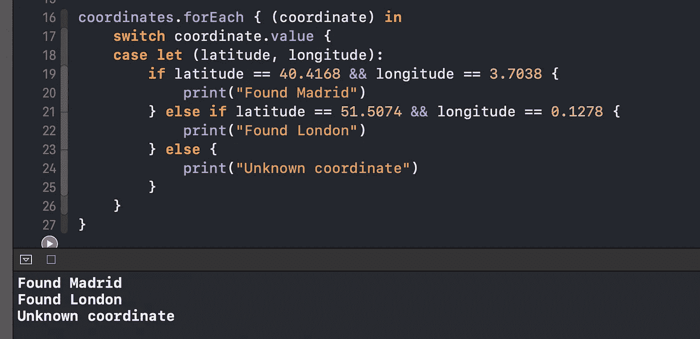

# Swift 中的价值绑定模式是什么？

> 原文：<https://betterprogramming.pub/what-is-the-value-binding-pattern-in-swift-a644be3e0597>

## 轻松匹配和比较值

谢尔盖·佐尔金在 [Unsplash](https://unsplash.com?utm_source=medium&utm_medium=referral) 上拍摄的照片

今天，我们将通过在 Xcode 操场上快速实现 Swift 中的值绑定模式来探索它。

值绑定模式允许您使用`case let`语句将匹配的值绑定到`switch`中的常量或变量。

# 我们开始吧

考虑下面这个叫做`Coordinate`的简单结构:

我们有一个包含纬度和经度`Double`值的命名元组。

让我们实例化一个`Coordinate`的数组:

现在假设我们想要检查某个特定的`Coordinate`是否与某个城市相匹配。我们为此使用值绑定模式:

`case let`语句允许我们将每个坐标的`value`属性分解成两个常量，称为`latitude`和`longitude`。因此，我们可以轻松方便地检查和比较这些值。

我们有以下输出:

完整源代码:

# 包扎

对 Swift 的其他功能感兴趣吗？请随意查看我的其他相关作品:

*   [Swift 中的类和静态有什么区别？](https://medium.com/better-programming/what-is-the-difference-between-class-and-static-in-swift-3493848ed831)
*   [Swift 中的带标签语句是什么？](https://medium.com/better-programming/what-is-a-labeled-statement-in-swift-2d245ac7b4e7)
*   [什么是 OptionSet，什么时候应该使用？](/better-programming/what-is-optionset-in-swift-and-when-you-should-use-it-419777f3c39)
*   [Swift 中的 CustomStringConvertible 协议是什么？](/better-programming/what-is-the-customstringconvertible-protocol-in-swift-4b7ddbc5785b)
*   [Swift 中的等价协议是什么？](/better-programming/what-is-the-equatable-protocol-in-swift-f3238f6821d6)

感谢阅读！