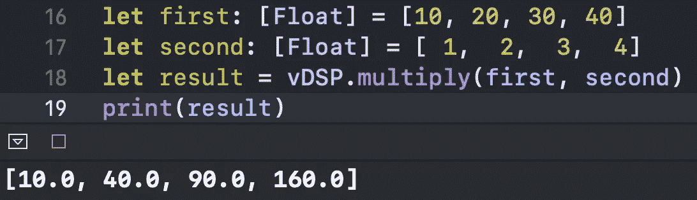
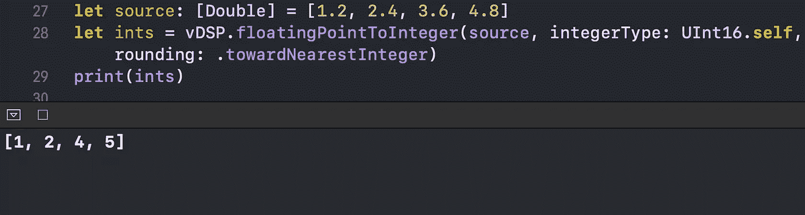
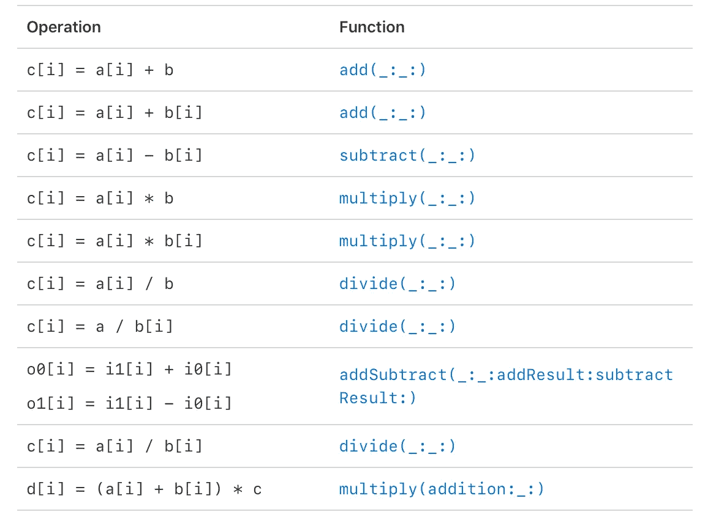

# Swift 中的 vDSP 框架是什么？

> 原文：<https://betterprogramming.pub/what-is-the-vdsp-framework-in-swift-fe2539693e9a>

## 优化您使用 Swift vectors 的方式


马库斯·斯皮斯克在 [Unsplash](https://unsplash.com?utm_source=medium&utm_medium=referral) 上的照片。

在这个简短的教程中，我们将探索 Swift 的 vDSP 框架，它是更大的 Accelerate 框架的一部分。我们将通过比较使用向量的标准方法和更新更有效的方法来做到这一点。

# 我们开始吧

考虑以下两个数组:

如果我们想将一个数组中的每个成员乘以另一个数组中相应的成员呢？这是我们传统上可以做的:

我们如何优化这段代码？首先，导入加速框架:

```
import Accelerate 
```

现在让我们执行以下操作:

我们在控制台中打印了以下内容:



这种方法不仅代码更干净，而且根据苹果公司的说法，我们得到结果的速度也快了几倍。

现在让我们尝试另一种操作:类型转换。

我们有一个包含`Double`成员的数组。我们希望对数组成员进行舍入，并将其转换为`Ints`，因此我们使用传统的`.map`函数:

让我们看一下该操作的 vDSP 版本:

此代码将数组中的每个成员四舍五入到最接近的整数，并在控制台中打印出来:



通过这种方式，我们优化了操作的性能，这在处理较大的数据集时会很方便。

vDSP 中还有许多其他有用的操作，可以极大地优化您的代码性能和清晰度:



# 包扎

对 Swift 更多鲜为人知的功能感兴趣？请随意查看我的其他相关文章:

*   [Swift 中的 ExpressibleByIntegerLiteral 协议是什么？](/cleansoftware/what-is-the-expressiblebyintegerliteral-protocol-in-swift-e71ad4a37a96)
*   [Swift 中的价值绑定模式是什么？](/better-programming/what-is-the-value-binding-pattern-in-swift-a644be3e0597)
*   [Swift 中的 vDSP 框架是什么？](/better-programming/what-is-the-vdsp-framework-in-swift-fe2539693e9a)
*   [Swift 中的 CustomStringConvertible 协议是什么？](/better-programming/what-is-the-customstringconvertible-protocol-in-swift-4b7ddbc5785b)
*   [Swift 中的类和静态有什么区别？](/better-programming/what-is-the-difference-between-class-and-static-in-swift-3493848ed831)

感谢阅读！