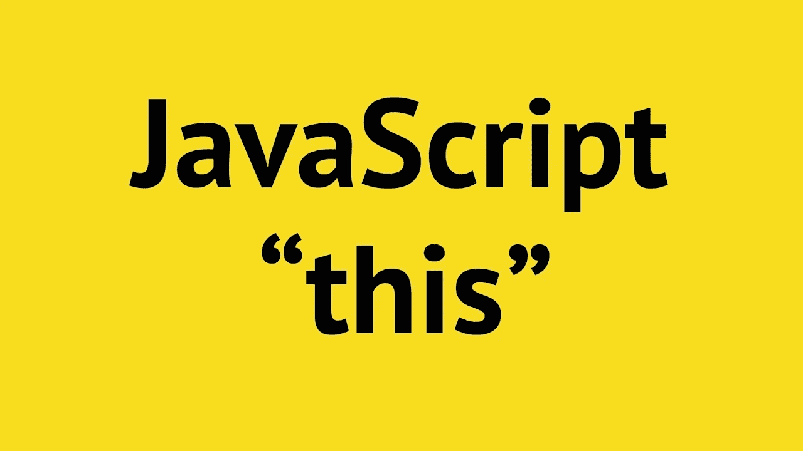

# 这个疯狂的关键词是什么？

> 原文：<https://betterprogramming.pub/what-is-this-crazy-keyword-25afeb2deb23>

## 掌握 JavaScript 的“this”



来自 YouTube 上的 Mosh 编程

任何有 Java 等面向对象语言经验的程序员都见过关键字`this`或类似的 Ruby 和 Python `self`。在那些语言中，`this`和`self`仅仅是指关键字出现的类的当前实例。

由于 JavaScript 的编写只是表面上模仿 Java 的外观和语法，所以 JavaScript 的开发者也选择使用`this`关键字。问题在于，在许多情况下，JavaScript 的`this`与真正面向对象语言中的`self`和`this`关键字完全不同。(关于 JavaScript 和具有类原生支持的语言之间的更多区别，请查看[我的上一篇文章](https://medium.com/better-programming/a-tale-of-two-languages-a-story-about-class-b6b7551c795d))。为了强调这种对比，下面对面向对象语言中的`this`进行更深入的解释。

# 它在面向对象语言中是如何工作的

如上所述，在真正的面向对象语言中，方法中`this`的值由定义方法的*决定*。例如，看一下这段伪代码，它是为了模仿一些真正的面向对象语言而编写的:

```
class Foo:
   constructor():
     this.example_var = 10
   end say_var():
      print this.example_var
   end
end
```

现在，当我们定义`instance = new Foo()`并调用`instance.say_var()`时，`say_var`中的`this`将查看该方法定义的位置，在本例中，作为`Foo`的实例方法。基于这个上下文，`this`将引用`Foo`的一个实例，`say_var()`将成功打印该实例的`example_var`属性，我们定义为 10。在像 Java 这样的纯面向对象语言中，这就是`this`的全部:一种访问类的当前实例的方法。此外，`this`的值完全由出现`this`的方法的上下文决定。

# JavaScript 的情况

我不想撒谎。有点复杂。MDN，我们的 JavaScript 圣经，是这样说的:

> 大多数情况下，`this`的值是由函数的调用方式决定的(运行时绑定)。在执行过程中不能通过赋值来设置，可能每次调用函数都不一样。

在一个过于简单的层面上，这意味着，在大多数情况下，当调用`f()`时，函数`f()`中的`this`将引用出现在点左边的任何东西。在`myObject.f()`中，`this`将指`myObject`。或者，当没有在任何对象上调用`f()`时，`this`将默认为全局上下文，通常是`Window`对象(稍后将详细介绍)。无论如何，这里有一个例子说明`this`的值取决于包含它的函数被调用的位置，而不是定义它的位置:

```
const obj = {
  attr: "whaddup",
  objMethod: function(){
          console.log(this.attr) 
    }     
  }
```

然后:

```
obj.objMethod()
>>> "whaddup"
```

有道理吗？看起来这里的`this`与真正面向对象语言中的`this`非常相似，都是指定义方法的对象。然而，这种行为与其说是 JavaScript 的特性，不如说是巧合。在这种情况下，定义`this`的上下文`obj`与调用它的对象一致(也是`obj`)。但事实未必如此。观察:

```
const globalFunc = obj.objMethod
globalFunc()
>>> undefined
```

这里，`this`最初出现在`objMethod`中，它是在对象`obj`上定义的。但是当我们复制了`objMethod`并调用`globalFunc`时，`globalFunc`的执行上下文就变成了全局对象，在基于浏览器的 JavaScript 中就是`Window`。因此，调用`globalFunc`时的`this`指的是`Window`，它没有`attr`键。这解释了为什么第二个例子导致`undefined`被打印到控制台。

# 绑定“this”和箭头函数

通常情况下，我们更希望`this`的值取决于包含它的方法是在哪里定义的，而不是在哪里执行的。这就是为什么在面向对象语言中`this`是这样工作的。这就是`.bind()`和箭头函数的用处。这些构造给了我们对`this`的一定程度的控制，而不仅仅是在调用方法时随意绑定关键字。这里有一个例子:

然后是`doggo.eatSnacksFunction()`版画:

```
>>> is eating cabbage
>>> is eating carrots
>>> is eating bones
```

所以我们能够打印出`favSnacks`的内容，但是无法访问 doggo 的`name`。几乎是我们想要的行为，但没有雪茄。在`eatSnacksFunction`内部，第一个`this`成功引用了`doggo`对象，允许我们访问`favSnacks`。这并不奇怪，因为`doggo`在`doggo.eatSnacksFunction()`中点的左边。当我们进入`forEach()`内部的回调函数时，问题就出现了。

因为这个匿名函数没有在任何对象上定义，所以它内部的`this`引用的是`Window`对象，该对象没有`name`属性。那么如何才能让内部的`this`引用`doggo`？我们有两个选择:

现在，当在`doggo`上调用这两个函数时，将成功打印:

```
>>> winfield is eating cabbage
>>> winfield is eating carrots
>>> winfield is eating bones
```

我们来说说发生了什么。在第一个函数中，`.bind(this)`的含义如下:使匿名函数内部的`this`引用与外部函数*、*、`firstSuccessfulEatSnacks`相同的`this`。因此，匿名函数中的`this`现在是`doggo`，给出了我们想要的行为。更一般地说，在一个函数上调用`.bind(someObject)`会使该函数内部的`this`引用`someObject`。

好吧，酷。但是第二个功能呢？在某种程度上，它只是第一个的语法糖。那个花哨的`=>`箭头函数本质上的意思是:制作一个普通函数，然后将`this`绑定到外层函数的`this`。就像第一个例子一样，只是语法更清晰。花一点时间来回顾这段代码；这是一个复杂的话题。