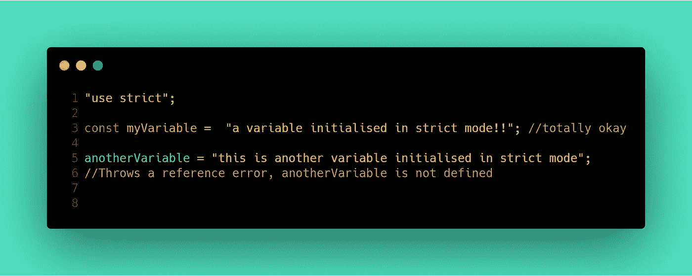
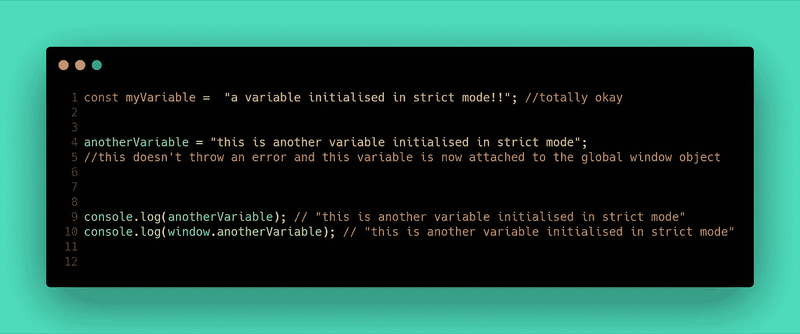
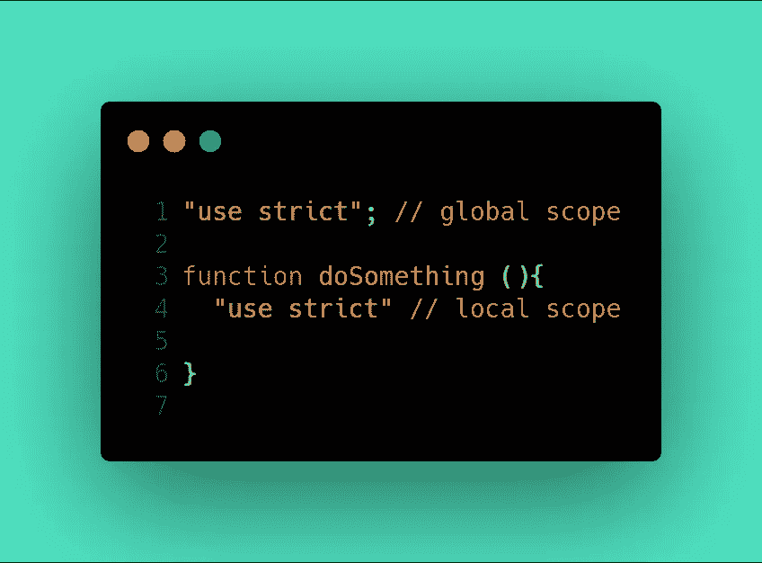
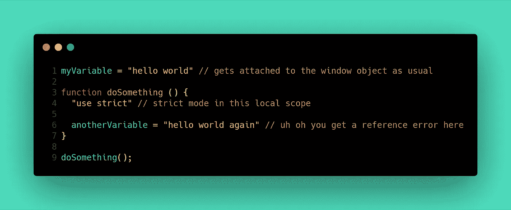

# 这种“严格模式”是什么？

> 原文：<https://betterprogramming.pub/what-is-this-strict-mode-4879143b46a>

作为一名 JavaScript 开发人员，您可能在代码中的某个地方使用过严格模式，如果您没有使用过，那么有一天您可能会使用。当试图调试你的应用程序时，严格模式会很有帮助，因为它会带来你通常在草率模式(稍后会有更多)下不会想到的错误，这与严格模式相反，所以让我们开始吧。

# 什么是严格模式？

在 ECMAScript 版本 5 中首次引入的严格模式是确保我们的代码没有任何漏洞的一种方式。它确保您的代码尽可能没有错误。

# 它是做什么的？

*   严格模式将静默错误转换为抛出错误。这意味着我们的代码中存在一些错误，JavaScript 可以忽略这些错误，以便我们的代码继续运行。这是 JavaScript 很有帮助，有时它可能会带来不可预见的后果，导致我们的应用程序出现错误。
*   严格模式还防止您以一种特定的方式编写代码，这种方式要么有风险，要么根本不是一种好的实践。

# 如何启用严格模式？

启用严格模式真的很容易；你所要做的就是将`"use strict";`添加到代码的顶部，这样你就万事俱备了。下面我们来看一些例子。

看看上面的代码片段，你认为应该如何处理没有使用`var`、`let`或`const`关键字初始化的变量？`anotherVariable`从未被声明为变量，第 5 行试图修改一个名为`anotherVariable`的变量。浏览器抛出错误是有意义的，因为`anotherVariable`不存在；在试图修改它之前，从未声明过它。但是如果我们删除了`"use strict";`语句呢？

看看上面的片段和上面的评论，你就能知道那里发生了什么。在非严格模式或“松散模式”下，未声明的变量被附加到全局窗口对象上。JavaScript 发现这个变量以前从未存在过，现在试图通过将它作为属性添加到窗口对象来帮助我们，这样我们就可以将它作为一个全局变量来访问。这真的不是一个好主意，因为如果你导入的某个库有一个同名的变量，就会有问题，因为现在引用那个变量可能只是取你放在全局窗口对象中的值。

# 将严格模式限制在一个范围内

没错，如果您愿意，您可以将严格模式限制为只有一段代码。假设您想确定从函数调用中返回了什么，这样该值就不会破坏您的代码；将严格模式限制在本地范围内才是正确的做法。所以基本上严格模式既可以在全局范围内，也可以在局部范围内(在两个花括号内)。

上面的代码片段区分了全局范围和局部范围。

既然我们将函数`doSomething()`的范围设置为在严格模式下运行，调用该函数将导致我们的代码失败，因为`anotherVariable`在重新赋值之前从未声明过。

# 在严格模式下还有什么不能做的？

*   不能用`delete`关键字删除变量、函数或对象。
*   函数中不能有重复的参数名。
*   不能有重复的对象属性。
*   不能写入只读对象属性。
*   `this`关键字指的是调用函数的对象，而不是全局窗口对象。

这些只是常见的几种；在下面的链接中，您可以了解更多关于严格模式及其应用的信息。

# **资源链接**

*   严格模式— [W3Schools](https://www.w3schools.com/js/js_strict.asp)
*   严格模式— [Mozilla 开发者网络](https://developer.mozilla.org/en-US/docs/Web/JavaScript/Reference/Strict_mode)
*   严格模式的一个实际应用— [如何让对象属性表现得像常数](https://medium.com/@26th_edmund/how-to-make-specific-object-properties-behave-like-constants-5277eddba5b0)