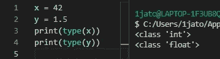
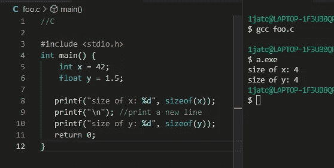
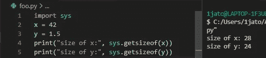
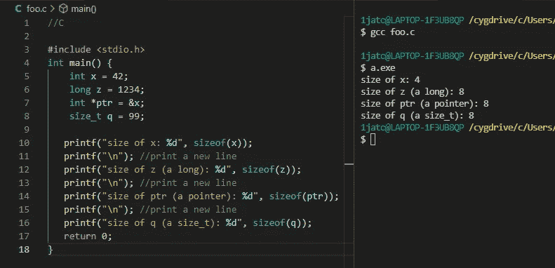
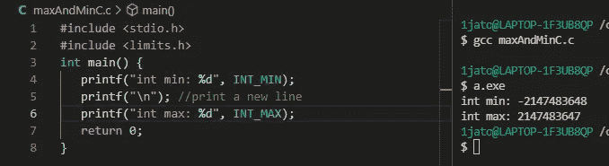
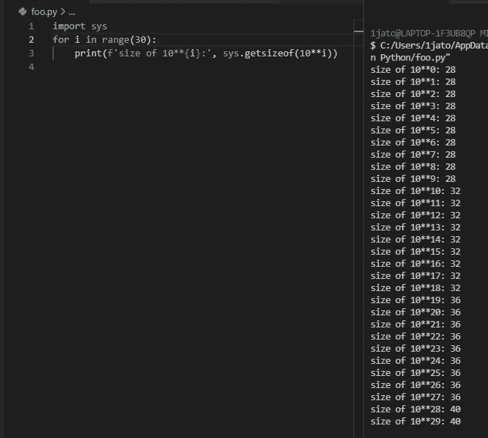

# Python 中的数字是怎么回事？

> 原文：<https://betterprogramming.pub/what-is-up-with-the-numbers-in-python-26d8d36e129b>

## 让我们来揭开为什么 Python 中整数的大小至少是 24 字节


简·kopřiva 在 [Unsplash](https://unsplash.com?utm_source=medium&utm_medium=referral) 上的照片

如果你是一个经验丰富的程序员，那么可以直接跳到叫做**“Python 中的数字类型”**的部分，因为第一部分可能不会教你很多新东西。不然就继续看下去。

## 显式和隐式类型

Python 是一种超级流行的语言，其中一个原因是用 Python 编码时，你不必考虑不同的数据类型。在 C、C#和 Java 等语言中，您必须指定变量的数据类型，而在 Python 中，您可以忽略这一点，只需键入变量的名称，就可以了。

你认为这是好是坏当然是主观的。一些开发人员讨厌非严格类型化的编程语言，因为如果您不是非常小心和清楚自己在做什么，类型的缺乏会增加创建易受攻击和不可预测的代码的风险。

另一方面，一些开发人员确实喜欢 Python 提供的可写性和可读性，因为语法不那么冗长。

在这篇文章中，我想让你更深入地了解 Python 中的数字是如何工作的，以及 Python 内部发生了什么。

## Python 中隐式类型的一个结果

我认为 Python 没有显式类型的一个后果是，许多新用户(包括我自己，直到最近)，并没有真正意识到他们使用该语言创建的数字背后发生了什么。让我们看一个例子:

```
#Python
x = 42
y = 1.5
```

在上面的代码块中，我们实例化了一个整数和一个浮点数(带小数点的数字)。

在像 C 这样的语言中，相同的代码可能是这样的:

```
//C
int x = 42;
float y = 1.5;
```

如你所见，在 C 语言中，这两个变量有明显的区别，我们必须指定浮点数是浮点数，整数是整数。

关于 C 中的数字类型，还有很多要学习的，但我现在不会深入探讨。

如果 Python 是您唯一有经验的编程语言，那么您可能没有太多考虑整数和小数之间是否有很大的区别。然而，在大多数其他语言中，这实际上是一件大事！

> 那么，Python 到底有没有 int 和 floats 呢？它们在 Python 中仅仅是相同的数据类型吗？幕后还有更多的事情吗？

你打赌有！

## Python 中的数字类型

如果我们使用 Python `type()`函数，我们可以得到变量的实际类型，在下面的截图中，你可以看到左边的函数调用和右边的终端输出。



Python 中的 42 和 1.5 类型

如你所见，x 的类型是`class 'int'`，y 的类型是`class 'float'`。所以 Python 实际上既有 int 也有 floats，即使在简单地实例化变量中的数字时并不明显。

## **整型和浮点型的大小**

现在让我们看看 C 和 Python 中 int 和 float 类型的字节大小。

*请注意，不同数据类型的确切大小因 CPU 架构和用于编译程序的编译器而异，但是为了使这篇文章简单易懂，我将坚持使用我的系统使用的大小。*

这是一个小的 C 程序，打印出我们的 int 和 float 的大小。



在 C #中打印 int 和 float 的大小

当程序运行时，您可以在右边的终端中看到，两个大小都是 4 字节，这意味着我们使用 32 位(8 * 4)来表示数字。

接下来在 Python 中做同样的事情，(记住 x 实际上是一个 int，y 是一个 float，正如我们之前发现的)。



在 Python 中打印 int 和 float 的大小

28 个字节用于 int，24 个字节用于 float。这意味着数字 42 在 Python 中占用的内存是 c 语言的 7 倍。

这就是为什么 Python 代码通常比 C 代码慢，以及为什么它需要更多内存的原因之一。

> 这是否使 Python 成为一种糟糕的语言？

不，不是的。这只是意味着 Python 可能不是适合所有情况的工具。例如，如果您的代码需要在低资源设备上运行，那么 C 可能更适合这个任务。

## Python 中 int 42 为什么需要 28 字节？

在本文的剩余部分，我将主要关注 int，而把 floats 的讨论留到以后。

int 42 在 Python 中占这么大空间的原因，不仅仅是数字。正如我们前面看到的，变量 x 的类型实际上是`class 'int'`。这意味着我们谈论的是一个整体，而不仅仅是一个数字。这个 int 对象有 4 个属性，正是这些属性占据了空间。

这四个属性是:

*   一个帮助 Python 寻找内存位置并为 int 进行内存分配和释放的引用。它的类型是`long`。
*   指向这个对象的对象类型的指针，它是一个 int 类型。数据类型是一个`pointer`。
*   以字节为单位的数据大小(该变量/对象需要多少空间)。数据类型为`size_t`。
*   最后，我们还有整数本身的值，也就是你想要存储在变量中的实际数字。默认情况下，Python 为此至少分配了 4 个字节。

总之，这意味着 Python 中 int 类的一个实例需要一个`long`、一个`pointer`、一个`size_t`的空间，它们都是 C 类型，而数字本身至少需要 4 个字节。

也许你已经知道，对于我们的数字 42，这是如何累积到 28 个字节的。然而，为了让它超级清楚，让我们跳回一些 C 代码，检查这些数据类型的大小。



用 C 打印出附加数据类型的大小

将这 4 个大小相加，我们就得到神秘的 28 字节，这就是为什么我们的数字 42 在 Python 中占据了这么多空间。

## 整数的范围限制

在 C #中，数据类型只能包含一定范围的数字，因为它们在某个时候会用完所有的位数。我们可以通过以下方式在我的系统上检查 4 字节 int 的范围:



C 语言中的 INT_MIN 和 INT_MAX

这意味着如果我们想存储一个大于 2147483647 或小于-2147483648 的数，那么我们必须使用另一种数据类型。

这在 Python 中有所不同，因为对于可以存储多大的值没有限制。Python 会继续为你的 int 分配更多的字节。



用 Python 打印超大数字的大小

正如你在上面的截图中看到的，数字越大，占据的空间就越大。(`**`运算符指的是的幂)。

## 临终遗言

因为 Python 是如此高级的语言，它抽象出了不同数据类型的概念以及它们所具有的正常大小限制。这样做的好处是，您不必担心太多的技术细节，可读性和可写性可能会得到提高。这样做的缺点是你不能完全意识到实际发生了什么，并且你不能控制你程序的小细节，这使得优化变得更加困难。

现在你知道为什么 Python 中的数字需要这么多内存了，希望你能利用这些知识。

感谢阅读！