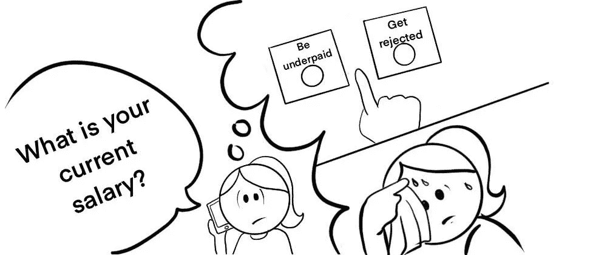

# “你现在的工资是多少？”这是一个危险信号，表明你不想在那里工作

> 原文：<https://betterprogramming.pub/what-is-your-current-salary-is-a-red-flag-that-you-dont-want-to-work-there-8a4f19a91bf>

## 询问你目前的薪水并不是一个合理的问题，应该被如此对待

Katerine Salazar Gonzalez 绘画。

# 可怕的薪水问题

背景是这样的:你正在和人力资源部的人进行第一次电话屏幕通话。

在过去的 30 分钟里，你一直试图简洁地解释你在过去十年里的生活。

也许你被一些棘手的问题戏弄过，比如 Git 内部是如何工作的，你已经尽了最大努力回答正确了。

你开始感到疲惫，但幸运的是，通话似乎即将结束。

然后，话题突然转到最后一件事上:“顺便问一下，你现在的薪水是多少，如果你跳槽，你的期望薪水是多少？”

你可能会急于回答问题的第二部分，而跳过第一部分，但不要这样做。让我们把注意力集中在第一部分:“你现在的薪水是多少？”

这个问题不合理。

# 为什么有些公司还会这么问？

今年我花了太多时间找工作。我很高兴地告诉大家，科技公司已经明白了这一点，不再要求你现在的薪水。

唉，还是现在的陋习。

为什么？因为它有效。

令人惊讶的是，在这种紧张的情况下，很多人会通过回答这个问题来贬低自己。

但这不是一个合理的问题。

想象你在工作面试的另一边。

如果爱丽丝和鲍勃有相似的技能，可以做同样的工作，为公司带来同样的价值，为什么他们以前的工资有关系呢？这一点也不相关。

但它确实为问题的第二部分(“你的期望薪资是多少”)创造了一个锚定效应(anchoring effect)，这本身就为你的最终薪资创造了一个锚定效应——而不是对候选人有利。泄露这些信息的候选人通常只会要求比他们目前得到的多一点。

然后人力资源部会开心地笑了:候选人的期望工资低于为该职位确定的范围。然后，他们会很高兴地比候选人要求的多给 3，000 美元。

多么慷慨。

不，这不慷慨。这实际上是事先为该职位确定的工资范围的绝对下限。

透露你目前的薪水有很大的坏处，也没有任何好处。

所以你有一个简单的规则可以遵循。

# 千万不要说出你现在的工资

简单吧？

但是如果你能，我会挑战你更进一步。

问你现在的工资是一个需要死亡的坏习惯，你可以通过反推这个问题来帮助它更快地死亡。

# 这是一个危险信号

公司试图在招聘过程中保持一致。

如果有人问你目前的薪水，很可能其他求职者也被骗了。

如果你在饮水机旁——或者在咖啡机旁(如果你在欧洲的话)——和你未来的同事讨论你的薪水，你很可能会意识到有些同事的薪水低得离谱。

那听起来像是一个工作的好地方吗？

如果公司在他们所谓的“价值观”营销文件中假装关心性别平等，那就加分了。

你知道她们的实际价值是什么:她们乐于利用女性开发人员报酬过低的事实……继续低于她们的报酬。

# 怎么推回去

*   招聘人员:顺便问一下，你现在的薪水是多少？如果你决定跳槽，你的期望薪水是多少？
*   你:你想知道我现在的工资？
*   你:…
*   招聘人员:…。
*   你:这有什么关系？
*   招聘人员:这是我们标准流程的一部分，流程如下…
*   你:啊，我明白了。谢谢你的澄清。听着，我想说清楚:如果你给我一个提议，我不太可能会接受。现在你的公司不太适合我。所以我不想再浪费你的时间了。但是，如果你最终重温了你的面试过程并取得了进步，请随时再次联系我，让我考虑一下。

*注:最终回复的部分内容摘自埃里克·迪特里希(Erik Dietrich)在* [*部署游击战术打击愚蠢科技采访*](https://daedtech.com/deploying-guerrilla-tactics-combat-stupid-tech-interviews/) *上的帖子。*

然后*你离开*。

你觉得这听起来激进吗？

考虑一下:一家公司在面试过程中比之后更有动力对你友好。所以如果他们在面试时是这样对待你的，那么他们之后会怎样对待你呢？

不要冒险和他们一起工作。

# 那些没有选择的人呢？

有些人没有拒绝一家公司的选择，不管这家公司的招聘流程有多糟糕。他们怎么了？

嗯，正是因为那些人没有选择，所以我鼓励你抵制这种不良做法*，如果你有选择的话。*

公司试图在招聘过程中保持一致，所以如果高需求的候选人开始反对这些做法，好公司将改变他们的规则，每个人都将受益。

# 那不是太对抗了吗？

你可能会想，“只要这种卑鄙的伎俩对我不起作用，为什么不耸耸肩，继续这个过程，就好像我没有注意到一样？”这是一个我可以同情的立场，因为这基本上是我直到去年一直在做的事情。

然后我意识到，如果卑鄙的手段没有用，他们就不会用。当然，即使对我不起作用，他们也对我未来的潜在同事使用过，对他们起作用了。

我是否想去一个地方工作，比如说，做同样工作的女同事工资会更低？

不，请参见上面的“注册标志”部分。

# 如果我没有选择呢？

你仍然不应该透露你目前的薪水。

很简单:你说你不愿意分享你现在的薪水，然后离开。

不过，请记住，公司问你这个问题是一个危险信号。如果你以后有更多的机会，考虑换工作。

# 这不是常识吗？

如果是这样，没有公司会问这个问题。

可能对你们这些有多年行业经验的人来说是显而易见的。但是要意识到，我们所处的行业每四五年就会翻一番。

所以有很多年轻的、没有经验的人会掉进这个陷阱！

# 招聘人员如何看待这种做法？

显然，这取决于他们是好的还是不太好的招聘人员。谷歌“你现在的工资是多少？”你会发现苏珊·p·乔伊斯的一篇颇有见地的文章:

> “问你现在的工资是不合适的，因为这是在不同的环境下做不同的工作。此外，雇主在以下几个地方问这个问题是非法的。

*   阿拉巴马州、纽约州奥尔巴尼县、加利福尼亚州、科罗拉多州(2021 年 1 月 1 日生效)、康涅狄格州、特拉华州、夏威夷、伊利诺伊州、缅因州、马萨诸塞州、密苏里州、新泽西州、纽约州、纽约市、俄勒冈州、波多黎各、旧金山、萨福克县、纽约州、托莱多、俄亥俄州、佛蒙特州、华盛顿州、纽约州威彻斯特县…

> 如果你感到勇敢(或恼火)，你可能要考虑采取攻势，问他们为什么不同雇主支付的工资与一家公平支付员工的公司有关。然而，这可能会很快结束这个机会。
> 
> …
> 
> 在一次求职中，这个问题由两个不同的人来问。从外部招聘人员，这可能是可以接受的。从内部招聘人员或雇主的任何其他雇员，这是不可接受的。"

现在，这看起来像一个你可以信任的招聘人员。谢谢你，苏珊！

# 下一步是什么？

我希望这篇文章是有用的！

我打算继续问如何回答问题的第二部分:“你期望的薪水是多少？”