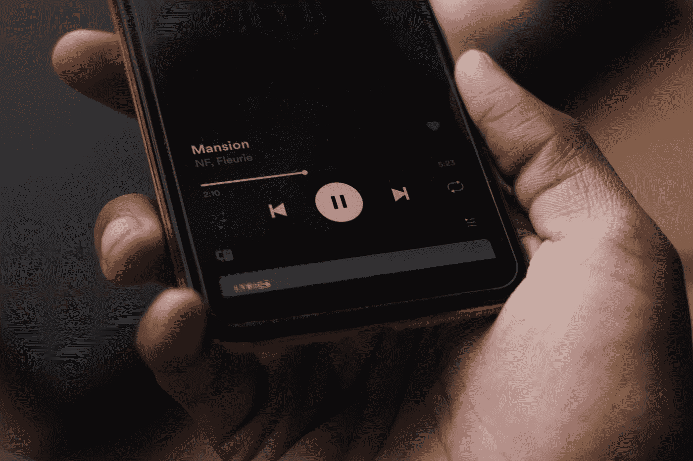

# Android 和应用商店优化的重要性

> 原文：<https://betterprogramming.pub/what-ive-learned-from-a-failed-startup-705218255f53>

## 优化是谷歌 Play 商店成功的关键

在 [Unsplash](https://unsplash.com?utm_source=medium&utm_medium=referral) 上由[米顿 V](https://unsplash.com/@maxmithun?utm_source=medium&utm_medium=referral) 拍摄的照片

我的一个最亲密的大学四年级学生开始了一个基于应用程序的创业，一年内严重失败。他破产了，觉得不得不关闭公司。这完全是一场灾难。

出于好奇，我想知道哪里出了问题。我研究了他们的商业策略，发现他们忽略了什么。

那是[应用商店优化](https://en.m.wikipedia.org/wiki/App_store_optimization) (ASO)。

他们在风险投资中投资了 10 万美元，但从未考虑过他们的 ASO。他们把最大的营销预算花在了更好的用户界面/UX 设计、漂亮的网站、搜索引擎优化和脸书广告上。他们没有看他们的应用程序，而这个应用程序应该被放在第一位。

# 谷歌 Play 商店

Google Play 商店比你想象的要拥挤和竞争激烈得多。如果你即将推出你的第一个应用程序，或者想要重新装修你的应用程序，你需要从一些基础开始。Google Play 商店有超过 290 万个应用程序可供下载。你需要从人群中脱颖而出以获得关注。

这些要点可能不会让你在一周内进入前 10 名，但正确应用这些要点可以让你登上排行榜的榜首。

# 标志是赌场

当我们遇到一个人时，我们首先会注意到什么？

你答对了。是脸。一张脸就是一种身份。同样，徽标是你的应用程序的外观。在将应用程序放入 Play store 之前，您首先需要检查的是您的徽标。它一定比赌场更有吸引力。

为你的标志雇佣一个专业的设计师。最好在这里多投资一点，即使你不得不超出预算。这个标志代表你的应用程序，所以它需要专业、相关和独特。你的投资是值得的。

你的标志应该说明一切。你的应用程序不在顶级排名或不为所有人所知，所以不要试图跟随大人物来获得你的标志灵感。尝试观察 Play store 的新热门。

# 选择正确的类别至关重要

无论如何，你都需要属于正确的类别。有时尝试不同的类别可以在短时间内提高你的下载量，但不要陷入这个陷阱。你最终会为此吃亏的。

类别是你不应该改变或误用的东西。找到你合适的类别就行了。如果你的应用都是关于学习的，选择教育，而不是游戏。也许你在这个领域已经有了强有力的竞争对手，但是你需要对更大的图景有耐心。

# 你的应用程序名称会给你带来巨大的名气

你的应用程序名称不能是你简单的愿望或感觉。这应该是你的观众需要的。试着让它与你的应用相关——例如，“[编程英雄:学习免费编码游戏](https://play.google.com/store/apps/details?id=com.learnprogramming.codecamp&hl=en)”在这里，应用程序名称说明了一切。你可以假设它是一个通过游戏教你编程的 app。

你的应用程序的名字应该清晰而不复杂。应该简单不混乱。

名字是顺利启动的最大关键。不要小看它。

# 副标题也非常重要

您会发现您需要添加一个少于 80 个字符的简短描述。

Google Play 商店读到了这个描述。你只需要找到合适的关键词，注入到你的字幕中。但是不要随便做。将关键字注入正确的位置。

在这样做的时候，确保它足够易读和吸引人。没有那个？人家不会点。

对于好的关键词来说，你的副标题是最重要的。在这里使用相关且高容量的关键词是明智的。

# 描述是药方

你将获得 4000 个字符来描述你的应用程序。

我们忽略了这一部分。但这是增加你的应用覆盖范围的金矿。这是提高搜索关键词排名的处方。这是增加下载量的终极方法。

事实是，你可以推动正确的关键字出现在搜索结果中。四千是很多字符。

为你的关键词做适当的研究。并推送转化率好的相关关键词。

# 更好的截图会有回报的

Goo Play 为您提供了在该区域添加总共八个截图的机会。

前两个对你来说最重要。用户通常会先看前两个，然后决定是否下载。

尽你最大的努力用这两张截图吸引观众。如果你能让他们看到你剩下的截图，他们可能会安装你的应用。这是一个你不应该错过的千载难逢的机会。

# 你的宣传片增加了你的转化率

你看过男主角难以察觉的电影吗？不是吧？

你知道为什么吗？这是因为导演为展示他们的英雄付出了特别的努力。你也需要为你的应用程序做同样的事情。

你的宣传片应该非常吸引人，并且不超过一分钟。很难控制你的观众的思想。雇佣一个好的动画师，为你的观众制作一个吸引人的视频。

确保你的视频反映了你的应用有多酷多有趣。你的 app 是英雄，你需要一个很酷的入口给他。

# 本地化意味着全球化

如果你的应用是为国际人士开发的，本地化可以给你带来真正的提升。本地化意味着将你的应用程序翻译成不同的语言。这会帮助你联系更有针对性的观众。

如果你没有足够的资源或人力，最初你可以只翻译你的应用程序描述。然后亲眼看看影响。

# 评论回复可以带你去最高的月亮

你将获得多少观众与你和你的观众有多少联系有关。

联系你的客户是你的应用发展的最大关键。应用点评是与客户沟通并了解他们需求的最佳方式之一。

许多应用程序所有者避免回复评论。你需要回复所有的评论来与你的消费者建立联系。

而且一定要回复每一个差评，把讨厌你的人变成崇拜者。这也表明你有多关心你的消费者。

记住，顾客是上帝。

# 该应用程序的网址是一个真正的珍珠

这对你来说是一次性的。最终确定应用程序 URL 时，您需要小心谨慎。

将你的标题和任何相关的流行关键词放在你的应用链接中。这将有助于您获得更好的流量。

假设你的应用全是视频通话。你可以在你的 app 链接中添加*视频、通话、*甚至*通话*。

# 最后的想法

ASO 的主要成分是与你的目标客户沟通。

应用这些技巧将帮助你非常容易地接触到你的目标客户，并让你走上[编辑的选择](https://play.google.com/store/apps/editors_choice/)之路。

祝你的应用程序一切顺利。