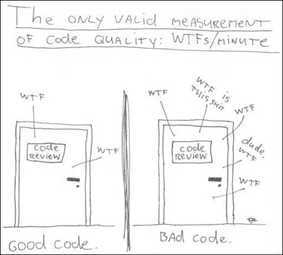

# 我从阅读干净的代码和在前端应用中学到了什么

> 原文：<https://betterprogramming.pub/what-ive-learned-reading-clean-code-and-applying-in-the-front-end-environment-921c470d552b>

## 如何编写干净代码的总结

沙哈达特·拉赫曼在 [Unsplash](https://unsplash.com?utm_source=medium&utm_medium=referral) 上拍摄的照片

学习编写干净的代码是一项艰苦的工作。你需要的不仅仅是原理和模式的知识。你得练习，看着自己失败。你必须看着别人练习，失败。你必须看到他们跌跌撞撞，然后原路返回。你必须看到他们为决策而痛苦，看到他们为错误的决策所付出的代价。

实现高质量的好软件是*难*。在前端环境中，规则是一样的，在过去的四年中，我一直在用 React 开发单页面应用程序，在这个过程中，我抓住了许多用干净代码编写的概念:罗伯特·C·马丁(在他的在线课程中被称为“鲍勃叔叔”)的《敏捷软件工艺手册》)这本书我已经读了好几遍了，有太多的啊哈时刻，我都记不清了。

我的人生故事

我将这篇文章分为四个主题:

1.  [干净的代码和有意义的名字](#98ad)
2.  功能
3.  评论
4.  格式化

# 干净的代码和有意义的名字

你曾经被糟糕的代码严重阻碍过吗？如果你是一个有经验的程序员，那么你已经来过这里很多次了。事实上，我们给它起了个名字——涉水*。我们艰难地穿过纠结的荆棘和隐藏的陷阱的泥沼。*

当然，你已经被糟糕的代码阻碍了。但你当初为什么要写呢？

写糟糕的代码会降低你的生产力。如果你有超过 3 年的经验，在你职业生涯的某一点上，你已经被别人杂乱的代码拖了后腿。随着生产率的下降，管理层做了他们唯一能做的事情——他们给一个项目增加更多的人员，希望提高生产率。但是，如果你的项目没有正确的指导方针、设计模式和编写优秀代码的人，新员工倾向于复制遗留代码——犯更多的错误，导致生产率更低。

# 什么是干净代码？

程序员有多少，干净代码的定义就有多少。所以在《干净的代码:敏捷软件工艺手册》中，有一个章节整理了几位导师的观点。总之，干净的代码具有:可读性、隔离性、组织性，不包含重复、格式化，并且最大限度地减少了类、方法和函数等实体的数量。少数导师说代码需要有测试——我不同意，在我看来，测试更多的是关于代码质量，而不是干净的代码；它们是不同的东西。

错误代码:

好代码:

这是一个使用功能组件和 React 的例子，只是一小块代码，我们可以注意到至少有四件事我们可以在坏代码中避免。

*   对象析构。
*   不必要的 if 语句(可以使用三元运算符)。
*   `<button />`中类型的不必要定义。
*   错误的名称组件定义。

# 有意义的名字

名字在软件中随处可见。我们给变量、函数、参数、类和包命名。我们命名我们的源文件和包含它们的目录。我们将 CSS 文件、ts 文件和 js 文件命名为。我们命名，命名，命名，那么声明好的变量和函数名有什么重要性呢？这对你的代码可读性和变量或函数的意图非常重要。

一个变量、函数或类的名字应该回答所有的大问题:它为什么存在，它做什么，以及它是如何被使用的。如果一个名字需要注释，那么这个名字就不会暴露它的意图。

以上，`d`这个名字没有揭示什么。它不会唤起一种流逝时间或时间单位的感觉。我们应该选择一个名称来指定测量的内容和测量单位:

选择揭示意图的名称使得理解和修改代码变得容易得多。总是使用透露意图的名字。

程序员必须避免留下模糊代码含义的错误线索。我们应该避免那些根深蒂固的含义与我们的本意不同的词。例如，`hp` *、* `aix` 和`sco`都是糟糕的变量名称，因为它们没有解释这些变量的作用。人类善于言辞。我们大脑的很大一部分致力于词汇的概念。根据定义，单词是可以发音的。如果不利用我们大脑中进化来处理口语的巨大部分，那将是一种耻辱。所以让你的名字更容易发音。

命名的另一个重要技巧是使用可搜索的名称，单字母名称和数字常量有一个特殊的问题，因为它们不容易在正文中找到。人们可能很容易找到`MAX_CLASSES_PER_STUDENT` *、*，但数字`7`可能更麻烦。搜索可能会将该数字作为文件名、其他常量定义的一部分，或者在值用于不同目的的各种表达式中出现。同样，名称`e`对于程序员可能需要搜索的任何变量来说都是一个糟糕的选择——它是英语中最常见的字母，很可能出现在每个程序的每段文本中。

如果名字太聪明，它们只会让那些和作者一样有幽默感的人记忆深刻，而且只要这些人记得这个笑话。不要说像`eatMyShorts()`这样依赖文化的小笑话来表达`abort()`的意思——说你想说的，说话算数。

# 功能

想象一下，阅读一个超过 200 行的函数的大块内容，函数内部发生的一些事情，以及太多的抽象层。奇怪的字符串，奇怪的函数调用混杂在由标志控制的双重嵌套的 if 语句中。您应该不惜一切代价避免这种类型的函数。

Bob 叔叔的干净代码中最重要的章节之一是关于函数的章节。这里有一些指导方针——坚持这些方针，为你、你的客户和你未来的同事开发更好的代码:

## **小**

函数的第一条规则是它们应该很小。函数的第二个规则是它们应该比那个小。根据你的编码风格，行数应该在 120 到 170 行之间，不要忘记将这个规则添加到你的`.eslintrc`或`.prettierrc`中。

## **分块和缩进**

这意味着 if 语句、else 语句、while 语句等语句中的块应该是一行。也许这一行应该是一个函数调用。这不仅使封闭函数很小，而且还增加了文档价值，因为在块中调用的函数可以有一个很好的描述性名称。

## **做一件事**

*函数应该做一件事。他们应该做好这件事。他们只应该这样做。*

如果一个函数只做了这些步骤中的一个步骤，而这些步骤比它的名字低一级，那么这个函数就做了一件事。毕竟，我们编写函数的原因是为了在下一个抽象层次将更大的概念分解成一组步骤。如果你能从中提取另一个函数，它的名字不仅仅是它的实现的重述，那么你的函数就不止做一件事。

## **自上而下读代码:降压规则**

我们希望代码读起来像自上而下的叙述。我们希望每一个函数后面都跟着下一个抽象层次的函数，这样我们就可以阅读程序，当我们阅读函数列表时，一次下降一个抽象层次。在书中，这被称为逐步下降规则。

事实证明，程序员很难学会遵守这一规则，也很难写出停留在单一抽象层次的函数。但是学习这个技巧很重要——它是保持函数简短并确保它们只做一件事的关键。

## **使用描述性名称**

我觉得这是函数做一件事最重要的一点。如果你为你的函数写一个语义名称，当其他开发人员接触代码时，你可能会帮助他们，使你的代码更可读。不要害怕让名字变长。一个长的描述性名字比一个短的神秘名字好，一个长的描述性名字比一个长的描述性注释好。使用一种命名约定，允许在函数名中使用多个易于阅读的单词，然后利用这些单词给函数起一个能说明其功能的名字。

## **干——不要重复自己**

不要重复自己(DRY)是软件开发的一个原则，旨在减少软件模式的重复，用抽象来代替，或者使用数据规范化来避免冗余。

您可以很容易地将上面的代码改为:

## **评论**

写评论最常见的动机之一就是糟糕的代码。我们写了一个模块，我们知道它是混乱无序的。我们知道这很乱。所以我们对自己说，“哦，我最好评论一下！”不——你最好把它弄干净！

带有少量注释的清晰而昂贵的代码远胜于带有大量注释的混乱而复杂的代码。与其花时间写评论解释你制造的混乱，不如花时间清理这些混乱。

## **用代码解释自己**

当然，有时候代码并不是一个很好的解释工具。不幸的是，许多程序员认为这意味着代码很少是解释的好方法。你想看哪个？：

## **好评**

有些评论是必要的或有益的。有时，我们需要通过评论来分享一些信息，例如，法律评论、信息性评论和待办事项评论。我个人喜欢在代码中插入一些`TO-DO`注释。

## **格式化**

你应该注意你的代码的格式。选择一套简单的规则来管理你的代码格式，然后你要坚持应用这些规则。如果你在一个团队中工作，那么团队应该同意一套格式规则，所有成员都应该遵守。拥有一个可以为您应用这些格式规则的自动化工具会有所帮助。例如，我和我团队正在使用`.prrettierrc`文件和`.editorconfig`进行 VS 代码。

## **垂直格式**

让书的现实适应我们的前端世界，当我写新文件的时候，我有一些我试图遵守的指导方针。其中最重要的是垂直格式，也就是代码行。我使用 React 开发我的应用程序，所以我尽量避免使用超过 250 行代码的组件。您可以理所当然地认为，如果您的组件文件超过 250 行，您可以将您的代码分割成代码块，并在新的组件中重用它们，从而创建更多的原子组件。

## **概念间的纵向开放性**

在解释这个概念之前，请先阅读下面的两个代码示例:

而现在有了**和**的垂直开放性:

这个用空行分隔概念的极其简单的规则对代码的视觉布局有着深远的影响。每一个空白行都是一个视觉提示，用来识别一个新的独立的概念。

## **变量声明**

变量的声明应该尽可能接近它们的用法。因为我们的函数非常短，所以局部变量应该出现在每个函数的顶部。

## **依赖函数**

如果一个函数调用另一个函数，它们应该垂直靠近，如果可能的话，调用者应该在被调用者之上。这给了程序一个自然的流程。如果约定被可靠地遵循，读者可以相信函数定义会在使用后很快遵循。

## **水平格式**

一条线应该有多宽？显然程序员更喜欢短线，但这是个人观点。在我的`.prettierrrc`中，我使用了`printWidth: 100`，但是我经历过每行代码 80 到 120 个字符的情况。

## **缩进**

如果没有缩进，程序对人类来说几乎是不可读的。缩进对于分离概念和范围很重要，可以让代码更具可读性。

# 摘要

在这篇文章中，我试图总结所有我认为重要的概念，并涵盖在《干净的代码:敏捷软件工艺手册》中。当然，这篇文章不能代替你自己阅读这本书。我强烈建议，如果这些概念对你来说是新的，我强烈建议你买一本——这是一个很棒的讲座。

# **资源**

*   [干净的代码:敏捷软件技术手册](https://www.amazon.com/Clean-Code-Handbook-Software-Craftsmanship/dp/0132350882)

你喜欢这篇文章吗？你会在干净代码的概念中加入其他规则吗？留言评论！