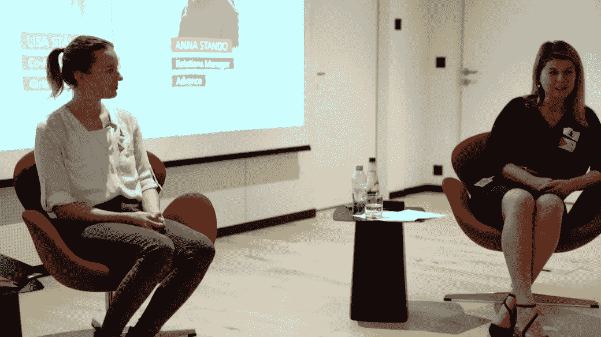

# 你想成为什么样的领导者？

> 原文：<https://betterprogramming.pub/what-kind-of-leader-do-you-want-to-be-77b7d96ced7c>

## *关于领导力的思考——以及找出你想成为什么样的领导者的 4 个步骤*

由[蒂姆·福斯特](https://unsplash.com/@timberfoster?utm_source=medium&utm_medium=referral)在 [Unsplash](https://unsplash.com?utm_source=medium&utm_medium=referral) 上拍摄的照片

在我们开始之前，需要注意的是:我绝不想通过这篇文章暗示我是领导力方面的专家。

恰恰相反，我的领导之旅才刚刚开始——至少在企业界是这样。

促使我写关于领导力的文章的原因是，我个人很重视有人对某个话题提出新观点的观点。这就是为什么我决定分享一些我的领导经验。

一开始只是写下我的想法，无意中却变成了一个由四个不同步骤组成的练习:

*   反思过去的经历
*   确定当前的挑战
*   描述我的榜样
*   定义我内心的领导力指南针

我现在将带你经历这 4 个步骤，希望它能启发你找出你想成为什么样的领导者。如果没有，那么我希望你会喜欢阅读我的想法和领导经验。

让我们开始吧。

# 开始永远不会太早

我第一次真正成为领导者的经历可能是在高中。出于纯粹的好奇，我在高中最后一年报名成为学生组织的主席——领导一个由 6 名学生组成的团队，我们与他们一起策划了全年的各种活动和倡议。

今年的重头戏是作为组委会负责人组织一年一度的高中舞会*。*我们售出了 600 多张门票，预算超过 20，000 瑞士法郎。参与该组织的团队由 30 名志愿者组成，他们都是高中生。活动取得了圆满成功，我在早期学到了许多重要的领导力课程。

*我给你留下了 2011 年的照片——真的没有人想在视觉上回忆起他们的高中时光*

2014 年，当我完成学士学位后，我开始了另一次志愿者领导之旅，组织了我的体育协会两年一次的晚会节目，整个周末吸引了 700 多名游客。

作为组委会的负责人，我需要确保 50 多名志愿者了解任务、责任和总体战略。计划在实际活动前一年就开始了，我们从想法、策略、计划、营销、视频等等方面都做了改进。在这个项目中，我学到了一大堆生活技能——我的身体和精神都被推到了极限。

此外，在活动本身，我作为主持人领导了整个晚上，这可能是我做过的最具挑战性，同时也是最有收获的公开演讲。我发现——尽管我非常紧张——我喜欢公开演讲。

我(右边)和所有参与者一起站在舞台上，为晚上的节目做最后的总结。数字电视赫丁根

对于这两次经历，我能够建立在别人多年前打下的基础上，这非常有帮助。我可以把现有的好的东西拿来，在有改进和试验空间的地方探索新的想法。

我能够在一个安全的环境中成长和学习，并承担巨大的责任和影响。这些经历永远塑造了我，并让我很早就意识到我喜欢担任领导角色。回想起来，这也是非常有趣的，主要归功于参与其中的人们——在这两种情况下，我都受益于一个真正出色的团队。

我从这些经历中学到的是…

*   意识到领导是一项艰苦但有回报的工作
*   让正确的人参与进来，问正确的问题
*   出现问题时，迅速做出决策并找到解决方案
*   有效沟通的重要性

…当然，所有这些都是在活动组织的背景下进行的。

# 没有人生来就是大师

当我回顾这些过去的经历时，毫不奇怪，不知何故，我被神奇地吸引到我可以管理或领导一个项目或团队的机会中。最近，我成为了一家日益壮大的[非营利组织](https://switzerland.girlsintech.org/)的联合董事总经理，我还在业余时间经营自己的小型[瑜伽](https://hathalisa.com/)和 [acroyoga](https://acroyoga-essentials.com/) 业务。

在一次小组讨论中，作为“瑞士科技女孩”的联席董事总经理，与 Sunrise UPC 的副首席执行官 Severina Pascu 一起谈论科技行业的女性。预先的

在 [work](https://www.esri.com/en-us/home) ，我对管理涉及跨职能协作的复杂项目以及领导和实施团队流程改进感到兴奋。

然而，我最近的领导经验也暴露了许多缺点和失败。以下是我目前正在努力应对的三大领导力挑战——不一定是决心，只是描述我正在经历的事情以及我如何试图理解它:

## **1。委派**——即使这意味着质量的暂时下降

这个几乎太明显了。我对自己的工作有很高的标准，当我让别人接手一项任务时，我也会用同样的标准对待他们。当没有达到这些标准时，通常是因为我的沟通不力，导致未来缺乏信任。但那完全是我的责任——不是别人的。

我已经不止一次地把一项任务交给某人— *假设*结果是显而易见的——结果却发现它只对我一个人显而易见。不仅传达任务，而且传达预期的结果，这不仅有助于做这件事的人，也有助于我能够放手、信任和更自在。

这也使得在交流的期望没有实现的情况下给出反馈变得更加容易，因为它们并不出乎意料。总而言之，我发现包含期望是一个更可持续的过程，但我仍在努力坚持到底——有时最终我会自己去做。

## **2。做决定**——即使不是每个人都满意(还没有)

我提出的解决方案必须让所有相关人员满意，这是一个根深蒂固的信念，我认为这是我成长为领导者的一个限制因素。我正在积极努力摆脱这样一种想法，即我总能让它为所有相关的人*完美地*工作。

我还意识到，当我处于压力之下时，做出*可能不受欢迎但重要的*决定对我来说要容易得多。我认为这与这样一个事实有关，即在有压力的情况下，这种必须取悦每个人的有限信念根本没有足够的时间浮出水面。

## **3。倾听我的直觉——即使我没有所有的事实来支持它**

如果我的观点没有确凿的事实支持，我也会努力表达出来。当然，有些情况需要确凿的事实，但特别是在我的产品设计工作中，有时没有足够的数据来支持决策。有时候，你必须听从你的直觉，甚至创造一些全新的东西。并且可以通过测试来验证解决方案。

直觉对我来说是一种奇怪的东西，我可以在日常工作之外相当容易地解开它。但是在工作中，我经常觉得我不能完全相信我的直觉——尽管我发现它经常是相当准确的。我希望这只是一个练习的问题，并对我的直觉有更多的信心。

# 3.见证领导力

但现在我说够了…让我们关注一些真正令人惊叹的领导者。为了弄清楚我想成为什么样的领导者，我也在思考榜样。我想在这里与你分享我从远处看着的软件工程的三个领导者——以及为什么。

## **#1 莎拉·德拉斯纳**

莎拉是谷歌的工程总监，无疑是科技界最受尊敬(也是最有趣)的声音之一。我喜欢她关于设计和软件工程主题的许多在线课程，我对她作为一名专业人士和一个人的表现方式印象深刻。

我欣赏莎拉的领导品质:

*   有效的沟通和表达技巧
*   不要害怕大声说出需要说的话
*   做任何事都带着幽默感和轻松感
*   变得脆弱、平易近人和谦逊

## **#2 热格利·奥罗兹**

Gergely 是优步公司的前工程经理，他成功地发布了一个名为[的博客:务实的工程师](https://www.pragmaticengineer.com/)。他有一种不可思议的感觉，能捕捉到我们这个行业的人所关心的有趣和耐人寻味的话题。在他的分析和写作中，他从不满足于抓表面，而是抓得太深以至于几乎伤人。通过他的博客，我对工作环境中的一些机制有了全新的理解。

我欣赏的 Gergely 的领导品质:

*   提供令人惊讶和发人深省的结果
*   对特定话题或问题的恰当时机的感知
*   积极倾听，不做任何假设
*   将点点滴滴联系起来，创造新的见解

## **#3 杰克·丹格蒙德**

Jack 是 Esri 的联合创始人兼首席执行官，我在这家公司工作了 5 年多。自 1969 年以来，他和他的妻子劳拉一起领导这家仍为私有的公司取得了巨大的成功。2018 年，我有幸在他参观我们位于苏黎世的 R & D 办公室时亲自见到了他，见证他的领导风格是一次深刻的体验。

我欣赏杰克的领导品质:

*   提出重要的问题，真正关心他人
*   回忆*每一个*小细节，让别人觉得被看见了
*   保持对事物的掌控，并牢记大局
*   目光水平的富有同情心的交流方式

我本可以在这里提到许多其他的领导者，但这三位在最近几年对我影响最大，他们改变了我对领导力的认知和思考。

我不知道人们在成为领导者或被认可为领导者之前，是否会问自己想成为什么样的领导者，或者这种情况是否会更自然地发生。不知何故，我深深地感到，我想了解并有意识地决定我想成为什么样的领导者。但是如果你有不同的经历，请挑战我的信念。

# 你想成为什么样的领导者？

基于激励我的领导者素质、我当前面临的挑战以及我对过去领导经验的反思，我将自己的内在领导力指南设定为以下方向:

我渴望成为一名领导者…

*   谁受到尊重并带来有意义的结果
*   谁富有同情心并关心他人
*   谁是支持者，谁不承担任何责任
*   谁有决心并为他人挺身而出
*   善于表达和有效沟通的人

我打算在任何需要的时候改进、扩展和调整这个指南针，但它将作为我的指南，以发展成为我想要成为的那种领导者——为自己也为他人。

yogaphoto.ch

下一步，我想知道如何通过具体的行动和持续的自我发展来强化上述所有品质。我感到非常幸运，我现在在多个机构工作，在那里我可以获得领导技能，并探索实现这些品质的不同方式。*嘿，如果你碰巧在这些机构中与我一起工作，我会非常高兴听到你的反馈。*

## 找出你想成为什么样的领导者的四个步骤

现在轮到你了。通过这个小练习来定义你想成为什么样的领导者。就这么简单:

*   **第一步——反思过去的经历**
    写下你过去的领导经验和学到的教训。
*   **第 2 步——识别当前的挑战**
    定义你今天在领导力方面面临的 3 个最大挑战。
*   **第 3 步——描述你的榜样** 选择 3 个榜样，写下他们的领导素质。
*   **第四步——定义你内心的领导力指南针** 为你渴望成为的那种领导者设定方向。

让我知道你做这个练习的结果是什么，它对你的帮助是否和对我的帮助一样大。我很想了解你，向你学习。感谢您的阅读。

这个练习是从写下我的想法和感受有机演变而来的——如果它类似于任何地方的任何方法，那么那是无意的，我真诚地为此道歉。在我的思考过程中，这四个步骤对我来说似乎很自然。