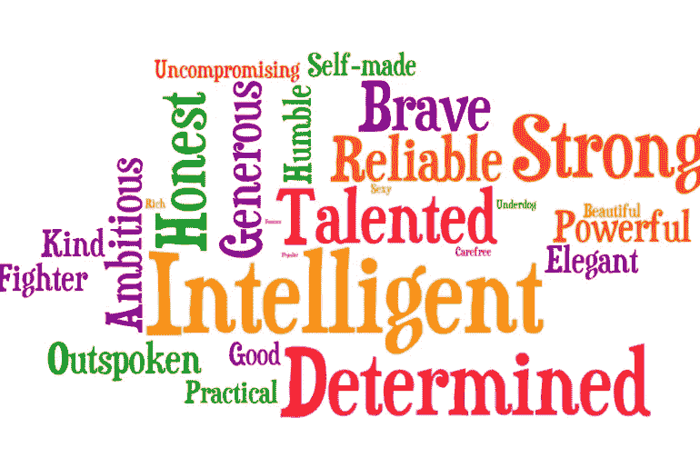

# 你是什么样的软件工程师？

> 原文：<https://betterprogramming.pub/what-kind-of-software-engineer-are-you-6e2069e623f1>

## 软件工程师和软件开发人员/程序员是有区别的

软件工程师参与产品的整个生命周期，这意味着他们与设计师/产品经理和 QA 一起讨论和实现。

例如，软件工程师通常会利用他们的专业知识来解释这种功能是否符合苹果/谷歌的设计准则，甚至解释添加任何缺失的功能，如应用内评论，以提高应用的评论。

这反过来增加了软件工程师的能力和技能，因为他们熟悉了设计师、产品经理和 QA 的流程。

另一方面，软件开发人员/程序员只负责编写交给他们的没有反馈的任务。

当你在各自的公司工作时，这些都是你将植入自己内心并引以为豪的身份。有些人有软件工程师的头衔，但行为却像软件开发人员，反之亦然。底线是:关于你在工作中的身份，这是你必须自己做出的选择。

我和许多软件工程师/软件开发人员/程序员一起工作过，我注意到和我一起工作的一些人身上有一些有价值的特质。你是否擅长编码并不重要，但最重要的是你的态度/心态。

# 1.谦逊

有五年工作经验还是一年工作经验都无所谓。在你的工作中，每天你都会发现新的东西，因为技术总是在发展和进步。你今天所知道的明天可能会不同。所以，要谦虚，互相学习。

# 2.完整

如果你给自己嵌入了软件工程师的头衔，那么如果你看到设计或流程需要改进，你应该大声说出来。如果你想成为一名软件开发人员，那就用最佳实践而不是简单的方法来写代码。

# 3.积极主动的

老实说，工程师之间的会议可能是最尴尬的一次。有时，它可能会安静几分钟，没有人说什么。我的意思是，如果你没什么要说的，你可以说，“我这边没什么”或者其他任何表明一切都好的话，而不是保持沉默。

# 4.骄傲

我当然不希望我们中的任何人会表现得骄傲。但是我希望我们每个人都以最高的自豪感拥有我们创造的产品。也就是说，当我们这样做的时候，我们努力给它最好的质量。

# 5.诚实

我现在会站出来说，我仍然为我上面提到的一些观点而奋斗，但是我会继续努力完善这些品质。承认你不是什么都知道是可以的。唯一无所不知的是谷歌；让它成为你最好的朋友。

这样的例子不胜枚举。对于我们每个人来说，这可能是不同的，也可能是相同的(这并不十分重要)，但我们确实需要更多态度正确的技术人员，在这个行业中，我们可以每天继续努力打造更好的产品。

最后，问你自己同样的问题:我是什么样的软件工程师/软件开发员/程序员？

搜索它，找到你的立场。

