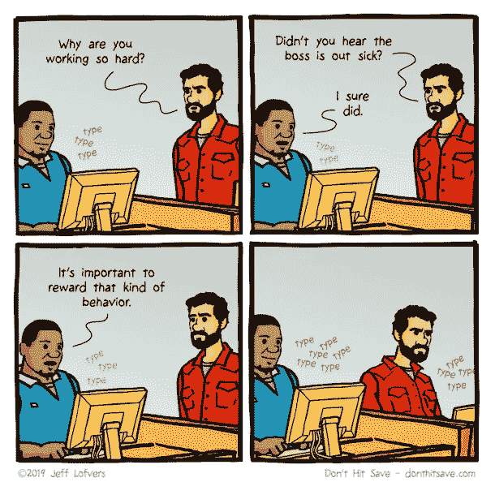
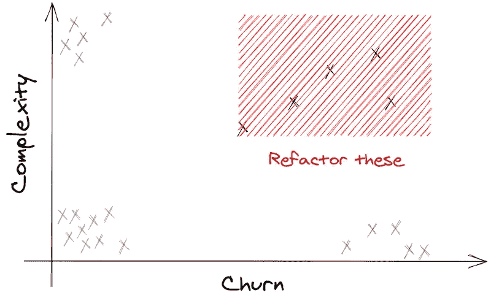

# 努力工作的背后是什么:代码搅动

> 原文：<https://betterprogramming.pub/what-lies-beneath-hard-work-code-churn-7cfe4f062248>

## 了解什么是代码变动，以及如何使用它来衡量代码质量

[乔丹·怀特菲尔德](https://unsplash.com/@whitfieldjordan?utm_source=medium&utm_medium=referral)在 [Unsplash](https://unsplash.com?utm_source=medium&utm_medium=referral) 上的照片

组织一直在寻找跟踪、测量和评估开发人员工作流的方法。如果做得有效，这就创造了提高性能、代码质量、缩短上市时间和增加利润的方法。但是衡量效率并不总是容易的:团队努力工作的第一个证据可能是更大的挑战和代码变动的低效率的指示。

# 什么是代码流失？

代码变动是衡量或指示文件更改频率的指标。它通常指的是开发人员在写作的前 2-3 周内抛出代码(比如函数、文件或类)的频率。

团队成员、不同经验水平和项目之间的流失率是不同的。不存在可以普遍适用于所有开发人员的正常级别的代码变动。在测试和提炼代码时，删除和编辑是正常的，尤其是在解决问题或尝试新代码时。然而，过度的代码变动或变动级别的突然变化可能是影响开发团队的其他问题的征兆。

# 测量代码流失能揭示什么？

如上所述，代码变动可能意味着开发人员面临更重大的问题。

在基本层面上，过度或不规则的代码变动可能表明开发人员正在努力，并将受益于额外的支持，如指导或结对编程。这可能意味着一个人有完美主义倾向，或者在解决问题时有重新发明轮子的倾向——浪费了宝贵的时间，却收效甚微。如果置之不理，这种行为可能会导致工作不满和倦怠。不断的编辑可能意味着团队领导需要清楚地表达“完成”和“结束”的真实含义。

代码变动还提供了对当前工作负载和资源分配的洞察。

托比·奥斯伯恩[建议](https://textexpander.com/blog/what-is-code-churn-and-how-to-reduce-it/)代码改变可以产生有用的见解。比如:“最近两周，*home.html*改了 50 次， *website_controller.rb* 改了 20 次。这些数据向您展示了:

*   系统中可能需要更多测试的部分，因为它们经常被改变。
*   系统中获得所有开发资源的部分。"

这些因素很重要，因为它们表明项目可能需要不同的资源分配、更多的测试或更长的期限。[研究](https://www.researchgate.net/publication/2816801_Code_Churn_A_Measure_for_Estimating_the_Impact_of_Code_Change)显示了大量代码变动和测试中发现的缺陷数量之间的紧密联系。

*图片来源:donthitsave.com 杰夫情侣*

时机也很重要。随着最后期限的临近，代码应该变得更加稳定，如果每次都发生相反的情况，这表明代码可能是不稳定的，并且容易受到发布后缺陷的影响。如果代码变动是对客户反馈的回应，这可能表明需要改进工作流程和时间表。

代码变动也可能表明内部团队在沟通方面存在问题——在这种情况下，大量的输出会得到很高的回报——但代价是更果断、更高效的代码编写。

# 代码变动与重构和技术债务有什么关系？

[源代码重构](https://www.stepsize.com/blog/the-ultimate-engineers-guide-to-refactoring)对于维护长期的代码质量、安全性和性能至关重要。它将混乱、不正确和/或重复的代码变成干净的代码。它解决了当多个开发人员贡献他们自己的代码时可能出现的标准化问题。重构提供了更好的可读性，并提高了源代码以及整体结构和功能的可维护性。

如果没有定期的分解，开发者会留下大量的技术债务。随着代码重构的机会越来越少，这种债务越来越多，结果，新的开发变得困难，尤其是在遗留代码的基础上。

许多组织面临的挑战是，当通过重构来减少技术债务时，从哪里开始。这是一张图片:

*图片来源:作者*

Nicolas Carlo [建议](https://understandlegacycode.com/blog/focus-refactoring-with-hotspots-analysis/)在 XY 图上测量复杂性变动是一种区分代码重构优先次序的方法，这是重要而紧迫的。他证明了引起最多问题的文件是那些复杂且频繁接触的文件。因此，部署这种度量可以帮助您识别在任何重构工作中需要首先关注的代码热点。

值得强调的是，代码变动并不总是有问题的。在原型和设计阶段，开发人员投入时间进行研究、测试和调查是正常的。随着想法的发展和完善，这可能会产生大量的代码变动。

# 如何衡量代码流失

没有度量就不能减少代码流失。因此，第一步是测量您的代码变动，以创建可操作的见解。您需要确定团队中的正常人员流失水平，并找出超出这些水平的事件和领域。

有许多测量代码流失的软件选项，这取决于您是想购买还是构建、您的组织的规模以及您的预算。他们通常关注在一段特定的时间内，通常是几个星期内，系统中有多少行代码发生了变化(被修改、添加或删除)。

如果你正在使用 git，你可以使用这个 git-churn 脚本来查看你修改了一个文件多少次。或者，Patrick Mevzek [建议](https://softwareengineering.stackexchange.com/questions/371653/measuring-file-churn-over-entire-project-history-in-git)，“您可以通过使用:

git 日志—format = one line[文件路径]

还有[的 churn-php](https://github.com/bmitch/churn-php) /”

更官方的说法是， [Pluralsight Flow](https://www.pluralsight.com/product/flow) 将历史 git 数据汇总到报告中，为团队的工程性能和流程效率提供更大的透明度。 [CodeScene](https://www.codescene.com/) 使用预测分析来发现代码中隐藏的风险和社会模式。它测量添加的代码行数和删除的代码行数。 [Stepsize](http://stepsize.com/) 正在为与技术债务相关的代码计算代码变动。

此外，N-Cover 使得识别测试了多少代码以及识别任何测试缺口成为可能。这是有帮助的，因为在高代码变动的情况下会发现代码缺陷。

对于 SaaS 开发者来说， [Azure DevOps Server](https://docs.microsoft.com/en-us/azure/devops/report/sql-reports/perspective-code-analyze-report-code-churn-coverage?view=azure-devops-2020) 自带了一个测量代码变动的内置机制。它使您能够创建显示以下内容的报告:

*   在特定版本中具有特定文件扩展名的文件的数量。
*   特定版本的源代码库中的代码行数。
*   提交了哪些变更集，每个变更的细节是什么？(例如:谁进行了更改，更改了哪些文件，更改是在什么日期进行的)？

# 结论

代码变动会对团队的能力和效率产生重大影响。高代码流失率可能表明团队成员是高度创新的，应该转向更有创造性的项目。但它也可以确定哪些人将受益于额外的支持。一旦您确定了代码变动在团队工作流中的位置，您就有机会做出改进。

代码变动可能是由外部因素造成的，如新的信息、数据或对客户反馈的响应。因此，这可能表明需要更好的沟通流程或更定期、更清晰的反馈。如果缺乏技能或开发人员知识是主要原因之一，那么这是向有需要的团队成员介绍专门培训的机会，这总体上提高了团队的士气和效率，意味着更大的业务目标得以实现。

感谢您的阅读！

*原载于* [*理工债博客*](https://www.stepsize.com/blog/code-churn) *。*