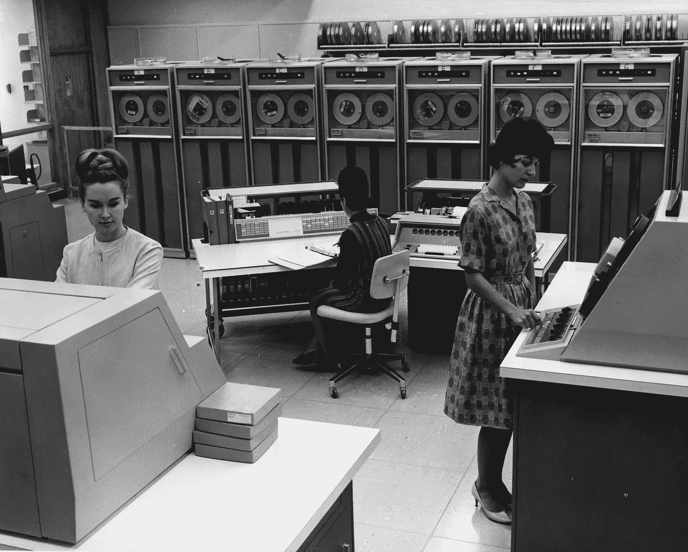

# 怎样才能成为更好的程序员？

> 原文：<https://betterprogramming.pub/what-makes-a-better-programmer-89093be66cf4>

在 20 世纪 60 年代使用大型计算机。[http://resource.nlm.nih.gov/101648240](http://resource.nlm.nih.gov/101648240)

## 从过去吸取教训

当我第一次被邀请为新的《更好的编程》杂志撰稿时，我努力想出一个合适的主题。网上已经有大量关于如何使用各种竞争性的框架和无数的工具来改进你的编程的内容。面对源源不断的[新技术](https://dayssincelastjavascriptframework.com/)，技术和淘汰，这样的文章也容易变得过时。关于编程，我能写些什么在一年后仍然有用的东西呢？五年后，甚至十年后呢？

为了寻找答案，我研究了过去的经历。今天仍在阅读和参考的编程书籍有哪些？根据[林迪效应](https://en.wikipedia.org/wiki/Lindy_effect)，一本已经出版了四十年的书预计还会继续出版四十年。更一般地说，是指一种不易腐烂的东西的预期寿命，如一种思想、一种政府形式、一种语言、一种技术等。随着年龄的增长而增加。

所以我首先看的是我自己的书架。毫不奇怪，没有被 Marie Kondo 编辑的编程书籍是关于软件模式的，因为它们是语言不可知的。模式是一个常见问题的通用可重用解决方案；在这种情况下，创建软件的问题。当许多其他人已经解决了类似的问题时，没有理由重新发明轮子。即使你的情况需要一个新的解决方案，看看现有的技术也是有指导意义的。这些是我找到的书:

## 2003:企业应用程序架构的模式

这些书中最新的一本是马丁·福勒 2003 年的《企业应用架构的模式》。这本书激发了 DHH 创作 [Ruby on Rails](https://rubyonrails.org/) 的灵感。一些模式已经被吸收到 web 应用程序设计中，以至于它们已经变得不可见了。阅读 *PEAA* 是理解 web 框架在幕后为你做什么的好方法。虽然这本书现在是一个 16 岁的少年，但里面的模式更古老。例如，无处不在的模型-视图-控制器模式，更广为人知的是 MVC，最早出现在 20 世纪 70 年代！除了更好地理解 web 应用程序是如何构建的，当你需要设计一个架构时， *PEAA* 中的模式仍然有用。就在上周，我了解到一个工程团队如何使用书中的模式重构他们的整个 Python web 应用程序。

## 2000 年:重构

说到重构，如果我没有提到同样由福勒于 2000 年首次出版的*重构*，那我就失职了。我最初考虑写这篇关于重构的文章，因为这是每个程序员都会做的事情。但是怎么重构，什么时候重构，重构到什么程度，都是这种上下文特定的决定，我没有想出一个简洁但可概括的主题。因此，我建议通过详细阅读*重构*中的例子，学习在你的代码库中以及在你编程时发现模式。第一版*重构*使用了为音像店编写软件的例子，尽管音像店已经走上了免下车影院的道路，重构模式仍然高度相关。彻底理解这些模式无疑会让你更擅长编程。

## 1994 年:设计模式

接下来是*设计模式:可重用面向对象软件的元素* e，作者是[四人帮](http://wiki.c2.com/?GangOfFour)(我很想知道为什么这四位作者的名字来自毛领导下的中国共产党的一个暴力政治派别)。出版于 1994 年，这是一个软件的基础文本。在我 25 岁的时候，现在是一个真正的成年人，这本书仍然是那些想学习如何设计好的面向对象软件的人的高度参考和推荐读物。

## 1975 年:*神话中的人月*

在面向对象编程和软件设计模式之前的时代呢？管理大型复杂软件项目的一些最持久的概念来自于神话般的人工月，该书于 20 年前的 1975 年首次出版。在 44 岁的时候，这本中年书籍中的概念继续预测软件项目的成功。软件工程师，尤其是经理们，会很好地注意到它的教训，例如随着最后期限的临近增加更多的程序员会进一步推迟项目，以及[第二系统效应](https://en.wikipedia.org/wiki/Second-system_effect)。甚至我们认为更现代的概念也在书中进行了探讨，包括 10x 工程师的概念，开发原型的有用性，团队间沟通的重要性，以及一旦客户使用了新的软件功能，对需求变化的考虑。

## 1971 年:计算机编程心理学

尽管《T4》神话中的人月经久不衰，但这本书是关于管理软件项目的，我认为这两者是相关的，但与更好的编程相比，它们有着不同的关注点。对于后者，我求助于一本更老的书，1971 年首次出版的《计算机编程心理学》。《PCP》是第一本从以人为本的角度来看待计算的书。因此，这本书的第一部分深入研究了作为人类行为和社会活动的编程。

在第二章，标题是什么造就了一个好的程序？，我看到了什么是更好的编程的一线答案。似乎如果我们想知道如何更好地编程，我们需要知道目标是什么。但与学校作业不同的是，不存在客观上最好的程序，因为对一个程序有多好的评估不能脱离它被开发的情况。

> [……]我们将对项目进行评估，不是相对于彼此，而是相对于一种情况——总的情况——在这种情况下开发项目。老老实实看情况，我们从来不是找最好的方案，很少找好的，总是找符合要求的。— *计算机编程心理学*

在这里，我发现原则真的没有改变。程序员经常迷恋于编写更高效的代码，因为速度是一种客观的可验证的度量。越快越好，对吗？典型的基于算法的编程面试问题，你还必须提供你的算法的 O(n)分析，只会鼓励这种类型的思考。

但是正如 PCP 所阐明的，对一个程序来说最重要的是正确。一个不能处理所有必需输入的快速优雅的算法不如一个能处理所有必需输入的程序好，即使后者更难看、更慢。

> 任何有效的程序都比无效的程序好。

根据 PCP，编程首先是为了正确性，然后是为了满足进度。软件按时交付后，下一个关注点是编程使代码具有适应性，只有这样才是关注效率。

我们知道这些都是权衡。编程就是不断地做出大大小小的权衡取舍的决定。也许在特定的情况下，效率确实是最重要的需求，即使是以丢失一些输入为代价。在这种情况下，错误被认为是可以容忍的，程序仍然“正确地”工作，因为输出在预期的范围内。

在另一种情况下，极高的内存效率可能是第二重要的考虑因素，例如在嵌入式系统上。在这种情况下，您不应该期望优化后的代码很容易修改。

明确权衡有助于理解如何进行您需要做的编程，并有助于将项目中的所有利益相关者统一到“好”的共同定义上

好的编程的标志是知道在给定的情况下，哪种折衷能最好地实现项目目标。没有最优的解决方案，因为软件项目是[棘手的问题](https://en.wikipedia.org/wiki/Wicked_problem)，但是如何做出这些决定的良好判断可以通过经验和反思来磨练。

当看到(或者诅咒)“糟糕”的代码时，理解代码的历史和过去所做的权衡有助于理解为什么代码是现在这个样子。这也有助于你理解编写代码的程序员。

最终，我认为“更好的”编程不是试图达到某种客观上更好的状态，而是认识到软件开发的复杂性，理解创建软件的人的一面，并且永远不要让“好的”编程妨碍你的最终目标:交付实现其目的的工作软件。

作为技术工作者，我们必须面向新的和未来。然而，我们能更好地吸取过去的教训，我们将成为更有效和更好的程序员。