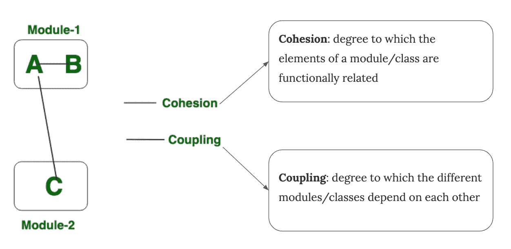
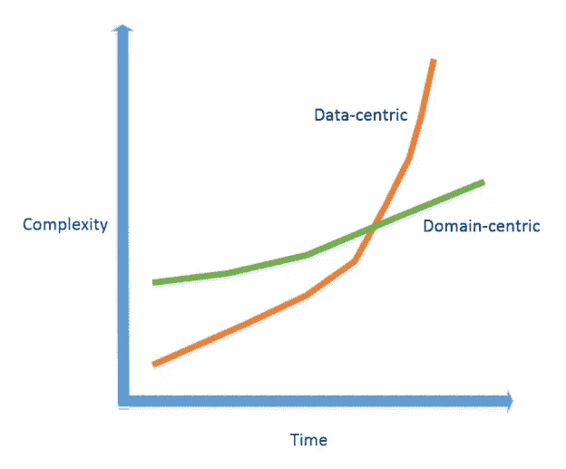

# 什么是好的软件设计心态？

> 原文：<https://betterprogramming.pub/what-makes-a-good-software-design-mindset-677c82c8adf1>

## 如何定位我们的思维，这样我们就可以解决我们面临的任何问题

丹尼斯·简斯在 [Unsplash](https://unsplash.com/s/photos/compass?utm_source=unsplash&utm_medium=referral&utm_content=creditCopyText) 拍摄的照片

作为一名软件工程师，你害怕过技术变革吗？

老实说，我有。从我应该开始学习哪种编程语言的第一个决定，到哪种技术栈将是我职业生涯的最佳方向(后端、前端、移动或其他)，我都迷失了。不管我做什么决定，它们每天都在快速变化。

我读过很多。有一天，我偶然发现了[马丁·福勒的博客](https://martinfowler.com/)，发现了对我来说最有趣的一句话:

> "虽然在我们的职业中技术的细节变化很快，但基本的实践和模式更稳定."

我非常同意这一点。对基本面有扎实的了解，一直是我最好的方向。它帮助我快速适应任何技术变化，因为一切事物，包括技术发展，都不应该远离基本面。

更具体地说，我意识到软件工程不仅仅是写代码，更多的是通过好的设计来解决问题。建立设计思维比获得任何特定的技术技能更重要。

# 设计思维

创建软件和发布第一个版本只是软件开发的开始。随着业务和技术的变化，持续采用对任何软件来说都更加重要和具有挑战性。

添加功能需要更改现有功能。更换数据库管理系统需要重建整个系统，包括所有业务逻辑。修复一个小错误会导致另一个你不知道的更大的错误。扩大团队会使冲突无处不在，从而降低持续集成的效率。这种情况证明了糟糕的设计，最终使得[敏捷开发](https://en.wikipedia.org/wiki/Agile_software_development)不切实际。

良好的设计思维意味着通过坚信基本实践和模式来开发能够快速适应变化、风险低的软件，从而拥有高度可维护、可扩展和可伸缩的解决方案。

无论你正在开发哪种软件(包括操作系统、网页、移动应用，甚至是新的云计算范式)，也无论你正在使用哪种编程语言，都有一些已经被证明了几十年的基本原理、原则和设计模式。

但是，如果没有经历过真正的问题，陷入痛苦，然后意识到自己的错误，比如维护遗留代码，那么一开始理解所有这些原则就有点困难。所以拥有一个好的设计心态对于塑造你的学习、思考和最终开发好软件的方向是非常重要的。

在这篇文章中，我不会深入到每一个基础，但会列出每一个最重要的点。互联网上有很多文章都有具体的例子，包括代码演示和插图。在本文中，您将看到软件设计基础的概述。

# 高内聚，松散耦合

[耦合和内聚](https://www.geeksforgeeks.org/software-engineering-differences-between-coupling-and-cohesion/)的简短定义

这是最重要的根本。

如果组成某些功能的代码分散在多个模块中，那么就很难独立地编写测试或维护该功能。如果需要更改，您还需要在多个模块中适应这些更改，这可能会带来产生副作用的风险。因此，您需要包含功能相关元素的高内聚模块。

如果改变程序中的一个模块需要改变另一个模块，那么就存在耦合。

如果一个模块以某种方式与其他模块紧密耦合，比如模块 A 依赖于模块 B 的具体实现，那么更改模块 B 也需要对模块 A 进行大量更改。而如果模块 C 和 D 也依赖于模块 A 的实现呢，以此类推？紧密耦合也使得模块很难进行单元测试、重用或组合，这对于使开发生命周期更安全、更高效也很重要。因此，在衡量任何模块化系统的设计质量时，松耦合应该是首先考虑的因素。

松散耦合意味着模块可以在较少副作用的情况下进行更改，甚至可以轻松地移动或部署到其他层，从而提高可伸缩性(例如，在[多层架构](https://en.wikipedia.org/wiki/Multitier_architecture)和[面向服务的架构](https://en.wikipedia.org/wiki/Service-oriented_architecture))。

解耦也是软件重构中一项众所周知的技术。

在本[极客概述](https://www.geeksforgeeks.org/software-engineering-coupling-and-cohesion/)中，有许多类型的耦合和内聚被清楚地描述。在本文的后面，您将看到大多数其他原则都是基于这些基础之上的。

# 关注点分离

> **“关注点分离** ( **SoC** )是一种设计原则，用于将计算机程序分成不同的部分，使得每个部分处理一个单独的关注点”
> 
> — [维基百科](https://en.wikipedia.org/wiki/Separation_of_concerns)

也许你有一个模块化的系统。这里每个模块都是一个应该尽可能分开的关注点。每个模块都应该通过设计良好的接口隐藏其详细的实现。功能封装保护该模块不受其他模块的任何改变的影响，因此它可以被独立地开发、部署、升级等等，从而显著地提高了系统的可维护性。

关注点的分离也适用于分层的体系结构，其中系统被分成不同的层(表示层、业务逻辑层、数据访问层等等)。).每一层都有自己的职责，并且只公开它的契约接口，而具体的实现是在内部封装和保护的。每一层都可以进行单元测试，并且可以独立地进行修改。结合适当的依赖规则，业务层可以免受数据库或 UI 中任何更改的影响。例如，应用需要改变整个表示层的新设计概念不应该影响系统的业务规则或持久逻辑。

换句话说，我们也可以说好的关注点分离=高内聚+松耦合。

# 坚实的原则

传奇人物罗伯特·c·马丁(鲍勃大叔)在他 2000 年的论文“[设计原则和设计模式](http://www.cvc.uab.es/shared/teach/a21291/temes/object_oriented_design/materials_adicionals/principles_and_patterns.pdf)”中提出了一套每个软件工程师都应该牢牢理解的原则。

## 单一责任原则

> "一个类或模块应该有且只有一个改变的理由."

将职责混合到一个类/模块中是低内聚的状态(如上所述)。例如，一个实现业务逻辑并具有持久逻辑(例如，将数据检索/存储到数据库中)的类显然违反了 SRP，因为更改数据库逻辑可能会对业务逻辑产生副作用，这是糟糕的设计。

多用途类，尤其是*上帝对象*，也很难编写单元测试，或者重用或组合。

## 开闭原理

> “软件实体(类、模块、函数等)。)应该对扩展开放，但对修改关闭。”

用更多的功能扩展系统需要修改现有的功能，这对任何开发团队来说都是可怕的。

其思想是，当添加新的需求时，我们不应该修改现有的代码，而是通过使用最常见的技术来扩展它:为不同的目的设计具有不同实现的抽象/接口，这些实现可以在运行时切换。这就是所谓的 [*策略模式*](https://dzone.com/articles/the-openclosed-principle) 。

让我们看另一个用例。我们在集成到 CI 系统中的自动化测试用例下运行应用程序，以确保每次提交后功能正常。但是在测试中，我们不需要验证消耗网络数据、降低测试速度并降低 CI 服务器效率的映像加载功能。那么我们是否需要调整生产代码来添加一些测试逻辑，比如`if "underTest" then "do not load image"`？不，解决方案应该是定义一个类似于`ImageLoader`的接口，并提供一个名为`OptOutImageLoader`的实现，它对使用[依赖注入](https://en.wikipedia.org/wiki/Dependency_injection)技术的测试没有任何作用。

因此，遵循开闭原则对于使系统在低风险下具有高度可扩展性非常重要。

## 利斯科夫替代原理

> "子类/派生类应该可以替换它们的基类/父类."

在面向对象编程中，如果一个子类违反了契约或者改变了它的父类的行为，那么它对于父类来说是不可替代的。这引入了代码味道——系统中的深层问题，这些问题在开始时并不明显，但在后来的维护阶段会出现。

比如我们定义了一个`Bird`(抽象类)的抽象，可以`fly`(抽象方法)。所有 bird 的子类，比如`Pigeon`、`Eagle`等等，都实现`fly`方法，因为它们可以以不同的方式飞行。一个例外是`Penguin`，抛出一个`Exception`表示不能飞。在代码库中的某个地方，我们对一列鸟执行`fly()`方法。如果列表中不包含`Penguin`，应用程序可以正常运行。但是如果有一天我们把`Penguin`加到列表里，它就会崩溃。我们必须设法捕捉将耦合引入到`Penguin`类的具体实现中或者违反上述开闭原则的异常。

违反 LSP 的一个例子

我们可能对`Bird`有错误的抽象，因为不是所有的鸟类都能飞。所以`fly`不应该是`Bird`中的抽象方法，而应该在`Flyable`接口中。

当我们扩展或修改一个抽象设计得不好的现有系统时，经常会引入这种违反契约的情况。所以 LSP 提醒我们抽象设计很重要。

## 界面分离原理

> "不应该强迫客户实现他们不使用的方法."

如果一个类用一个只包含`//do nothing`注释的空方法实现一个接口，我们看不出有什么大问题。

但真正的问题是我们的抽象中一定有什么地方出错了。抽象设计比编码更像一门艺术。设计正确的抽象对于任何领域都是具有挑战性的。这对系统的进一步扩展和维护非常重要。

这个原则建议我们应该把非常大的接口分割成更小更具体的接口，这样客户就只需要知道他们感兴趣的方法，从而使它们更加紧密和可靠。

## 从属倒置原则

> “高层模块不应该依赖低层模块。两者都应该依赖于抽象(例如接口)。”
> 
> “抽象不应该依赖于细节。细节(具体实现)应该依赖于抽象。”

体现 DIP 的控制反转(IoC)或基于接口的编程(也称为基于接口的架构)是一种众所周知的方法，用于帮助软件工程师设计复杂系统，专注于业务和功能的高级抽象，而不关心设计阶段的具体实现。

关键是在构建接口的时候，不要去想他们的方法会如何实现。例如，我们有一个包含`getAllUsers(): List<UserEntity>`方法的存储库接口。我们需要这个接口，因为它服务于我们的业务逻辑。但是在设计我们的领域层时，我们并不关心用户数据是如何存储的，是在关系型 DBMS 中还是在 NoSql 服务器中；只要它能得到所有用户的名单，我们就没事。

这个原则还有助于通过基于抽象建立依赖关系来减少组件/模块之间的紧密耦合，同时所有详细的实现对于系统的全局来说都是绝对隐藏的。

# 领域驱动设计(DDD)

大多数产品的诞生都是为了解决客户的问题，软件也不例外。因此，产品有自己的业务规则，这些规则是特定领域中这些问题的解决方案。

在软件开发中，*域*意味着“应用程序逻辑围绕的知识和活动领域”，或者简单地说是业务逻辑。

DDD 注重三个核心原则:

*   关注核心领域和领域逻辑。
*   基于领域模型的复杂设计。
*   不断与领域专家协作，改进应用程序模型并解决任何新出现的领域相关问题。

体现 DDD 的以领域为中心的架构(例如，[鲍勃大叔的干净架构](https://blog.cleancoder.com/uncle-bob/2012/08/13/the-clean-architecture.html))认为`domain`是系统的核心，因为它是最稳定的部分。领域封装了最通用和最高级的规则，以及当外部事物改变时最不可能改变的系统的所有用例。如果我们改变领域，我们可能想要构建另一个应用程序。

尽管与以数据为中心的方法相比，以域为中心的方法在数据一致性或代码重用方面有一些缺点(如文章“[以域为中心与以数据为中心的软件开发方法](https://enterprisecraftsmanship.com/posts/domain-centric-vs-data-centric-approaches/)”中所述)，但从长远来看，它已被证明是任何涉及随时间变化或复杂性增长的系统的良好选择。

图片来源:"[以领域为中心和以数据为中心的软件开发方法](https://enterprisecraftsmanship.com/posts/domain-centric-vs-data-centric-approaches/)"

# 继承之上的组合

一名软件工程师毕业于顶尖大学，对 OOP 有着扎实的理解，他相信他们可以用一个设计良好的继承树构建一个应用程序，这个继承树有五层派生类。是的，它工作得很好，代码库看起来很专业。

后来，天才离开了公司。另一位工程师接手了维护这个项目的工作。需求是不断变化和增加的，因此项目的某些特定部分必须进行调整。他们需要改变继承树中某个类的某些东西来改变一个重要特性的行为。好吧，成功了。它通过了质量控制，然后最终上线。

第二天，有许多客户抱怨功能损坏。整个团队没有意识到工程师通过扩展该类破坏了另一个特性。然后，一些黑客代码必须非常快速地完成一个修补程序，以允许损坏的功能与其父类表现不同。

一次又一次，代码库被子类和父类之间的许多契约冲突(LSP 冲突)弄得一团糟。维护需要更多的时间，并且引入了更多的错误，甚至在交付之后。团队变得好累，深深感受到了传承的痛苦。

我很确定大多数 OOP 程序员都经历过类似的情况，包括我。这个有趣(但真实)的故事告诉我们，继承在软件开发中是多么痛苦，尽管事实上它已经被作为 OOP 的基础之一在学校里教授。

另一方面， *c* 组合方法已经被证明是高度可维护软件的最佳方向，比继承要好。有史以来最好的游戏引擎 Unity 就是体现构图的明显例子。

简而言之:

> “面向对象程序设计中的组合优先于继承(或组合重用原则)是这样的原则，即类应该通过它们的组合(通过包含实现所需功能的其他类的实例)来实现多态行为和代码重用，而不是从基类或父类继承
> 
> **— [维基百科](https://en.wikipedia.org/wiki/Composition_over_inheritance)**

**但有时，在某些情况下，继承仍然有增加代码重用和减少编程工作量的好处。然而，维护更重要。在上面维基百科页面的最后，你可以找到一些作文缺点的例子，也有避免那些缺点的技巧。**

# **设计模式**

**除了软件设计的基础，我们还需要了解、理解和实践四人组(即 Erich Gamma 等人)在《[Design Patterns:Elements of Reusable Object-Oriented Software](https://www.goodreads.com/book/show/85009.Design_Patterns)》一书中清楚描述的众所周知的设计模式。**

**在本书中，有三种类型的设计模式:**

*   ****创造** —构建器、工厂方法、抽象工厂、原型、单例**
*   ****结构** — 适配器、飞锤、代理、复合、装饰…**
*   ****行为** —策略、中介、观察者、模板、责任链等。**

**我没有什么可写的，除了建议你阅读这本书，同时练习这些模式。**

# **结论**

**好的设计没有完整的公式。只要遵循基本的实践，你会没事的。但是理解所有这些，然后将它们应用到实际问题中，真的很有挑战性，即使对于高级工程师来说也是如此。拥有良好的心态有助于你专注于正确的学习，并在此过程中积累宝贵的经验和技能。**

**从我的角度来看，我可以总结出为大多数(但不是全部)软件做出好设计的重要基础:**

**精心设计的抽象+高度内聚的类/模块+松散耦合的依赖关系+继承之上的组合+领域驱动+良好的设计模式+最后一点…**

**最后要记住的是，我们构建软件是为了满足用户需求。如果根据我们自己的观点，我们有一个非常好的架构设计，但是最终的输出并不符合用户在用例中的期望，或者如果系统的性能非常低但不可用，这是没有任何意义的。所以，除了以上所有的，总是考虑用户来构建伟大的软件。**

**感谢阅读！**

# **参考**

*   **[减少耦合](https://martinfowler.com/ieeeSoftware/coupling.pdf)——[马丁·福勒](https://martinfowler.com/)**
*   **[设计原则和设计模式](http://www.cvc.uab.es/shared/teach/a21291/temes/object_oriented_design/materials_adicionals/principles_and_patterns.pdf)论文—罗伯特·c·马丁**
*   **书籍:"[干净的架构:软件结构和设计的工匠指南](https://www.amazon.com/Clean-Architecture-Craftsmans-Software-Structure/dp/0134494164) " —罗伯特·c·马丁**
*   **书籍:“[干净的代码:敏捷软件工艺手册](https://www.amazon.com/Clean-Code-Handbook-Software-Craftsmanship/dp/0132350882)”—罗伯特·c·马丁**
*   **书籍:《设计模式:可重用面向对象软件的元素》，作者 Erich Gamma 等人**