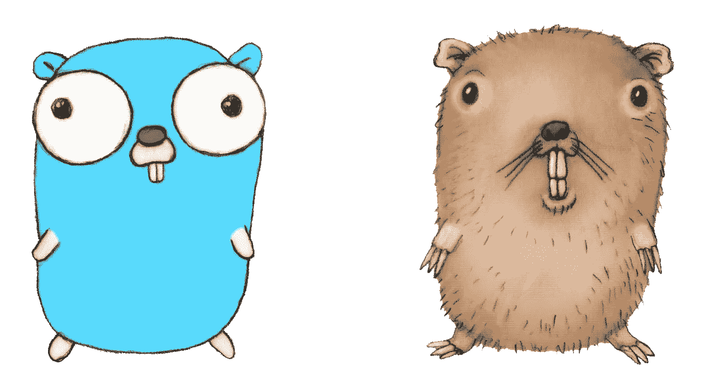
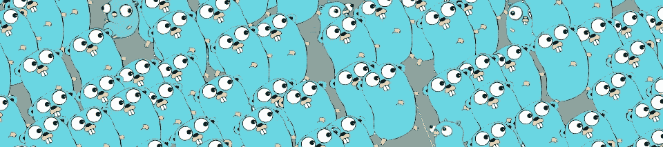

# 是什么让围棋如此与众不同？

> 原文：<https://betterprogramming.pub/what-makes-go-so-different-eb0648498ce0>

## Go 是目前最值得使用的语言之一。这是它成功的秘密因素

Go 与其他语言(插图由[作者](https://github.com/timoth-y)提供)

# 介绍

编程语言显然可以被认为是每个程序员武库中的主要工具。因此，我们倾向于把自己和被选中的人联系在一起。我的意思是，我们正在形成庞大的社区，撰写文章，制作 YouTube 视频，吉祥物，更重要的是——模因。开个玩笑，但是很难否认在我们和这些抽象工具之间存在着某种紧密的，几乎是个人的联系。

Gopher look(作者使用 Go 的标志性吉祥物进行说明)

正如您可能已经猜到的，这篇文章将是众多文章中的一篇，它还将介绍一种广泛流行的、新流派的、总体上非常独特的编程语言 Go。但是，为了像围棋一样——简单、与众不同、有用——我就不复述别人已经写过的东西了。我更愿意尝试通过分析 Golang 的设计解决方案、其外观的背景、其鲜明的特点，以及最终它可以有效地用于今天的东西，来形成一个新的愿景。

# 简要概述

这里有几篇论文可以让你体会一下:

围棋是不同的，但很像。
围棋很独特，但毫无特色。
围棋很年轻，但已经普及。
围棋虽小，却很强大。
围棋很简单，但相当复杂。Go 是独立运行的，但作为一个实例。围棋是一种语言，也是一种思想。

现在，让我们来深入探讨其中的每一个。

# 创建上下文

为了全面理解 Golang 的本质，让我们深入了解其[创作](https://golang.org/doc/faq#creating_a_new_language)的[脉络](https://talks.golang.org/2012/splash.article#TOC_1.)。由于当时谷歌面临的问题是其现有工具无法克服的，Go 诞生于对变革的强烈需求中:

> “Go 项目的目标是消除谷歌软件开发的缓慢和笨拙，从而使该过程更具生产力和可扩展性。这种语言是为那些写、读、调试和维护大型软件系统的人设计的—罗布·派克，Golang 的创造者

也就是说，Go 在设计时就有一组[特定问题](https://talks.golang.org/2012/splash.article#TOC_4.)需要解决，并且最初拥有 C、 [Pascal](https://en.wikipedia.org/wiki/Pascal_(programming_language)) 、 [Modula](https://en.wikipedia.org/wiki/Modula-2) 和 [Oberon](https://en.wikipedia.org/wiki/Oberon_(programming_language)) 等高贵编程语言的最佳特性的坚实基础。它还记住了语言的有用特性，如 [Python](https://towardsdatascience.com/golang-ai-programming-language-for-the-20s-71890baa8c47#49a6) 、 [C++](https://talks.golang.org/2012/splash.article#TOC_5.) 、 [Java](https://medium.com/@akansha.yadav/go-lang-vs-java-whats-the-future-of-programming-1800a1e1ad7e) 等等，这些正是 Go 要解决的[批评](https://talks.golang.org/2012/splash.article#TOC_5.)。

# 语言差异

然而，这绝不是复制已经很棒的东西。相反，它是关于提出一种全新的处理问题的方式，因为有时为了解决一个问题，需要放弃已经被证明是无效的东西。因此，Go 的每一个主要特性都主要源于一些主要的约束，比如:

*   为了易读、易学和入门，特意简化了语法。
*   具有严格、安全、完全静态类型化的 [语义](https://talks.golang.org/2012/splash.article#TOC_12.)，以便在编译时处理静态错误，并加速执行和构建
*   有一个[垃圾收集器](https://talks.golang.org/2012/splash.article#TOC_14.)，虽然非常[有效](https://talks.golang.org/2015/simplicity-is-complicated.slide#20)一个，为了处理内存不安全，同时保持相当高的执行速度和证明的资源效率
*   缺少[通用特性](https://talks.golang.org/2015/simplicity-is-complicated.slide#9)和[语法糖](https://medium.com/@asilvr/the-cost-of-syntactic-sugar-in-go-5aa9dc307fe0)以达到最小化、精确化和简单明了，因为只有一种方法来解决一个特定的问题，从而只留下一种使用它的风格，结果显著加快了开发、调试、审查和测试过程，并使维护变得更加容易
*   没有通用的[面向对象原则](https://talks.golang.org/2012/splash.article#TOC_15.)，例如继承、类和[普通接口](https://golang.org/doc/faq#implements_interface)以应对 OOP 批评，这种批评自面向函数语言兴起以来变得越来越频繁，尽管 Go 也是一种多范例语言。同样，这有助于实现[正交性](https://arschles.svbtle.com/orthogonality-in-go)。
*   拥有 [vendoring](https://riptutorial.com/go/topic/978/vendoring) (从 1.11 起被 [Go 模块](https://blog.golang.org/using-go-modules) [取代)，一个健壮的](https://blog.golang.org/using-go-modules)[依赖管理](https://talks.golang.org/2012/splash.article#TOC_7.)系统，其[汇编器](https://youtu.be/KINIAgRpkDA)非常接近二进制代码，以便实现极快的构建，并且之后非常轻量级和二进制文件大小高效。这使得它成为微服务架构模式和云原生开发的完美匹配。
*   没有 [try-catch 异常](https://golang.org/doc/faq#exceptions)处理。尽管争议很大，[批评](https://opencredo.com/blogs/why-i-dont-like-error-handling-in-go/)，但这实际上是 Golang 处理错误的真正[惯用方式](https://blog.golang.org/error-handling-and-go)，这实际上在很多方面都是有益的:避免重复的错误处理代码，保持控制流高效和快速执行，保持代码整洁和可读，简化代码编写和调试。

正如所见，Go 的开发人员已经设法提出了一个非常有效的基于语言的约束系统，以实现其一些最大的特性和功能。这种实践给人留下了深刻的印象，通过使用每一个约束，它设法同时实现了不是一个而是多个主要特性。

我应该指出的是，我在这里定义的将 Go 特性基于其约束的方法，并不完全基于其创造者的引用、博客帖子或演讲、该语言的官方文档或其他作者的文章，事实上，这是我个人理解和描述 Golang 本质及其独特性的方式。当然，你可以同意或不同意我的想法。你爱它或恨它完全没问题。此外，我鼓励你不要相信我，而是做你自己的研究。

此外，在这一点上，很明显，Go 实际上不同于其他语言，因为它们通常通过添加新功能来进化，然后增加其复杂性并变得[收敛](https://www.merriam-webster.com/dictionary/convergent)。而 Go 首先使用一种方法来约束自己，然后从一开始就保持[有限。](https://blog.golang.org/toward-go2)

> “许多新来者会询问他们所了解的语言的特性。但是这些特性不属于 Go——而且这种语言是固定的。给 Go 增加功能不会让它变得更好，只会变得更大。这会让围棋变得不那么有趣，因为它与众不同。”—罗布·派克，Golang 的创造者

# 独特的特征

然而，这并不一定意味着 Go 有缺陷或缺少一些重要的功能特性。事实上，这将使编程变得毫无用处，因为为什么不首先使用汇编语言呢？但围棋却不是这样。它肯定有一些特点。然而，事实是，为了保持简单，Go 非常谨慎地避免在不解决问题的情况下带来更多复杂性的特性。事实上，这是使围棋成为“惯用法”的原因之一，正如它过去的著名叫法一样。

不必要的功能带来了不清晰的复杂性(由 Renee French 绘制)

那么那些已经成为 Go 一部分的功能呢？实际上，有意简化的规则对他们来说也很有效。我这么说的意思是，Golang 的创造者做了一项令人难以置信的工作，创造了看起来如此简单易用的东西，而实际上却非常复杂。

> “围棋其实很复杂。事实上，这是我做过的最复杂的事情之一，然而，它看起来很简单…它需要大量的设计、思考、实现工作和改进。简单是隐藏复杂的艺术！”—罗布·派克，Golang 的创造者

让我们来看看围棋中几个“简单”的东西:

*   [**垃圾收集器**](https://blog.golang.org/ismmkeynote) 实际上是 Go 最简单的功能，因为它没有任何控制界面。然而，它也是最复杂的一个，因为它设法提供完全的内存安全，同时节省了极高的运行时速度，并提供了惊人的资源效率。为创造者喝彩！

没错，无论如何，Go 都不是[最快的编程语言](https://benchmarksgame-team.pages.debian.net/benchmarksgame/measurements/go.html)，因为我们肯定有 [Rust](https://benchmarksgame-team.pages.debian.net/benchmarksgame/fastest/rust-go.html) 、 [Julia](https://www.hpcwire.com/off-the-wire/julia-joins-petaflop-club/) 、 [C++](https://benchmarksgame-team.pages.debian.net/benchmarksgame/measurements/gpp.html) 、[和 C](https://benchmarksgame-team.pages.debian.net/benchmarksgame/measurements/gpp.html) 。但是这些语言都没有 GC，因此远不如 Go 简单——而且实际上也没那么慢。不过，在大多数情况下，这也是可能的，因为下一个特性非常简单。

并发地鼠(作者使用[蕾妮·弗伦奇的](https://www.instagram.com/reneefrench)图进行说明)

*   [**并发**](https://www.golang-book.com/books/intro/10) 又名 [**Goroutines**](https://tour.golang.org/concurrency/1) 被普遍认为是迄今为止最简单直接的并发模型实现。事实上，产生一个新的子流程的过程非常简单，以至于感觉更像什么都不做。你需要做的只是输入`go`。没有比这更简单的了，对吧？
*   [**界面**](https://medium.com/rungo/interfaces-in-go-ab1601159b3a) 显然是 Golang 最鲜明、最容易识别的特征之一。他们独特的设计解决方案解决了大部分对 OOP 的批评，实现了[正交性](https://arschles.svbtle.com/orthogonality-in-go)和[真正的组件架构](https://medium.com/omarelgabrys-blog/component-based-architecture-3c3c23c7e348)同时只是一套毫无价值的方法，其中仍然隐藏着一些巧妙的[设计技巧](https://talks.golang.org/2015/simplicity-is-complicated.slide#24)。
*   [**套餐**](https://talks.golang.org/2012/splash.article#TOC_8.) 。简单来说，他们就是牛逼。它们工作起来天衣无缝，没有任何惊喜，使用起来感觉也很棒，尤其是导入的时候。通过使用`go get`工具，你可以在任何地方做这件事:Gopkg、GitHub、GitLab、BitBucket，甚至你自己的托管库源码，因为[“虚荣”导入](https://sagikazarmark.hu/blog/vanity-import-paths-in-go/)被引入。但是我想，你已经知道这种做法了…是的，他们也在暗中[相当复杂](https://talks.golang.org/2015/simplicity-is-complicated.slide#26)为了实现组件化、模块化、可伸缩性、共享、数据隐藏和隔离等等。
*   Go 的 [**标准库**](https://golang.org/pkg/#stdlib) 包含了大量非常方便的特性，这证明了 Golang 实际上是一种功能非常丰富的语言。然而，它们的实现方式使得它如此独特。例如，通过使用`import “[net/http](https://golang.org/pkg/net/http/)"` magic package，你可以通过一个完全生产就绪的网络服务器，在一个令人敬畏的、高度并发的、[非常容易使用的](https://golang.org/doc/articles/wiki/#tmp_3)中立刻实现上述所有特性。
*   [**反射**](https://blog.golang.org/laws-of-reflection)**——特别是这个，使用起来不像列表中的其他那样简单，因为它不是任何编程语言中最简单的概念。不过，Go 仍然设法充分利用了这一点，同时保持了相对的易用性。**

**有时可以有意避免反射，以支持 Golang 的另一种范式，[代码生成](https://blog.golang.org/generate)，就 Go 意识形态而言，这种范式不那么[神奇](https://news.ycombinator.com/item?id=13949588)，但更清晰有效。不过，我个人认为它是白魔法，并且肯定会提倡有意使用它，因为有时，尽管效率较低，反射实际上可以提供一些真正的魔法能力。**

**现在你知道了。Golang 的功能集是对另一个主要语言设计问题的深思熟虑的解决方案的结果，该问题要求只选择正确的功能，而不增加整体语言的复杂性，并保持其清晰性。**

> **简单是很难设计的。建造起来非常复杂。但是如果你做对了，你就会得到易于使用的东西。而围棋的成功就证明了这一点！—罗布·派克，Golang 的创造者**

# **适用范围**

**好了，现在很清楚 Go sure 有一些特点。它还易于使用，速度快，效率高。但是你在哪里可以用它来生产呢？你能用围棋做什么？**

**一些经典的编程语言，如 C#和 Java，在其存在的整个过程中，已经在编程应用的几乎所有领域取得了成功。所以似乎很难与他们竞争。当然是，但是 Go 实际上并没有尝试这样做。它是为特定目的而设计的，所以从定义上来说，它不是一种通用语言。**

**然而，在现实中，它有点是一个。**

**你看，尽管最初是由谷歌设计来满足他们的开发和环境需求，但当 Go 成为[开源](https://github.com/golang/go)并迅速扩大其[贡献者](https://github.com/golang/go/graphs/contributors)基础时，很明显开发者想要在更广泛的范围内使用它。随着 Go 1 的[发布](https://golang.org/doc/go1#introduction)，这种语言被认为是一种通用语言。**

**但这并不是 Golang 推广过程的结束。随着它的社区变得越来越大，它正在扩大 Golang 的使用范围，并继续构建新的工具、包、框架、驱动程序、API、代码生成器，甚至更棒的东西，让新开发人员相信 Go 确实也可以成为他们的下一个主要语言。跟我一样！**

**接下来让我们来看看 Go 的能力:**

*   **云原生 web 服务开发，尤其是使用
    [Go kit](https://gokit.io/) 、 [Micro](https://m3o.org/) 、 [Gizmo](https://github.com/NYTimes/gizmo) 、 [Kite](https://github.com/koding/kite) 、 [Goa](https://goa.design/) 、 [Caddy](https://caddyserver.com/) 等等的微服务**
*   **REST API 开发使用了[杜松子酒](https://github.com/gin-gonic/gin)、[马提尼](https://github.com/go-martini/martini)、[狂欢](http://revel.github.io/)、[大猩猩](https://www.gorillatoolkit.org/)、[比戈](https://beego.me/)等等**
*   **使用 [gRPC](https://github.com/grpc/grpc-go) 、 [Twirp](https://github.com/twitchtv/twirp) 、 [Spiral](https://spiral.dev/docs/grpc-golang) 、 [Gorilla](https://github.com/gorilla/rpc) 进行 RPC API 开发**
*   **GraphQL API 开发 [graphql-go](https://github.com/graph-gophers/graphql-go) 、 [gqlgen](https://github.com/99designs/gqlgen) 、[迅雷](https://github.com/samsarahq/thunder)**
*   **无服务器功能开发使用[无服务器框架](https://www.serverless.com/blog/framework-example-golang-lambda-support)、[谷歌云功能](https://cloud.google.com/functions/)、[斯巴达](http://gosparta.io/)、[戈登](https://github.com/jorgebastida/gordon)**
*   **Web UI 开发( [WebAssembly](https://github.com/golang/go/wiki/WebAssembly) )使用 [Hugo](https://gohugo.io/) 、 [Vugu](https://www.vugu.org/) 、 [TinyGo](https://tinygo.org/webassembly/) 、 [Vecty](https://github.com/hexops/vecty)**
*   **机器人、[物联网](https://medium.com/@talktopoorni/my-2-cents-golang-for-internet-of-things-596de9b1f8df)，以及使用 [Gobot](https://gobot.io/) 、 [Mainflux](https://github.com/mainflux/mainflux) 、 [TinyGo](https://tinygo.org/microcontrollers/) 、 [EMBD](https://embd.kidoman.io/) 的嵌入式开发**
*   **使用 [Cobra](https://github.com/spf13/cobra) 、 [cli](https://github.com/urfave/cli) 进行应用开发**
*   **[机器学习](https://towardsdatascience.com/golang-ai-programming-language-for-the-20s-71890baa8c47)和 AI 开发使用 [GoLearn](https://github.com/sjwhitworth/golearn) ，[柳珊瑚](https://github.com/gorgonia/gorgonia)**

**还有一些不是特别明显的用例:**

*   **使用 [gomobile](https://godoc.org/golang.org/x/mobile/cmd/gomobile) 开发移动应用程序**
*   **使用 [Lorca](https://github.com/zserge/lorca) 、 [Wails](https://github.com/wailsapp/wails) 、 [Fyne](https://github.com/fyne-io/fyne) 的桌面应用开发**
*   **游戏开发使用 [Ebiten](https://ebiten.org/) ， [Pixel](https://github.com/faiface/pixel) ， [G3N](https://github.com/g3n/engine)**
*   **聊天机器人发展为[不和](https://github.com/ewohltman/ephemeral-roles)，[电报](https://github.com/olebedev/go-tgbot)，[懈怠](https://github.com/sbstjn/hanu)，[更有](https://github.com/avelino/awesome-go#bot-building)**
*   **[区块链](https://www.youtube.com/watch?v=mYlHT9bB6OE&ab_channel=TensorProgramming)和[智能合约](https://goethereumbook.org/en/)开发**

**目前，Golang 的应用范围显然更面向云、web 和系统编程。但是考虑到它的高度热情、主动性和活跃的社区，Go 正在稳步进入 IT 应用程序的几乎所有其他领域。**

# **最后的想法**

**我在我的项目中使用 Go 已经快一年了，到目前为止，我真的对它感到非常兴奋。使用它感觉很棒，尤其是当你看到自己用它达到更高的生产力水平时。**

**Go 背后的思想是基于这样一种认识，即编码本身通常是整个开发中最少的一部分。因此，Go 方法限制了不必要的表达，以确保所有后续过程的简单性、清晰性和效率，如维护、审查、阅读和编辑，这些过程之后也对编码有益。**

**总的来说，我认为 Golang 的开发者做出了令人难以置信的设计和实现工作，结果是，我们现在拥有了游戏中最方便和最具成本效益的语言之一。由于他们在寻找一种方法来提高大型代码库的开发和维护的速度和效率，Go 最终成为了一种终极的生产力增强工具。**

**为了总结 Golang 的独特性，并确定这种语言是否适合您，我想再一次引用 Go 创始人的话来阐述我的核心观点:**

> **“与大多数其他语言不同，Go 中有一个基本的权衡，即:你想要哪种语言，是编写起来更有趣，还是更容易开发和维护？”—罗布·派克，Golang 的创造者**

**感谢你的关注。
编码快乐！**