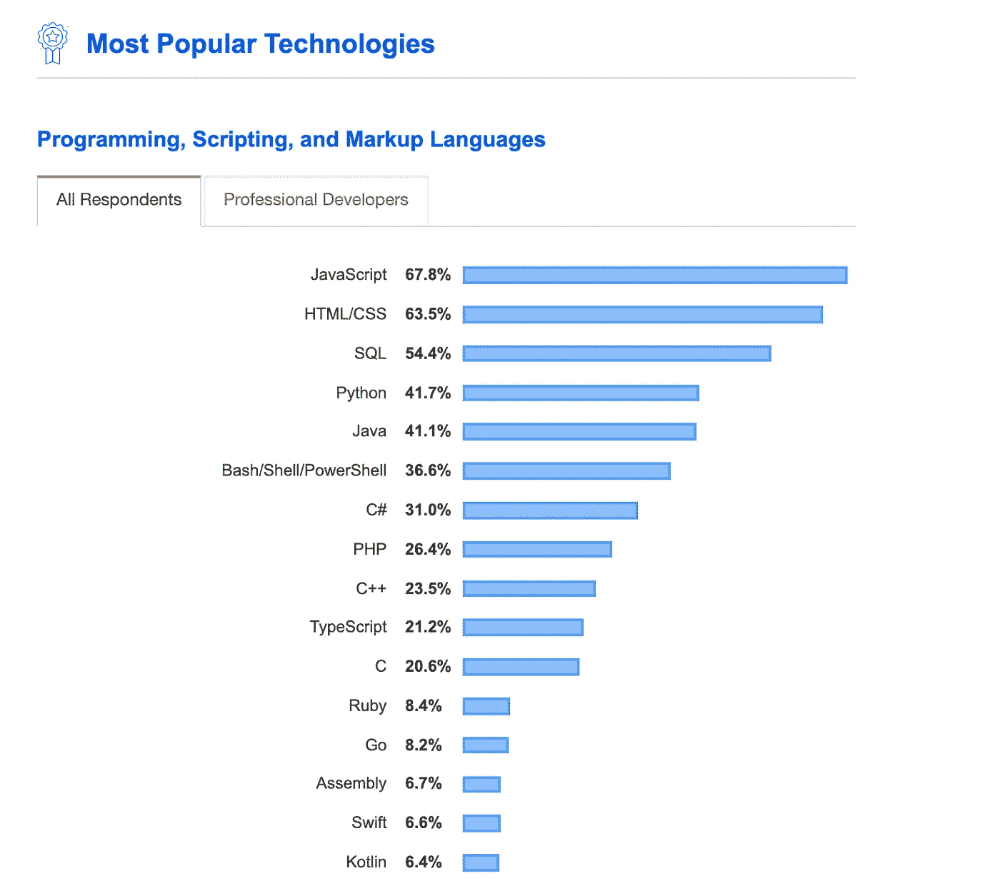
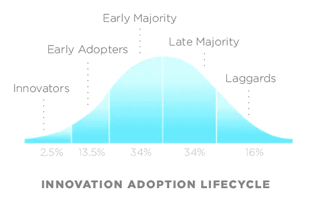

# 是什么让 JavaScript 流行起来的？

> 原文：<https://betterprogramming.pub/what-makes-javascript-javascript-b9ab51ad983a>

## JavaScript 为什么这么受欢迎，是什么让它这么受欢迎？让我们来了解一下！

JavaScript 是由 Brendan Eich 在 1995 年创建的，当时他还是网景公司的一名工程师。

网景导航器

我们今天所知道的 JavaScript 最初将被称为 LiveScript，但它被重命名为 JavaScript，这是一个营销决策，试图利用 Sun Microsystem 的 Java 语言的流行，尽管这两者没有什么共同点。

JavaScript 最初是在 1996 年初与 Netscape 2 一起发布的。

> “任何可以用 **JavaScript** 、**编写的**应用，最终都会用 JavaScript**编写。”—杰夫·阿特伍德，2007 年**

# JavaScript 到底有多流行？

谈到编程语言的流行，JavaScript 是皇冠上的宝石。根据 2019 年 StackOverflow 开发者洞察，最受欢迎和使用的编程语言是 JavaScript。

2019 年最受欢迎的技术—[https://insights.stackoverflow.com/survey/2019#technology](https://insights.stackoverflow.com/survey/2019#technology)

您可能想知道的问题是，是什么让 JavaScript 如此广泛地被采用和流行？这里有一些我个人认为有助于 JavaScript 流行的好理由。

# 提前上市

JavaScript 是第一种被广泛支持的语言，可以在所有浏览器上实现。如果你想显示一个弹出窗口，只有 JavaScript 可以做到。这导致了我们今天仍然看到的统治世界的自然道路。

随着时间的推移，采用过程通常被描述为经典的[正态分布](https://en.wikipedia.org/wiki/Normal_distribution)或*钟形曲线*。

[罗杰斯](https://en.wikipedia.org/wiki/Everett_Rogers)’[钟形曲线](https://en.wikipedia.org/wiki/Normal_distribution)

# JavaScript 代码可在客户端和服务器上执行

我们称*客户端*为浏览器，称*服务器*为浏览器环境之外的服务器。你最有可能在浏览器或原生媒体应用程序上阅读文章，这两者都是客户端。文章从服务器获取并在客户机上提供。

2009 年，Node.js 发布。Node.js 是一个[开源](https://en.wikipedia.org/wiki/Open-source_software)、[跨平台](https://en.wikipedia.org/wiki/Cross-platform) [JavaScript](https://en.wikipedia.org/wiki/JavaScript) [运行时环境](https://en.wikipedia.org/wiki/Runtime_system)，在浏览器之外执行 JavaScript 代码。

Ryan Dahl:原始 Node.js 演示文稿

这意味着你可以获取这段代码并在浏览器之外执行它。

这绝对改变了游戏规则。以前，你受到浏览器的约束。随着 Node 的发布，您可以用 uni 语言的方式编写应用程序，这意味着您的后端和前端都使用一种语言。

# 开发者之间易于共享代码

JavaScript 有简单易用且直观的包管理器。这是至关重要的，因为包管理器让开发人员在团队之间共享他们的代码并节省大量时间。

[https://yarnpkg.com/lang/en/](https://yarnpkg.com/lang/en/)

发布或安装 JavaScript 模块从未如此简单。

# 灵活且充满活力

JavaScript 给了我们很多自由和选择。为了真正理解 JavaScript 的动态性，让我们比较一下 Java 和 JavaScript 之间广为人知的“hello world”。

## “Hello World”Java 示例

## 现在，JavaScript

JavaScript 比 Java 体积小得多。不要抨击 Java 它的严格类型系统有时很有用。有些公司犯不起错误，比如银行；因此他们愿意为了安全而牺牲速度。这都是权衡的问题。

对于 Javascript 来说，入门和构建的差距要小得多。

你不需要编译器来设置或学习类型检查、类等。你可以创建你的`index.html`和`app.js`并连接两者，就有了一个功能性的工作原型。

# 庞大活跃的社区

JavaScript 开发人员社区并不总是平静的。自 JavaScript ES2015 发布以来，有许多新的框架、构建工具和新的语言特性需要学习。这种不断“跟上”的感觉导致了术语 *JavaScript 疲劳*。

从 2015 年到 2019 年初，术语 *JavaScript 疲劳*被广泛使用。

**JavaScript 疲劳:**有*几十个*JavaScript 框架，他们都认为他们的理念是最好的。如果你有时间把它们都学完，在你学完最后一个之后，你会听到第一个已经改变了一切，你需要再试一次。你永远也不会完成任何实际的工作。你会把所有的时间都花在尝试框架上。

然而，创新越多越好。我强烈要求在更长的时间内坚持使用一种语言和框架，以便掌握良好的内在运作。

额外收获:我发现了一个很酷的视频，它深入解释了 JavaScript 概念。

JavaScript: 制作方法

如果你是 JavaScript 新手，想学习这门语言，我建议你从阅读书籍和构建东西开始。从“ [*学习 JavaScript 的更聪明的方法*](https://amzn.to/2LOkzjj) ”这本书和[开始吧，这里有一个要构建的有趣应用的列表](https://medium.com/better-programming/the-secret-to-being-a-top-developer-is-building-things-heres-a-list-of-fun-apps-to-build-aac61ac0736c)。编码快乐！

感谢阅读！保持牛逼。