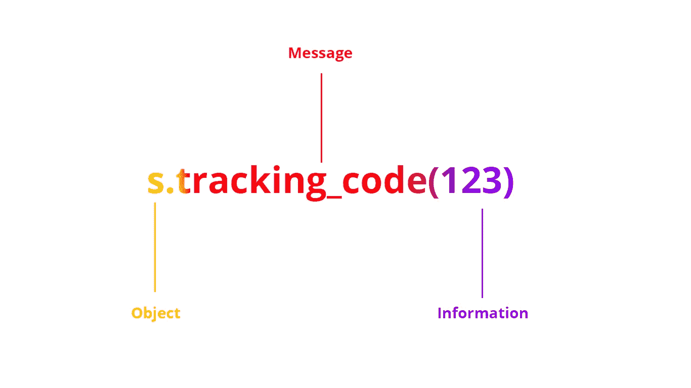
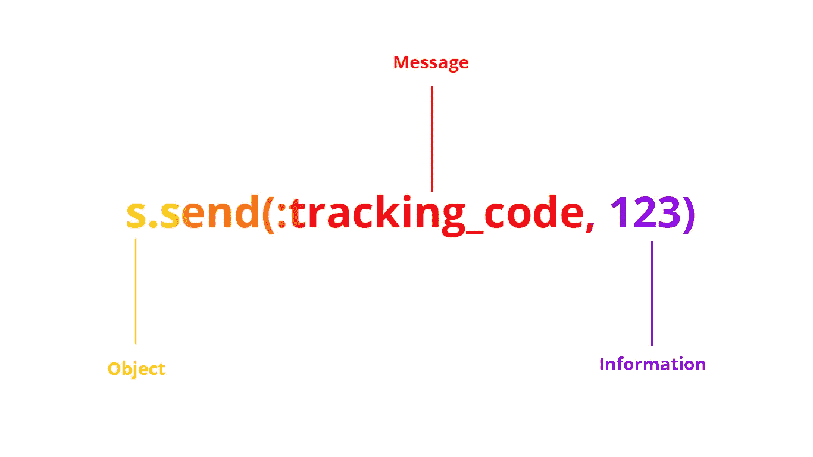

# 是什么让 Ruby 如此美丽:元编程

> 原文：<https://betterprogramming.pub/what-makes-ruby-beautiful-metaprogramming-8d3bf3e046fb>

## Ruby 的 respond_to 方法的魔力


随着 Ruby on Rails 框架的出现而流行起来的 Ruby，是现代开发者中最被低估的编程语言之一。

> Ruby 让开发人员快乐、高效并享受编程。—松本幸宏

也许你来自有很多框架的 JavaScript 世界，或者来自 Java 及其所有的复杂性。

如果你已经受够了浪费时间*构建重要的软件*并且你想要*尽快得到具体的结果*，让我向你介绍 Ruby。

首先，我将向您介绍元编程的概念。

我第一次学习 Ruby，**当我面对这个的时候，我的头脑被炸了**:*想象一下，一个程序可以自己生成代码，不需要开发者的帮助。这不是科幻小说，而是 Ruby 元编程！*

如果我必须向一个 5 岁的孩子解释，我会说，想象你想画一个阳光灿烂的城市。你拿起笔在纸上写下“阳光之城”，按下按钮，画面就出现了。这就是元编程。

现在，我给开发者解释一下。在 Ruby 中，可以对方法进行运行时自省。另一方面，你可以询问一个对象的能力(*你有这个方法吗？*)，它的变量、常数，以及它的类和祖先。

在本文中，我将向您展示一些使用类似`respond_to?` ( *)的方法的示例。*是返回布尔值的方法的 Ruby 约定)`send`和`define_method`。但是还有很多像`method_missing`、`remove_method`和`undef_method`这样的。

我将解释这三种方法，最后给你看一些令人兴奋的例子。

# 对...的回应？()方法

此方法测试您的类是否可以处理特定的消息。对于那些不会说 Ruby 的人:它检查一个方法是否可以在一个特定的类中被调用。



在 Ruby 词汇表中，消息被称为方法

这里有一个`Shipment`类:

使用`respond_to?`方法检查`prepare_for_delivery`方法是否存在:

```
s = Shipment.new 
s.respond_to?(:prepare_for_delivery) ==> true
```

下面是一个更完整的向另一个对象发送消息的示例(如果存在的话):

它可用于任何类别:

```
'hello'.respond_to?(:count)
==> true'world'.respond_to?(:include)
==> false
```

# send()方法

您可以用`send()`方法调用类中的任何方法:



消息在 send()的第一个参数中发送

“为什么不能直接调用我们的方法？”我听到你哭泣。

你说得对，我们可以这样做，我知道这不是我们如何使用它的真实例子。我们继续。

# 方法的定义方法

现在你知道了逻辑，你甚至可以在我解释之前找到这个方法的行为。

它定义了一个方法？*干得好！*

您刚刚为`Shipment`类定义了一个新方法，将实例变量`cancelled`设置为`true`，并打印`reason` **。**

现在，让我们看看最后一个例子，它会让你大吃一惊！

# 在一个例子中，元编程

您已经了解了 Ruby 元编程的基础，让我们来看看最后一个例子:

这里我们已经使用了我解释过的所有方法。对于每个`Container`类，我们定义了新的方法，这些方法根据它们的产品名调用一个方法(如果存在的话),一个扫描器。

输出:

```
Scanning apples...
Scanning potatoes...
```

现在，您知道了什么是元编程以及它是如何工作的。干得好！

元编程的第一个用例是创建自己的 DSL(领域特定语言)。

有一些著名的基于 Ruby DSL 的工具——devo PS 人民用的 [Chef](https://www.chef.io/) 和[木偶](https://puppet.com/)。

这就是红宝石的美丽之处。