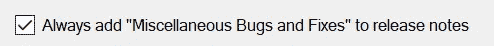

# “杂项错误和修复”的真正含义是什么

> 原文：<https://betterprogramming.pub/what-miscellaneous-bugs-and-fixes-really-mean-3c190aa9f22f>

## Bug 笑话:开发者幕后的一瞥


照片由 [S & B 冯兰森](https://unsplash.com/@blavon?utm_source=medium&utm_medium=referral)在 [Unsplash](https://unsplash.com?utm_source=medium&utm_medium=referral) 上拍摄

也许你和我一样，每次更新你的应用时，你都会看一眼发布说明。毕竟，你可能在想，*我不是上周才更新了这个吗？这次有什么新鲜事？*

假设是 Instagram 刚刚表示有新版本。它可能会这样说:

*   修正了多次上传后图像纵横比的间歇性问题
*   修正了一些 Android 设备上的通知警报
*   各种错误和修复

就在那里。在最后一行，隐藏在众目睽睽之下。

我自己已经发布了大量的软件，几乎每次我都会明确地加入这个看起来非常友好的短语。下面是该行项目的含义:

# 1.我们修复了一些你从来不知道的错误

一些应用程序、服务和网站允许用户和公众在问题追踪器上提交错误，在那里他们被追踪、评估和优先化。当这些错误被修复后，它们会被包含在发行说明中。

但是有时候，开发人员、测试人员和产品负责人会发现我们忽略了添加到问题跟踪软件中的错误，因为 1)我们忘记了 2)我们懒惰了 3)我们只是不想让用户知道。通常，内部会维护一个额外的问题跟踪器。

当然，开发人员和评审人员也喜欢在代码中留下注释:

```
// Fix this piece of crap, Jackson! You call yourself a Senior Dev?
```

# 2.我们清理了一些技术债务

几个地方都列了技术债项目。当这些项目被处理时，债务条目根据它们最初被跟踪的方式或位置被擦除，而不是在发行说明中被提及:

*   **代码中的注释**——要么从代码中完全删除注释，要么添加额外的反作用注释，通常带有一些标记
*   在开发者的头脑中——开发者永远不会忘记技术债务。一旦债务被偿还，最初的技术债务将作为开发人员头脑中的轶事继续存在。
*   **在内部产品路线图中** —创建新的路线图，不包含违规债务行项目
*   **在会议室的白板上** —通常需要喷几滴橡皮擦液，因为这些东西在白板上已经有一段时间了，所有的干擦感都消失了
*   **在开发人员机器上的便签上** —当这些便签最终从开发人员的显示器上移除时，人们会庆祝一番。

# 3.我们修复了一些尴尬到无法承认的问题

*   我们将实际的异常处理代码添加到我们发现的一些空的 try-catch 块中。是的，我们在忍受错误。
*   我们发现一些区域没有任何日志逻辑
*   我们发现从接口派生的类只有缺省的或者缺少具体的实现代码
*   在 UI 上也有一些打字错误，变量名和一些项目被一些最近愤怒退出的开发者不恰当地命名
*   我们不得不降级一些库，因为最新的库破坏了我们的代码
*   我们必须将一些代码恢复到以前的分支，因为最新的分支产生了更多的问题
*   我们决定使用内置的系统函数，而不是我们从堆栈溢出中挪用的函数，一旦我们意识到它是可用的

# 4.我们没有记录我们修好的所有东西

简而言之，我们处于最佳状态，我们正在解决各种问题。称之为附带损害。实际错误附近的各种大小的问题也得到解决。

有些问题可能已经列在了计划在以后发布的追踪器中，我们只是没有意识到它不是当前的优先事项。但是，见鬼，我们已经在那里了。有些可能是从未被发现的 bug，直到我们进入代码的最深处。

说实话，在那次修复狂潮中，我们可能也添加了更多的 bug。

# 5.我们没修好一些东西。我们刚刚重构了

总有一些代码需要重写、润色或现代化。

我们真的需要让代码*变得流畅*吗？可能没有，但开发人员刚刚了解了流畅的编程，并希望在某个地方注入一些知识。

那个 *if 语句*也恳求删除；取而代之的是超酷的零聚结算子。从四行减少到一行！

有必要吗？不太可能，但是这样做确实感觉很好，而且在解决实际问题时，它让开发人员摆脱了思维障碍。这就像把车送去做定期保养时获得免费洗车一样。

# 6.我们实际上解决了一些编译器警告

编译器警告通常与技术债务捆绑在一起，但程度较轻。毕竟，代码是可以编译的。所以它一定很好用，对吧？

但是，伙计，编译器警告肯定是持久的，永远存在的！看到`0 Errors`*`0 Warnings`时有一点点满足感的获得。*

*当然，大多数程序员只处理错误，而不处理警告，即使删除那些未使用的变量可以很快很容易。这一点点清洁工作是有价值的，就像我炒饭里的豌豆和胡萝卜是我每天摄入的蔬菜一样。*

# *7.我们“认为”我们已经修复了间歇性的错误*

*众所周知，难以复制的错误很难修复，有时甚至无法修复。如果开发人员不能复制 bug，如何修复它？通常，开发人员会添加更多的日志记录，并有针对性地解决这个问题。*

*也许可以增加一些边界条件的检查？也许再加一些空头支票？那些改变可能会解决这个问题。让我们发布更改，看看会发生什么。由于团队不确定是否修复了 bug，所以不能在发行说明中报告。*

*有时候，开发人员确实很幸运，他们修复代码的最佳猜测最终确实让问题消失了。在 sprint 回顾会上，开发人员可能承认也可能不承认其中的猜测，但还是接受了英雄奖。*

# *8.发行说明中没有足够的项目*

*有时，为期两周的冲刺是一个前所未有的燃烧热混乱，只有几个项目得到修复和即将到来的版本验证。带有这两个项目的发布说明看起来有点稀疏，几乎不配成为它自己的版本。*

*第三个项目“杂项错误和修复”完美地完成了笔记。因为这个列表中的第四条确实经常出现，所以添加这条线就有一层薄薄的真相。*

# *坦白:有时发行说明可能是欺骗性的*

## *真实故事*

*有一次，我们在测试软件生成的一个报告的时间。“问题”是，它太快了，我们无法按照我们的目的正确计时。所以我们添加了一些睡眠代码。*

*然后，我们忘记了我们已经添加了睡眠代码并发布了软件。几年后，我们发现了埋藏在密码中的加重背心。尽管故意放慢速度，报告仍然相对可用和快速，我们从未对报告有过抱怨。*

*那我们做了什么？对于未来的版本，我们注释掉了*睡眠*代码，并在发行说明中添加了“优化报告生成”*

*用户喜欢我们！*

# *新功能创意*

*把“杂项…”这一行想象成添加到你发送的每封邮件中的签名行。没有人读过它，但它一直在那里。*

*也许流行的发布软件可以把它作为一个特性，一个隐藏在选项中的复选框…*

**

*发布软件的功能思想*

*当然是默认设置的“选中”。*