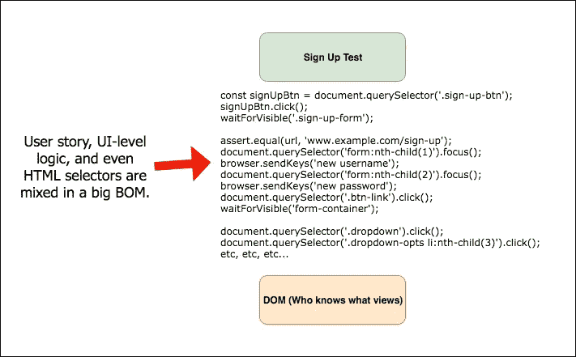

# 编写 E2E 测试时不要做什么

> 原文：<https://betterprogramming.pub/what-not-to-do-when-writing-e2e-tests-ef7b9d09cc81>

## 避免这些陷阱将帮助您有效地应用端到端测试

弗雷德里克·图比尔蒙特在 [Unsplash](https://unsplash.com/search/photos/end?utm_source=unsplash&utm_medium=referral&utm_content=creditCopyText) 上拍摄的照片

我最近合作为 [ArcGIS Hub](https://www.esri.com/en-us/arcgis/products/arcgis-hub/overview) 编写了一个新的端到端(E2E)测试套件。

让我来定义一下我在说什么。E2E 测试通常采用在实时系统上运行的自动化 GUI 测试的形式。

在 web 环境中，端到端的测试运行人员经常远程自动化浏览器。这意味着经典的单元测试工具——模仿、存根、访问内部状态等。—通常不可用。

这使得端到端测试非常高保真，但也引入了潜在的陷阱。这是我的建议。

# **没有明确原因就不要写**

你为什么要写这些测试？在本文[中，研究人员确定了开发人员编写这些和其他 GUI 测试的两个主要原因:](https://prism.ucalgary.ca/bitstream/handle/1880/49989/2014-1057-08.pdf?sequence=1&isAllowed=y)

1.  自动化验收测试(客户期望的封装)。
2.  自动化回归测试(防止回归错误)。

哪一个适合你？还是完全是另一个原因？

阐明你的目标，并确保你的团队在这一点上意见一致。这确保了每个人都确切地理解这些测试的目的和价值。

# **不要重复覆盖**

假设您已经创建了一个新的 UI 组件。如果你能在一个单元测试中涵盖功能(或者你的特定框架称之为什么)，就在那里做吧！

在您的 CI 管道中运行单元测试通常更容易维护，不那么古怪，也不那么昂贵。

E2E 测试应该只覆盖他们能覆盖的区域。通常，这些是跨越许多组件和视图的大图用户故事。我们谈论的是大的、高价值的流动，比如:

*   报名。
*   登录和退出。
*   创建新的<whatever users="" create="" in="" your="" app="">并共享它。</whatever>
*   更新用户的配置文件信息。

# **不要使用单层架构**

在 web 环境中，单层 E2E 测试架构应该是这样的(所以这是应该避免的):

如果您为您的 E2E 测试套件使用单层架构，您将会陷入痛苦的世界。

具体来说，你(和其他人)会发现:

*   测试难以理解，因此难以调试。混合高层次和低层次的逻辑会在测试中引入太多的细节。
*   相对不重要的 UI 更改会破坏大量测试。这是因为逻辑和 HTML 选择器将被大量复制，产生多个故障点*。*
*   当 UI 改变时，测试套件的大部分需要更新。这与前一点相吻合。
*   您将无法重用部分测试逻辑。这将产生额外的努力和麻烦。
*   我的声音可能会突然出现在你的脑海里…嘲笑你的痛苦。

相反，使用多层架构，允许测试本身成为用户故事的可理解的表达。隐藏中介层中特定于区域的逻辑和选择器。

具体来说，我推荐使用页面对象模型。参见马丁·福勒的文章[了解更多信息。](https://martinfowler.com/bliki/PageObject.html)

# 不要使用易碎的选择器

这一节专门针对我的专业，web 开发，但是使用健壮的方法来获得正确的 UI 元素的原则总是适用的。

在 web 环境中，有几种方法可以找到特定的元素，并且它们都不会受到 UI 变化的影响。

让我按照断裂能力的顺序来评价它们。

1.  CSS 选择器(例如`.sign-in-btn`)。类很容易改变，所以它们很容易被打破。
2.  `:nth-child()`选择器。在同一层次级别的元素的排序似乎服从于重新排序。此外，这些选择器通常是非描述性的，使得来自测试运行程序的错误消息更难理解。
3.  范围选择器(例如`.img-view .container .img-wrapper img`)。与前两个相比，这一个似乎不太可能改变，因为元素层次结构更加不可变。然而，这一个也通常与 CSS 选择器混合。
4.  ID 选择器(例如`#thumbnail`)。似乎 id 几乎从不改变，但它们可以。也可能有其他原因避免将它们添加到元素中，例如如果您使用的 UI 框架在内部插入并依赖它们。
5.  `data-test=”some-unique-slug”`属性。这是添加到目标元素的一个属性，只是为了给测试一个句柄。它可以是你想要的描述性的，只要值是唯一的，测试就能找到它。它完全不受布局、ID、样式甚至元素类型变化的影响。此外，大多数开发商/UX 人知道不要惹它。这个是银弹。

我不打算宣扬反对 CSS 选择器的地狱火。选择信任哪个选择器取决于你自己。

但是，如果由我决定，我每次都会选择`data-test`属性。当我的 E2E 测试失败时，我不希望是因为风格的改变。

# **不要指望你的套房是免维护的**

当你创建一个 E2E 测试套件时，它会成为你的应用程序用户界面的反映。

在接下来的一年中，用户界面多久会改变一次？没错。一直都是。因此，反射必须随之发展。您和您的团队需要接受端到端测试的事实。

否则，您可能会发现自己与测试套件处于对立的关系中。这将导致他们变得古怪、讨厌和被忽视。如果你允许那种情况发生，你将会浪费你的努力！

# 不要忽视不可靠的测试

一般来说，开发人员倾向于首先责怪测试，然后责怪他们的更改。

我注意到这在端到端测试的环境中更加明显。此外，由于 E2E 测试依赖于实时的外部系统，因此需要额外的努力来确保它们不会因为网络条件、外部服务的当前负载等不确定因素而随机失败。

努力是值得的。如果测试过于古怪，开发人员就不会信任它们。他们就是不会。这些测试将变得令人讨厌，而不是有益的。

每个薄片测试是不同的。测试可能需要等待更长时间来加载一个视图，或者它可能需要其他东西。不管怎样，我的建议是要么支持它，要么移除它。不要把它留在那里玷污套房的声誉。

向仪表板界面自动报告基本遥测数据，如运行长度和失败/成功，有助于识别测试问题。我们用橡皮筋的[基巴纳](https://www.elastic.co/products/kibana)。

# 结论

端对端测试作为用户期望的表达和对回归的防范可能是强大的。我认为它们绝对应该在开发人员的工具包中占有一席之地。

避免这些陷阱将帮助您尽可能有效地应用这个有用的工具。

# 参考

[1]有些框架如[柏树](https://www.cypress.io/)do 提供 XHR 请求和 DOM 嘲讽。这可能非常有用，但是请记住，虽然这些特性可以减少剥落，但是每当您模仿外部系统时，您就降低了测试的保真度。

[2]赫尔曼、T. D .、莫阿曾、e .、夏尔马、a .、阿克巴、z .、西利托、j .、&毛雷尔、F. (2014 年)。自动化 GUI 测试的探索性研究:目标、问题和最佳实践。([外部链接](https://prism.ucalgary.ca/bitstream/handle/1880/49989/2014-1057-08.pdf?sequence=1&isAllowed=y))

[3]m .福勒(2013 年)。PageObject。从[https://martinfowler.com/bliki/PageObject.html](https://martinfowler.com/bliki/PageObject.html)取回。