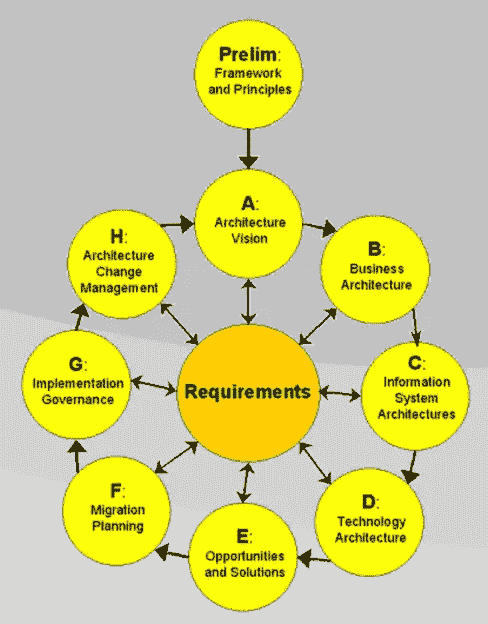
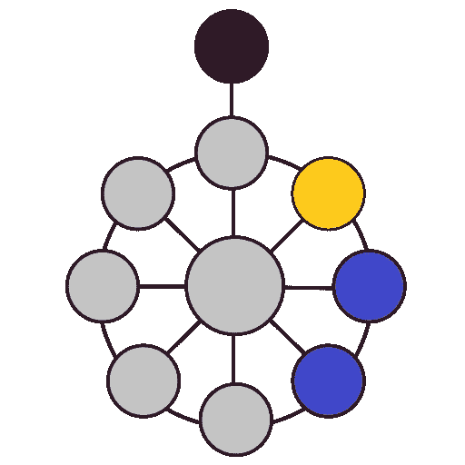
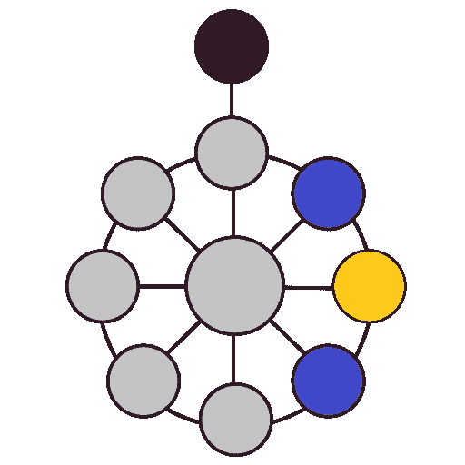
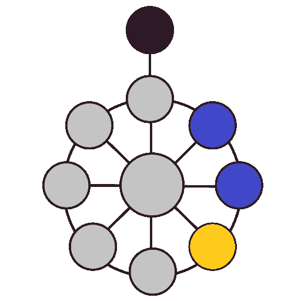

# 关于“TOGAF”解决方案架构，软件工程师应该知道什么？

> 原文：<https://betterprogramming.pub/what-should-every-engineer-know-about-togaf-solution-architecture-866e21f77edb>

## 以下是对企业解决方案架构的核心工程阶段的简要回顾

丹尼尔·麦卡洛在 [Unsplash](https://unsplash.com?utm_source=medium&utm_medium=referral) 上的照片

# 为什么选择解决方案架构？

如您所知，解决方案架构有许多不同的风格，几乎每个公司都有自己的混合职责。

因此，有一个共同点来解释和分类解决方案架构中涉及的核心功能和角色是至关重要的。

本文的基础将是[TOGAF 框架](https://www.opengroup.org/togaf)，这是一个概述软件开发和架构标准的著名和成熟的框架。

> 如果您正在阅读这篇文章，那么您很可能正在从事软件开发，并且您正在问自己如何成为一名架构师或者如何为您的团队找到一名架构师。您甚至可能想要偷偷摸摸地了解企业环境中软件开发的复杂性，或者想要获得另一个认证，TOGAF 就是其中之一。

来自[维基百科](https://en.wikipedia.org/wiki/The_Open_Group_Architecture_Framework)

# 什么是解决方案架构？

> 解决方案架构！=技术架构

在继续之前，我们先做一下尽职调查，复习一下必要的词汇。

[Open Group](https://en.wikipedia.org/wiki/The_Open_Group)对**解决方案架构**的定义明显强调业务运营:

> 对离散的和集中的业务操作或活动以及信息系统(IS)如何支持该操作的描述。

然而，团队[既没有将“解决方案架构师”](https://en.wikipedia.org/wiki/Solution_architecture)视为一个角色，也没有将其纳入[TOGAF 技能框架](https://en.wikipedia.org/wiki/The_Open_Group_Architecture_Framework)。它在信息系统、技术和业务架构之间画了一条细线。

*解决方案架构*的巨大范围在于过程、框架和组织结构的定义。

信息系统架构和技术架构只是隐藏在其保护伞下的部分支柱。

# **业务架构**

业务架构是为进一步的设计活动开发基础和输入的先决条件。

本质上，业务架构必须展示技术架构和未来系统如何映射到利益相关者的 [ROI](https://www.investopedia.com/terms/r/returnoninvestment.asp) 。

TOGAF 架构开发方法(ADM)中的业务架构

定义架构和组织价值之间联系的最常见方式是使用*业务场景*——技术架构可以支持的流程和应用程序。

一个好的*业务场景*必须是:

*   ***S****specific***——*需要做什么*
*   ***可衡量的***——*成功的衡量标准***
*   ******—*确定解决方案行动计划的依据*****
*   *****R****eal istic***—*在组织、时间和成本的限制范围内***
*   *****T****ime-bound—*机会到期时明确时间表**

**因此，有了一些软件工艺的经验，你会注意到业务架构是敏捷中*产品经理、产品所有者和业务分析师*的工作。**

****

**[滑块](https://unsplash.com/@slidebean?utm_source=medium&utm_medium=referral)在 [Unsplash](https://unsplash.com?utm_source=medium&utm_medium=referral) 上拍照**

**尽管 TOGAF 并不为敏捷方法及其一致性而烦恼，但您可以在最常见的敏捷企业采用中找到业务架构参考。作为参考，请查看大型组织的`[SAFe](https://scaledagile.com/what-is-safe/)` (可扩展的敏捷框架)配置。**

**软件架构师可以对解决方案计划、解决方案上下文和解决方案意图做出有价值的贡献。相比之下，在 BAs 的支持下，企业所有者的工作是定义并*确认未来技术架构需求的基础。***

# **信息系统架构**

**业务体系结构有明确的目标和范围，而信息系统体系结构嵌入了一组底层的设计和分析活动。**

****

**TOGAF 架构开发方法(ADM)中的信息系统架构**

**简而言之，信息系统架构的主要目标是确保在企业范围内，无论是已建成的还是当前处于设计阶段的，都得到充分利用，并与我们未来要开发的系统保持一致。它适用于数据治理、结构以及与现有应用程序和功能的集成。**

> **当 *ISA* 被忽略时，即使一个架构良好、看似成功的应用程序/系统也可能无法适应当前的企业生态系统，从而成为一个失败。**

**ISA 包括两个步骤:**

*   **数据架构**
*   **应用架构**

**两者都将业务场景、上下文、意图、差距分析结果和组织的可重用构建块作为输入，并为系统打算实现的数据应用程序架构、蓝图和目标架构产生核心原则。**

## **数据架构**

**在此阶段，设定数据架构实践的界限和架构师的参与程度非常重要。**

**常见的错误是跳入数据库设计，即*数据层的逻辑和物理架构。*然而，主要目标是识别和定义与企业相关的数据实体及其关系，特别是关于我们正在设计的信息系统的范围。**

> **ISA 数据架构与数据库图表或 ACID 原则无关**

**通常，这一步的工作环境是通过[业务场景和架构愿景](https://pubs.opengroup.org/architecture/togaf8-doc/arch/chap16.html#tag_17_03_02)来定义的。**

**一旦收到所有输入，数据架构师必须建立一个 ***基线数据架构*** 。此类架构产品的格式在每个组织中可能有所不同，但它应该包括以下信息:**

*   ***业务数据模型*(实体、属性和关系)**
*   ***逻辑数据模型*(从系统角度对数据的逻辑视图)**
*   ***数据原则*(安全、治理和管理模型)**

**一旦定义了基线，就产生了另一个基本文档— ***目标数据架构。*****

***目标*文档将包括数据模型和原则的定义以及其他支持文档，这些文档被设计成系统实现其目标和业务目标的未来状态。因此，这是一种基于架构和业务信息预测未来的尝试。**

## **应用架构**

**..我不得不在这里让你失望；我们还没有到达未来信息系统的设计阶段。**

**TOGAF 中的应用程序架构旨在审查与企业相关的功能和应用程序。因此，这一步的练习将包括对当前应用程序、它们的交互以及它们对业务功能的影响的分析。**

***在此阶段审查的应用*没有被定义为*计算机系统*，而是企业中管理每个数据架构的数据对象并支持业务架构中的业务功能的逻辑功能组。**

> **ISA 应用程序架构与设计模式、服务或 API 无关**

**除了我们在每个设计和分析阶段收到的工件之外，还有一些特定于应用程序架构的输入:**

*   ***应用原则* —由架构领导和架构委员会开发的应用架构的基本规则、其原理和含义的集合**
*   ***架构愿景—* 详细的目标、参与者及其角色、架构约束以及映射到目标架构的需求**

**工作和输出将类似于数据架构，不同之处在于我们正在分析的主题—应用程序:**

*   **基线*应用*架构**
*   **目标*应用*架构**
*   ***观点*解决主要利益相关方的问题**
*   **通用*应用服务互操作性*视图**

**值得注意的是，所有的设计工作都应该与应用程序背后使用的技术无关。良好应用架构的核心 TOGAF 原则之一是*技术独立性和易用性。***

# **技术解决方案架构**

**祝贺你，我们终于到达了软件工程师称之为职业生涯终点的解决方案架构部分！**

****

**TOGAF 架构开发方法(ADM)中的技术架构**

**前面的步骤主要属于尽职调查阶段，而技术解决方案架构通过使用面向服务的描述对构建块和系统进行建模，定义了未来应用程序的有形特征。**

**这个阶段的目标是将需求、约束、分析、原则和指导方针转化为未来实现工作的基础。**

**在此阶段，Technical Architect 的主要交付成果将是目标技术架构，即使用架构构建块(abb)的广泛架构模型，该模型提供了对特定于应用程序和全球企业功能的深入了解。**

**让我们简要回顾一下目标技术架构中必须解决的基本部分:**

*   ***原则* —将 ISA 原则和约束实现为适用于实施工作的规则**
*   ***参考模型和模式—* 定义构建块的*，功能、服务和企业范围框架的模型***
*   ***观点—* 总体架构的表示，展示了涉众的关注点是如何被解决的，即服务互操作性观点、成本观点、处理观点等。**
*   ***架构定义—* 相对抽象的服务地图和详细的特定于实现的构建块的综合表示**
*   ***过渡架构—* 必须定义中间架构，以展示在需要多个步骤时迁移到目标架构的复杂性**
*   ***架构决策记录—* 在系统开发的每个阶段做出的架构决策的记录**

# **决定吧。提交。重复一遍。**

****

**布雷特·乔丹在 [Unsplash](https://unsplash.com?utm_source=medium&utm_medium=referral) 上拍摄的照片**

**最后，我们审查的所有阶段都不是一次性行动。架构师和开发团队应该经常返回到以前的结果，根据不断变化的业务和生态系统需求审查和重新评估决策。**

**在不断发展的技术、不断变化的趋势和客户需求的背景下，目标系统架构和系统架构作为一个整体总是一个移动的目标。难怪最近几年，紧急架构和敏捷方法一起越来越受欢迎。**

# **C4 模型**

**一个参考模型和框架的完美例子是 [C4 模型](https://c4model.com/)，它允许在技术架构中拥有所需的细节级别。**

**C4 是一种图形化的符号技术，用于建模技术架构，它吸取了 UML 和 ERD T21 模型的精华。**

****

**不同级别的变焦可以让你向不同的观众讲述不同的故事。**

**它将体系结构分解为层次化的观点:**

*   ****一级。上下文图** —显示与外部系统和用户的关系**
*   ****二级。容器图—** 将系统分解成一组*架构构建块*,作为解决业务问题的独立组件进行部署**
*   ****三级。组件图—** 使用体系结构连续体中定义的原则和技术实现容器功能的技术和应用程序代码(不可单独部署)**
*   ****四级。代码图—** 接口和实现细节等。**

**如果您还没有，请检查这个框架。这是一款*简单易用的*工具，用于简化组织中的沟通。工程师、业务分析师、架构师和其他人可以使用它来共享知识和做出决策。**

# **积木**

> **构建块是一个功能包，定义为使组织中的业务需求能够通过已发布的接口来访问该功能。**

****

**照片由 [Unsplash](https://unsplash.com?utm_source=medium&utm_medium=referral) 上的 [Mourizal Zativa](https://unsplash.com/@mourimoto?utm_source=medium&utm_medium=referral) 拍摄**

**TOGAF 的技术架构都是关于架构构建块(abb)的。因此，架构是一组构建块、规范和互操作性，映射到实现业务需求。**

> **重要的是要理解，定义和维护 abb 注册中心的工作看起来是多余的，但在一个大型组织中支持和接受可重用性是必需的。**

**当架构工作从愿景阶段转移到业务、信息系统阶段，并最终转移到技术架构阶段(从 A 到 D，查看 ADM)时，abb 被逐渐定义和指定。每走一步，ABB 都采取更具体的形式和特征，并被确定为要么继续、淘汰、定义为新能力、开发或采购。**

**感谢您阅读我的文章，希望对您有所帮助。**