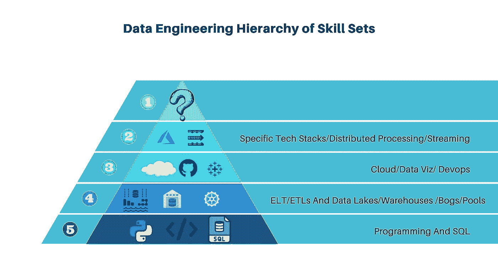

# 一个数据工程师需要什么技能？

> 原文：<https://betterprogramming.pub/what-skills-does-a-data-engineer-need-55ea69f77422>

## 数据工程师技能金字塔

由[吉尔·Á·阿尔瓦雷斯](https://unsplash.com/@guillealvarez?utm_source=medium&utm_medium=referral)在 [Unsplash](https://unsplash.com?utm_source=medium&utm_medium=referral) 拍摄的照片。

凭借在数据科学、分析和云计算方面的广泛背景，我不断被反复问及同样的问题。除了想知道数据工程师和数据科学家之间的区别，最常见的问题之一是“作为一名数据工程师，我应该学习什么技能？”

对于新的或潜在的数据工程师来说，这是一个基于可用机会的极好的询问。

事实是，公司比以往任何时候都更需要数据工程师。按照我们目前的速度，每天大约有 [2.5 万亿字节](https://www.forbes.com/sites/bernardmarr/2018/05/21/how-much-data-do-we-create-every-day-the-mind-blowing-stats-everyone-should-read/?sh=2fca23af60ba)的数据产生，这个数字还在继续加速增长。专家估计，到 2025 年，全球每天将产生 463 艾字节的数据。这相当于每天 212，765，957 张 DVD。

为了更好地利用数据，公司现在意识到他们需要雇用数据工程师将数据从 A 点带到 b 点。这样，数据科学家和分析师就可以轻松地使用数据，从而提高效率和生产力。这就是为什么“数据工程师”是增长最快的职位，根据 2019 年的一项分析。

作为一名新的数据工程师，为了帮助你，我创建了一个技能集金字塔，可以认为是技能集需求的层次结构。这将帮助你专注于你应该首先学习的技能，让你在继续学习更具体的技能时建立一个坚实的基础。只要记住，你学习金字塔每一步的方式不需要过于死板或保持严格的顺序。您可以将每个步骤分层，帮助您在学习过程中不断进步。我们开始吧！

作者照片。

# Python 和 SQL

在金字塔的底部，我建议学习结构化查询语言(SQL)和某种形式的编码。

当我说编码时，我指的是学习核心概念，比如循环、`if`语句、函数和数据结构。你需要了解他们是什么，他们做什么，他们是如何运作的。为什么要用一个而不用另一个呢？

要成为一名成功的数据工程师，你需要成为一名熟练的程序员。目前，我们生活在 Python 时代，它仍然是一个标准的切入点。这种编程语言非常适合网站、脚本和数据。SQL 是数据语言，与自动化、脚本和数据库建模相关。尽管年代久远，它仍然在管理和处理数据方面发挥着举足轻重的作用。

SQL 和 Python 都是工作列表中最常见的技术。无论是为苹果工作的数据工程师，还是为小型创业公司工作的数据工程师，他们都必须是 SQL 方面的专家。Python 也仍然有很高的需求。

最适合你的语言和技术将取决于你的专业目标。例如，那些数据处理专家可能对 Spark 或 AWS 非常精通。然而，在你到达那个点之前，你需要学习基础。

# ETL 和数据仓库

下一个级别包括[ETL(提取、转换、加载)和 ELT](https://www.theseattledataguy.com/etls-vs-elts-why-are-elts-disrupting-the-data-market-data-engineering-consulting/)，这是允许您将数据从一个点带到另一个点的过程——通常使用工具或编程。数据经过处理、提取、转换，然后加载到数据湖或数据仓库中。理解如何移动数据对于下一组与数据仓库、数据湖(有时是数据湖库)相关的技能至关重要:

*   数据仓库将帮助你理解数据建模，以及为什么有经验的数据工程师以特定的方式处理数据。获得这种洞察力将使您能够确保更高的一致性，帮助公司做出更明智的决策。
*   根据数据湖在公司中的角色来理解数据湖，因为与数据仓库相比，该选项允许企业以一种通常更便宜且流程更繁重的方式来管理数据。
*   *数据湖房屋*是一个在过去一年变得流行的术语。公司再次发现这是一个有吸引力的选择，因为它结合了数据仓库和数据湖的元素。

你可以花很多时间学习上面的三个系统，因为在 ETL、数据建模等方面有很多最佳实践。不要急于完成这一层的学习，因为它是数据工程的“肉和土豆”。

问自己一些关键问题，例如:

*   这三个概念是什么？他们从哪里进化而来，又要去哪里？
*   ETL 和 ELTs 有什么区别？
*   从业务角度来看，这一层的目标是什么？

# 云、开发运维以及数据可视化

一旦你获得了更多的经验，这一步的基础就相当简单了。然而，当你第一次开发数据工程师技能时，一切看起来都是势不可挡的——只是因为有很多东西要学。

*   首先从无服务器计算、云数据仓库等方面来理解云。如果你将来在创业公司工作，这些知识将会很有价值。
*   DevOps 将帮助您将代码从您的环境带入生产环境。熟悉 Git——一种用于源代码管理的工具。
*   在学习数据可视化时，您将选择一个工具，如 [Tableau](https://www.tableau.com/learn/articles/data-visualization) 。学习最佳实践。

# 流式数据、分布式计算和专业化

一旦你了解了最上面的三层和其中的概念，你就可以用你的方法变得更具体。既然你有 ETLs 和数据仓库的背景，并且习惯于使用云，那么在 [AWS Kinesis](https://aws.amazon.com/kinesis/) 上设置一些东西对你来说会更自然。

在这个阶段，您还可以更深入地研究分布式处理以及使用这种系统的利弊。

一些数据工程师努力成为专家，要么严格地与微软、Azure Data Factory 合作，这样的例子不胜枚举。许多公司都在寻找特定领域的专家，所以这是许多新数据工程师在磨练技能时要考虑的因素。

变得更有见识的最大好处是你可以自由选择你想关注的东西。一些人喜欢构建基础设施组件，而另一些人喜欢构建数据产品。

作为一名新的数据工程师，你的目标是帮助公司更好地管理他们的数据——无论一家公司有多大或多成功，总会有数据问题。这对于初出茅庐的数据工程师来说非常好，因为这增加了高工作安全性的可能性。

# 综上所述，数据工程师应该具备哪些技能？

*   你应该能够建立和维护数据库系统。
*   理解并流利使用编程语言，尤其是 Python 和 SQL。
*   知道如何找到和使用仓储解决方案以及 ETL 工具。
*   对云技术、数据等有透彻的理解。
*   您还应该熟悉最基本的程序，根据您的专业知识建立特定于软件的技能。比如红移、Azure、Apache 等特有的技能。

与数据科学家和数据分析师不同，数据工程师更关心准备数据，而不是分析和解释数据。尽管这三个头衔的许多技能重叠，但数据工程师专注于 ETL、数据仓库、高级编程、脚本、数据可视化和管道。深入了解 SQL 是必要的。

一旦你磨练了上面的技能，你就可以自由地掌握最吸引你的系统、工具和模型。无论你是对管理公司的大数据基础设施感兴趣，还是被机器学习所吸引，你的职业生涯都可以立即开始。利用今天上面讨论的基本技能的力量！